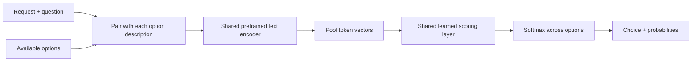

<div align="center">

# First Instinct

**Small model. Described options. One decision.**

An inspectable experiment in teaching a language encoder to choose a tool.
<br>Train it on a Mac. Read every update. Try the saved model.

[](https://github.com/catoenm/first-instinct/actions/workflows/tests.yml)
[](LICENSE)
[](docs/model-card.md)

[Try it](#try-the-model) · [Reproduce](#reproduce-the-experiment) · [Results](docs/experiment.md) · [How it works](docs/how-it-works.md)

</div>

First Instinct takes a request, a question, and a list of described options. It
returns an option and a probability for each choice. The experiment asks:
**can a small, pretrained encoder learn which tool to call first?**

Yes, on this small test: full fine-tuning matched **29 of 34 held-out synthetic
reference answers**, compared with **24** for word overlap and **18** for a
trained scoring layer over a frozen encoder. Training the full model took about
**144 seconds on an Apple M5 Max**, including validation and checkpoint writes.

This is a working learning project, with a deliberately small evaluation. It is
not evidence of broad decision-making ability or production readiness.

The next experiment tests **three task families and question-dependent answers**
using a larger dataset and three training seeds. Its
[protocol and reproduction commands](docs/multitask-experiment.md) are available;
the table below records the completed original tool-selection experiment.

## The result, with the denominator attached

| Method | Reference matches | Match rate | Log loss ↓ |
| :--- | ---: | ---: | ---: |
| Uniform random choice, expected | — | 37.1% | — |
| Word overlap | 24 / 34 | 70.6% | — |
| Frozen encoder + trained scorer | 18 / 34 | 52.9% | 0.9350 |
| **Fine-tuned encoder + scorer** | **29 / 34** | **85.3%** | **0.2494** |

One training seed. One question family. Synthetic labels, not independently
verified tool executions. There are **166 training examples**, **44 validation
examples**, and **34 test examples**. Every example offers at least two tools.
The same data and three-pass training budget are used for both learned models.

The full model has **141,305,088 trainable parameters**, including its embedding
matrix. It starts from Microsoft's DeBERTa-v3-small; this is supervised
fine-tuning, not pretraining from scratch or reinforcement learning.

[Read the experiment and its limitations →](docs/experiment.md)

## Try the model

Tested with **Python 3.14**. On Apple Silicon, PyTorch automatically uses Apple's
Metal Performance Shaders (`mps`) backend. Use `--device cpu` to run inference on
the central processor instead. The measured training machine had 128 GB of
unified memory; minimum training memory has not been measured.

```bash
git clone https://github.com/catoenm/first-instinct.git
cd first-instinct
python3.14 -m venv .venv
source .venv/bin/activate
python -m pip install -r requirements-multitask.txt

python download_checkpoint.py
python decision_model.py \
  --run output/pretrained/first-instinct-v0.1.0 \
  --input examples/weather.json
```

The checkpoint download is approximately 422 MB. It includes the encoder,
scoring layer, and tokenizer; subsequent inference runs locally. The downloader
checks the release checksum and model artifact hashes. No account or service
key is required. On Linux, install the processor-only PyTorch build before the
requirements to avoid downloading unused accelerator libraries:

```bash
python -m pip install torch==2.14.0 --index-url https://download.pytorch.org/whl/cpu
```

Here is the input shape. The included [weather example](examples/weather.json)
uses the complete first-tool question and fuller descriptions:

```json
{
  "state": "What's the weather forecast for Toronto tomorrow?",
  "question": "Which available tool should be called first?",
  "options": [
    {"id": "weather", "description": "Get a weather forecast for a city and date."},
    {"id": "calendar", "description": "Read upcoming calendar appointments."},
    {"id": "calculator", "description": "Evaluate an arithmetic expression."}
  ]
}
```

The output contains `choice`, `probabilities`, and a reminder that probabilities
are **uncalibrated**. A score of 0.9 has not been shown to mean 90% reliability.
The model chooses an option; it does not execute tools, supply their arguments,
or generate an answer. Changing the question is supported by the input format,
but general understanding of new question types has not been demonstrated.

## How it works



The same network scores every option. There is no permanent output neuron for
“weather” or “calendar”: descriptions supply the meaning, and identifiers are
used only to attach scores to the caller's options. During training, the
reference answer tells the model which option's probability to increase.

The [walkthrough](docs/how-it-works.md) follows the numbers from text to loss to
weight updates. There is no hidden trainer framework.

## Reproduce the experiment

The commands below reconstruct the **reported** experiment, including an early
question-wording correction. The 37 MB public source is downloaded at a pinned
revision and verified by checksum. The pretrained encoder is downloaded from a
pinned revision on the first training run.

```bash
python decision_dataset.py \
  --task legacy-whole-request --output output/decision_dataset_v1

python decision_dataset.py \
  --revise-from output/decision_dataset_v1 --output output/decision_dataset_v2

python finetune_decisions.py --data output/decision_dataset_v2
```

Each comparison writes a new directory under `output/decision_comparisons/`:
selected checkpoints, every training update, validation history, test
predictions, and checksummed manifests. Existing dataset directories are never
overwritten; choose another output path to rebuild them.

Why two dataset versions? The original wording asked which tool best fulfilled a
request, while the label identified its **first call**. After diagnosing this on
an exploratory test, we corrected the question and used a previously untouched
partition for the reported test. The old test is development data. The
[experiment report](docs/experiment.md#the-question-wording-mistake) records the
whole change, including the misleading legacy `calibration.jsonl` filename.

The reconstructed split files match the recorded files byte for byte. Floating
point training results can vary by hardware and software. Source snapshots and
original manifests are preserved in [results/mac-v1](results/mac-v1).

To start a **new** experiment directly with the corrected question:

```bash
python decision_dataset.py --output output/my_dataset
python finetune_decisions.py --data output/my_dataset
```

This direct build has different partition membership from the historical
revision process; do not expect it to reproduce the table above.

## Read the project

| File | Purpose |
| :--- | :--- |
| [decision_data.py](decision_data.py) | Strict source conversion; keep inputs and labels separate |
| [decision_dataset.py](decision_dataset.py) | Pinned download, filtering, grouping, split checks |
| [decision_model.py](decision_model.py) | Encoder, scorer, and saved-model inference |
| [finetune_decisions.py](finetune_decisions.py) | Frozen baseline, full fine-tuning, checkpoint selection, evaluation |
| [train_decisions.py](train_decisions.py) | Optional eight-example exercise with each weight update exposed |
| [results/mac-v1](results/mac-v1) | Recorded predictions, traces, hashes, and exact source snapshots |
| [docs/model-card.md](docs/model-card.md) | Model purpose, provenance, constraints, and release details |

The earlier document-deduplication exercises (`pipeline.py`, `minhash.py`,
`lsh.py`) remain as small learning examples. The dataset builder also reuses
these text-similarity helpers. See [the learning path](docs/how-it-works.md#learning-path)
if you want to work from the beginning.

Run the offline checks:

```bash
python -m unittest discover -v
```

They check label isolation, option masks, known gradients, gradients reaching the
encoder, split boundaries, probability metrics, and checkpoint integrity. They
require no model download. GitHub Actions runs them on macOS and Linux.

## What would make it more convincing?

The next milestone is a **larger, independently audited evaluation**, followed by
one useful routing workflow. That would test whether the improvement survives
outside this tiny synthetic sample.

1. Hold out semantic tool families and test multiple training seeds and stronger baselines.
2. Vary the question for the same state so different questions require different choices.
3. Reserve new data for probability calibration and “none of these / ask for help” decisions.
4. Measure decision quality, latency, memory, and cost in one realistic workflow.
5. Add reinforcement learning only when an environment can score completed outcomes.

This project was inspired by interest in decision-oriented models such as
[TypeSafe's Jev](https://docs.typesafe.ai/primitives). It is an independent
educational implementation of a conventional described-option classifier,
**not a reproduction of Jev's architecture or training method**.

## Credits and license

Code: [MIT](LICENSE). Pretrained encoder:
[Microsoft DeBERTa-v3-small](https://huggingface.co/microsoft/deberta-v3-small), MIT.
Data: [Team-ACE/ToolACE](https://huggingface.co/datasets/Team-ACE/ToolACE), declared
Apache-2.0. See [third-party notices](THIRD_PARTY_NOTICES.md) for provenance and
included license texts.
