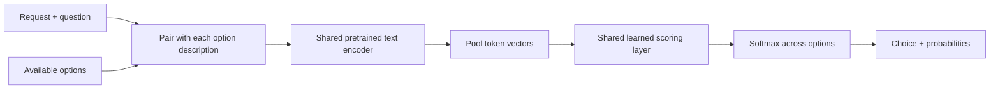

<div align="center">

# First Instinct

**Small model. Described options. One decision.**

An inspectable experiment in teaching a small language encoder to make decisions.
<br>Train it on a Mac. Read every update. Try the saved model.

[](https://github.com/catoenm/first-instinct/actions/workflows/tests.yml)
[](LICENSE)
[](docs/model-card-v0.2.md)

[Try it](#try-the-model) · [Reproduce](#reproduce-the-experiment) · [Results](docs/multitask-experiment.md) · [How it works](docs/how-it-works.md)

</div>

First Instinct takes some text, a question, and a list of described answers.
One shared network scores the answers. It can choose a tool, identify an emotion,
or judge how two sentences relate—without generating a stream of text.

**In progress: [a four-billion-parameter decision model](docs/larger-model.md).**
The separate `scale_lab` pipeline adds pinned pretrained models, adapter training,
larger public datasets and executable outcome records. The existing released
model and results below remain the completed experiments.

**Latest: [Learning to inspect software before making a forecast](docs/software-inspection.md).**
The new data factory verifies **7,793 program variants from 369 open-source
functions**, with source groups kept separate and about half a million candidate
test executions. Twenty-four small models test reward-only forecasts and a
hybrid that learns forecasts from outcomes while using reinforcement learning
to buy evidence. Inspection helps, but a simple empirical planner remains
stronger; broader forecast practice does not consistently win. Data, receipts,
checkpoints and a runnable environment are public. The language-model export
contains 36,189 training views and 34.6 million input tokens.
[Read the results and run the inspection demo →](docs/software-inspection.md)

The previous [Executable evidence: auditing the data before reinforcement learning](docs/executable-evidence.md)
pilot used authored contracts.
We built 24 authored Python tasks and compared random, coverage and adaptive
data collection at **100 verified programs per run**. Coverage modestly improved
forecasts on new tasks, while random sampling did better on new edit mechanisms.
The audit found **31 of 59** programs that passed both visible checks failed a
private suite—and two passed the private suite despite a known visible failure.
A frozen language encoder also remained sensitive to explicitly copied evidence.
All nine collectors, references, receipts, selection logs and a disclosed verifier
repair are public. This pilot uses direct labels; the numeric studies below
contain reinforcement learning. [Read the findings and run the replay →](docs/executable-evidence.md)

The previous [forecast-practice experiment](docs/forecast-audit.md) tests
keeping a decision model's forecasts in practice.
Extra forecast exercises throughout training reduced probability error from
**13.9 to 8.6 percentage points** under familiar conditions, with better workflow
reward in all three seeds. Giving the same exercises early achieved 10.8 points;
direct-label training still did better at 4.1. The model stayed the same size.
Unfamiliar sensors and irrelevant price changes exposed persistent failures.
All twelve models and reproducible results are public, alongside a
[paired benchmark with 6,144 text requests](docs/probability-benchmark.md) and an
optional Jev runner. Live Jev results have not been collected.

The previous [learned-inspection experiment](docs/learned-inspection.md) exposed
the gap this follow-up tries to repair.
Twelve tiny models learn to stop or buy another observation before reporting an
answer. An initial exploration phase cut the forecast policy's lost reward by
**63%** under familiar conditions. It almost never bought duplicate evidence,
yet showing it a duplicate still moved its probability report by **11 percentage
points**. Direct-label training produced much better forecasts, and unfamiliar
sensors exposed large failures. All seeds, weights, traces, and a runnable
two-step environment are included. [Try it →](docs/learned-inspection.md#reproduce-it)

The earlier [75-policy size and data-coverage experiment](docs/ppo-data-results.md)
compared the training method, model size and data coverage.
We compared supervised learning, simple policy gradients, and Proximal Policy
Optimization on a Mac. Broader data reduced the supervised model's probability
error on reversed sensors from **21.4 to 2.7 percentage points**, at the same
model size and episode budget. Increasing the reward-trained models' size did
not reliably help. All five seeds, six test domains, weights, and runnable
examples are public.

The [calibration laboratory post](docs/calibrated-decisions-post.md) starts with two tiny
models that both made the right yes/no choice 77.43% of the time, but substituting one
model's action probabilities for event forecasts more than doubled a program's
cost in a tested inspection setting. We trained reward policies, compared
supervised and temperature-scaling baselines, and tried recovering probabilities
from decisions across different mistake costs. [Run the experiments, inspect
every seed, and read the limits →](docs/calibration-results.md)

The text-model experiment trains **five tasks from three families** on your own Mac.
Across three training seeds, full fine-tuning reached **79.5% average accuracy
across tasks**, versus **57.5%** when training only a scoring layer over the same
fixed encoder.

The more revealing test asks **two different questions about the same text**,
with identical yes/no options but opposite correct answers. Full fine-tuning
answered both correctly on **61.8% of pairs**, versus **20.7%** for the fixed
encoder. Rewording those questions reduced paired accuracy to **46.0%**: useful
learned behavior, with visible limits.

## The result, with the denominator attached

**3,567 training questions from 1,407 source examples.**
**1,144 test questions from 424 source examples, including 360 question pairs.**
Questions derived from one source are correlated; they are not independent samples.

| Method | Average of five task accuracies | Both paired answers correct |
| :--- | ---: | ---: |
| Original tool-only model, no additional training | 50.3% | 3.3% |
| Fixed encoder + trained scorer, three-seed mean | 57.5% | 20.7% |
| **Fine-tuned encoder + scorer, three-seed mean** | **79.5%** | **61.8%** |

| Task | Test questions | Fixed encoder | Full fine-tuning |
| :--- | ---: | ---: | ---: |
| First tool to call | 64 | 92.2% | 94.3% |
| Sentence relationship, three choices | 180 | 32.2% | 70.0% |
| Sentence relationship, yes/no | 360 | 50.4% | 72.8% |
| Emotion, six choices | 180 | 54.8% | 76.5% |
| Emotion, yes/no | 360 | 58.1% | 84.1% |

These are three-seed means on source annotations. Full-model average accuracy
ranged from **78.6% to 81.1%** across seeds; the source-resampling interval for
its improvement over the fixed encoder is **18.9–25.1 percentage points**.
This tests new examples within known task families, not arbitrary new tasks.

The model has **141,305,088 parameters**, including embeddings. Each full run
completed six passes in about **10 minutes on an Apple M5 Max with 128 GB of
unified memory**. This is supervised fine-tuning of Microsoft's DeBERTa-v3-small;
the released text model has not undergone reinforcement learning or probability
calibration. The separate numeric calibration laboratory above includes reward
training with policy networks of 1,217–19,733 parameters.

[Read the experiment, every seed, and wording sensitivity →](docs/multitask-experiment.md)

The original 166-example tool-only experiment remains available with its
[report](docs/experiment.md), [artifacts](results/mac-v1), and
[v0.1.0 checkpoint](https://github.com/catoenm/first-instinct/releases/tag/v0.1.0).

## Try the model

Tested with **Python 3.14**. On Apple Silicon, PyTorch automatically uses Apple's
Metal Performance Shaders (`mps`) backend. Use `--device cpu` to run inference on
the central processor instead. The measured training machine had 128 GB of
unified memory; minimum training memory has not been measured.

```bash
git clone https://github.com/catoenm/first-instinct.git
cd first-instinct
python3.14 -m venv .venv
source .venv/bin/activate
python -m pip install -r requirements-multitask.txt

python download_checkpoint.py --version v0.2.0
python decision_model.py \
  --run output/pretrained/first-instinct-v0.2.0 \
  --input examples/weather.json
```

The checkpoint download is approximately 412 MB. It includes the encoder,
scoring layer, and tokenizer; subsequent inference runs locally. The downloader
checks the release checksum and model artifact hashes. No account or service
key is required. On Linux, install the processor-only PyTorch build before the
requirements to avoid downloading unused accelerator libraries:

```bash
python -m pip install torch==2.14.0 --index-url https://download.pytorch.org/whl/cpu
```

Here is the input shape. The included [weather example](examples/weather.json)
uses the complete first-tool question and fuller descriptions:

```json
{
  "state": "What's the weather forecast for Toronto tomorrow?",
  "question": "Which available tool should be called first?",
  "options": [
    {"id": "weather", "description": "Get a weather forecast for a city and date."},
    {"id": "calendar", "description": "Read upcoming calendar appointments."},
    {"id": "calculator", "description": "Evaluate an arithmetic expression."}
  ]
}
```

The output contains `choice`, `probabilities`, and a reminder that probabilities
are **uncalibrated**. A score of 0.9 has not been shown to mean 90% reliability.
The model chooses an option; it does not execute tools, supply their arguments,
or generate an answer. Question dependence is tested on known tasks; general
understanding of arbitrary new task types has not been demonstrated.

Try changing only the question while keeping the same text and yes/no options:

```bash
python decision_model.py \
  --run output/pretrained/first-instinct-v0.2.0 \
  --input examples/statement-supported.json
python decision_model.py \
  --run output/pretrained/first-instinct-v0.2.0 \
  --input examples/statement-contradicted.json
```

The [emotion example](examples/emotion.json) offers six described categories.
These small authored examples demonstrate the interface; the held-out benchmark
above measures performance.

## How it works



The same network scores every option. There is no permanent output neuron for
“weather” or “calendar”: descriptions supply the meaning, and identifiers are
used only to attach scores to the caller's options. During training, the
reference answer tells the model which option's probability to increase.

The [walkthrough](docs/how-it-works.md) follows the numbers from text to loss to
weight updates. There is no hidden trainer framework.

## Reproduce the experiment

The multi-task comparison starts from the **released v0.1.0 model**, so every
condition shares the same initial weights. Dataset downloads are pinned to
specific revisions and checked by checksum.

```bash
python download_checkpoint.py --version v0.1.0
python multitask_data.py
python multitask_train.py \
  --init-run output/pretrained/first-instinct-v0.1.0
```

Skip the first command if that verified checkpoint already exists. The default
training recipe uses three seeds, six passes, effective batches of 32 questions,
and eight-question microbatches to limit memory use. `--microbatch-size` can be
reduced for smaller machines; minimum memory requirements have not been measured.

Training writes a new directory under `output/multitask_runs/`, including the
exact source snapshot, every update, validation histories, selected checkpoint
hashes, and every test prediction. It selects all checkpoints by validation loss
before opening the final test. Run the source-level uncertainty analysis with:

```bash
python summarize_multitask.py --run output/multitask_runs/<run-directory>
```

The data builder independently reproduced the recorded split files byte for
byte. Floating point training can differ across hardware or runtime versions.
[The full protocol](docs/multitask-experiment.md) explains grouping, label
adaptations, controls, and two exploratory runs stopped before final testing.
[Recorded evidence](results/multitask-v1) includes all three seeds, rather than
only the released model.

For the earlier single-task experiment and its question-wording correction,
use the [original reproduction commands](docs/experiment.md#verification-and-reproduction).

## Read the project

| File | Purpose |
| :--- | :--- |
| [decision_data.py](decision_data.py) | Strict source conversion; keep inputs and labels separate |
| [decision_dataset.py](decision_dataset.py) | Pinned download, filtering, grouping, split checks |
| [decision_model.py](decision_model.py) | Encoder, scorer, and saved-model inference |
| [multitask_data.py](multitask_data.py) | Pinned sources, grouped partitions, balanced questions about the same text |
| [multitask_train.py](multitask_train.py) | Shared-model training, three seeds, validation selection, question controls |
| [summarize_multitask.py](summarize_multitask.py) | Whole-source resampling and results across all seeds |
| [finetune_decisions.py](finetune_decisions.py) | Original tool-only comparison |
| [train_decisions.py](train_decisions.py) | Optional eight-example exercise with each weight update exposed |
| [results/multitask-v1](results/multitask-v1) | Recorded predictions, traces, hashes, and exact source snapshots |
| [docs/model-card-v0.2.md](docs/model-card-v0.2.md) | Model purpose, provenance, constraints, and release details |
| [calibration_lab](calibration_lab) | Numeric reward environments, policies, verification, and runnable demo |
| [docs/calibrated-decisions-post.md](docs/calibrated-decisions-post.md) | Post draft explaining what action probabilities mean |
| [results/calibration-v1](results/calibration-v1) | Five-seed summaries, frozen protocols, and evidence verification |
| [docs/ppo-data-results.md](docs/ppo-data-results.md) | Learning method, model size, broader data, and runnable saved policies |
| [docs/data-environments.md](docs/data-environments.md) | What decision-training data contains, and how to extend the environment |

The earlier document-deduplication exercises (`pipeline.py`, `minhash.py`,
`lsh.py`) remain as small learning examples. The dataset builder also reuses
these text-similarity helpers. See [the learning path](docs/how-it-works.md#learning-path)
if you want to work from the beginning.

Run the offline checks:

```bash
python -m unittest discover -v
```

They check label isolation, option masks, known gradients, gradients reaching the
encoder, split boundaries, probability metrics, and checkpoint integrity. They
require no model download. GitHub Actions runs them on macOS and Linux.

## What would make it more convincing?

The text experiment demonstrates a shared model learning several kinds of
decisions, including answers that depend on the question. The calibration
laboratory now tests reward learning, model capacity, data coverage, and probability
semantics in a synthetic numeric environment. Extending those lessons to verified
text decisions and learned information acquisition is the next useful step.

1. Execute safe local tools in a repeatable environment and score whether the requested task succeeds.
2. Hold out task families and question styles, then compare outcome rewards before and after training.
3. Reserve fresh data for probability calibration and “none of these / ask for help” decisions.
4. Measure decision quality, latency, memory, and cost in one realistic workflow.

More passes over this benchmark cannot establish those missing capabilities.
The current final test is now observed; future experiments need fresh evaluation.

This project was inspired by interest in decision-oriented models such as
[TypeSafe's Jev](https://docs.typesafe.ai/primitives). It is an independent
educational implementation of a conventional described-option classifier,
**not a reproduction of Jev's architecture or training method**.

## Credits and license

Code: [MIT](LICENSE). Pretrained encoder:
[Microsoft DeBERTa-v3-small](https://huggingface.co/microsoft/deberta-v3-small), MIT.
Data: [ToolACE](https://huggingface.co/datasets/Team-ACE/ToolACE) and
[GoEmotions](https://huggingface.co/datasets/google-research-datasets/go_emotions),
declared Apache-2.0; [Stanford Natural Language Inference](https://nlp.stanford.edu/projects/snli/),
Creative Commons Attribution-ShareAlike 4.0. Source and adapted data retain their
upstream terms. See [third-party notices](THIRD_PARTY_NOTICES.md) for provenance and
included license texts.
