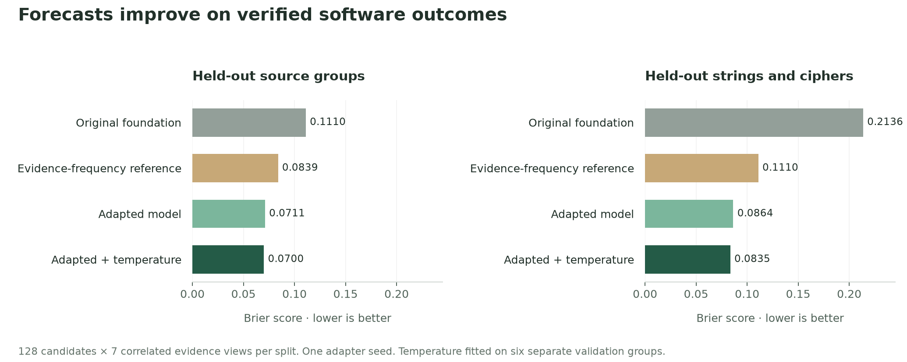
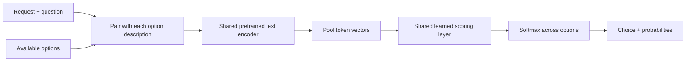

<div align="center">

# First Instinct

**Build verified data. Learn when to inspect it.**

Open experiments in outcome forecasts, reinforcement learning, and the cost of evidence.
<br>Inspect the data. Try the models. Reproduce the measurements.

[](https://github.com/catoenm/first-instinct/actions/workflows/tests.yml)
[](LICENSE)
[](docs/general-supervised-results.md)

[Try the decision demo](docs/general-demo.md) · [Model download](https://github.com/catoenm/first-instinct/releases/tag/general-decisions-v1) · [Reinforcement results](docs/general-reinforcement-results.md) · [Next data](docs/general-rl-data-next.md)

</div>

**Current result:** the original supervised 9B checkpoint remains selected; later
learning runs have not qualified a replacement. A
[controlled tool-description experiment](docs/report-contract-paired-v1-results.md)
improved its expected forecast accuracy from 52.3% to 69.5% on one exposed workflow
without changing weights. New [live database decisions](docs/revisioned-live-v1-results.md)
and their [learning adapter](docs/decision-learning-v2-results.md) now pass local
execution and CPU checks. They prepare richer training experience; they do not
establish a new trained model or broad transfer.

**Next milestone: [a usable 9B release candidate](docs/release-candidate-v1-plan.md).**
The release plan combines general decisions, broader tool-selection data and
verified outcomes, then tests reinforcement learning as a measured upgrade.
Dataset admission, evaluation and serving qualification are still in progress.
The [combined release corpus](docs/release-mixture-v1-results.md) now passes its
source audit: 371,278 training questions and 133.8 million input tokens. This is
prepared data, not the amount consumed in a run. The
[first training pilot](docs/release-pilot-v1-results.md) completed 80 updates on
5,120 presentations. Average forecast error fell, but tool accuracy and one
probability group failed the release gates, so it was not promoted. The
[coverage-balanced follow-up](docs/release-balanced-v1-results.md) completed 160
updates on 10,240 presentations. Forecast Brier error improved by 57%, and every
forecast group passed its checks. Equal-server tool accuracy did not improve, so this run also
stopped without replacing the released model. Both runs are recovered and audited.

The first [release-data admission](docs/release-tool-data-v1-results.md) now adds
17,786 tool-choice training questions across 283 server groups, with 2,217
development and 2,431 reserved-transfer questions kept separate. These are checked
teacher-action examples, not verified outcome labels. The first pilot consumed
2,240 tool questions; further consumption is recorded separately for each run.

**Latest audit: [tool success is not financial success](docs/retail-ledger-v1-results.md).**
A real simulator's payment-change-then-cancellation sequence returned normally but
over-refunded a synthetic account; an independent ledger/goal check rejected it.
The [telecom question admission](docs/telecom-questions-v1-results.md) also caught
shared worlds across proposed learning roles before training. Its 51 short paired
questions are now evaluation-only. No new model improvement is claimed.

**Latest data qualification: [stale evidence, scoped changes and payment prerequisites](docs/retail-evidence-v1-results.md).**
Three retail goals now have 120 executed alternatives and 120 exact replays.
The best offered procedure changes with inspection and attempted-write costs; 30 of 36
forecast targets retain legitimate uncertainty. Their
[67 paired questions](docs/release-retail-questions-v1-results.md) now pass admission
in one connected training-only group, with zero model updates.
The [live tool interface](docs/retail-live-v1-results.md) also passed 120 runtime
episodes: each command is charged, and verified success pays only at termination.
The [language-policy interface](docs/retail-actor-v1-results.md) fits every saved
decision point without cropping. Its [isolated process check](docs/retail-process-v1-results.md)
then ran 108 real tool calls, including refused writes and six-action terminations.
These are runtime checks with scripted actions, not learned-policy results.
[Fresh-observation forecasts](docs/retail-history-v1-results.md) add 190 verified
questions from 300 executed alternatives and 300 independent replays; 29 retain
legitimate uncertainty. These questions have not yet been used in training. The preceding
[AppWorld comparison failed its transfer and format checks](docs/appworld-transfer-evaluation-v2-results.md),
so the demo remains on its original supervised checkpoint.

**New: [measured results for the nine-billion-parameter decision model](docs/general-supervised-results.md).**
One supervised pass over 350,857 examples raised accuracy from **63.3% to 78.1%**
on 17,277 held-out questions under the same constrained-answer interface.
Gains are strongest on executable reasoning worlds; public text tasks improve
less, and some tasks regress. Prose-pair accuracy is unchanged. The model
accepts user-defined questions and choices.

**The [four completed reinforcement-learning runs](docs/general-reinforcement-results.md)
did not reliably improve held-out decisions.** Three selected the unchanged
supervised start; all four latest checkpoints lost reward under shifted
conditions. Outcome-forecast practice reduced probability drift relative to
reward-only training, without establishing a better decision policy. The
[model release](https://github.com/catoenm/first-instinct/releases/tag/general-decisions-v1)
preserves the supervised adapter, every selected and latest reinforcement
adapter, raw predictions, receipts, and reports. Foundation weights download
separately.

The new [general decision demo](docs/general-demo.md) offers four example tabs
in a compact retro interface. The local version now serves the completed
supervised checkpoint; the underlying interface accepts your own questions
and choices.

**Next capability gap: [using forecasts to select actions](docs/forecast-selector-v1-results.md).**
An offline diagnostic of saved predictions found that the forecasts still
overvalue stopping in some unfinished tasks. Perfect verified forecasts recover
most of the available reward in this small development curriculum; the trained
forecasts do not. The next priority is broader execution-verified supervision and
application workflows, beginning with [local AppWorld qualification](docs/appworld-local-v1-protocol.md).

**Completed pilot: [costly evidence and recoverable commands](docs/evidence-decisions-v2-results.md).**
Consequence supervision improved execution return from 0.316 to 0.483–0.502
and forecast Brier from 0.311 to 0.068–0.096 across two seeds. Reward learning
was less stable: three of four reinforcement arms stopped at the policy-change
limit. Stale evidence remains unsolved, and broader-task accuracy is essentially
flat. These are held-out combinations in three authored mechanisms, not broad
tool-use generalization. [All arms, receipts and training counts](results/evidence-decisions-v2-final/)
are published; the demo checkpoint remains unchanged.

**Next data stage: [paired decisions and consequences](docs/decision-curriculum-v3-results.md).**
Local qualification adds artifact staging, hash validation and atomic publication,
alongside costly evidence and recoverable failures. All 3,024 counterfactual
branches were executed and audited. They represent four fixture roots, not
thousands of independent tasks. Whole families are reserved for validation and
transfer; prepared counts are recorded separately from actual training consumption.

The [application extension](docs/application-curriculum-v1-results.md) adds real
ToolSandbox dependency chains, duplicate prevention and already-completed tasks.
Its 2,268 distinct alternatives were each replayed once, producing 1,564 paired
questions from one new root. An independent audit passed, and a prospective
training guard now rejects and rolls back over-limit updates.

**Completed: [stable learning, but no joint transfer gain](docs/mixed-decisions-v1-results.md).**
All six mixed-mechanism arms completed 40 accepted updates without rejection.
Reward-only learning improved held-out decision return slightly; forecast
supervision lowered probability error. No method improved both enough to pass
the predefined gate in both seeds. General-task performance stayed close to the
starting model. The audit also found no uncertain or incorrect-outcome forecast
groups in the single transfer mechanism, motivating broader data and forecasts
from intermediate execution states. All checkpoints were recovered and the GPU
deleted; the demo remains on its supervised checkpoint.

**New local data:** [forecasts inside execution histories](docs/trajectory-decisions-v1-results.md)
now cover uncertain and incorrect publication outcomes that the earlier forecast
set missed. A [filesystem mutation-scope family](docs/filesystem-decisions-v1-results.md)
adds actual hard-link side effects, goal-dependent operations and cost-sensitive
inspection. Both collections passed execution/replay audits; the filesystem
slice also matched pinned Linux execution. Together they contain 1,848 distinct
alternatives and 1,324 prepared questions, with zero training consumption at the
time of collection; the later learning comparison below records actual use.
The [calendar transfer family](docs/calendar-decisions-v1-results.md) now adds
2,160 executed alternatives and 1,504 questions about interval conflicts,
ambiguous local times and atomic rescheduling. Native replay and Linux parity
passed; its model results are now reported below. A [source index](docs/decision-source-registry-v1-results.md)
prepares 2,280 distinct forecast inputs across five training mechanisms while
preserving uncertain outcomes and whole-mechanism ownership. These preparation
counts are separate from actual consumption. [Live runtime and learning qualification](docs/expanded-decisions-v1-qualification.md)
now passed: 384 primary trajectories were independently replayed, 96 Linux checks
matched, and all 27 startup tests passed in the exact cloud bundle. The
[controlled pilot](docs/expanded-decisions-v1-protocol.md) has now completed.

**Latest: [broader executable training did not improve unfamiliar decisions](docs/expanded-decisions-v1-results.md).**
Five training mechanisms, 4,800 live episodes and 230 accepted updates still
produced no method that passed the joint transfer gate in both seeds. All models
completed 50 of 80 calendar cases, and every trained model's overall forecast
error worsened on that new mechanism. Small gains on uncertain inputs did not
offset losses on deterministic ones. General capabilities stayed close to the
starting model. All checkpoints and 514 artifact files were recovered and
verified; no rented pods remain. The demo keeps its supervised model. The
[public evidence](results/expanded-decisions-v1-final/) separates prepared data,
consumed questions, repeated presentations and underlying tasks. Next comes a
local check of how forecasts could support action selection, not a larger run
of the same recipe.

**Earlier protocol: [learning decisions from executable outcomes](docs/outcome-v2-protocol.md).**
Two environments cover SQLite retries and a workshop with prerequisites,
replacement parts and irreversible damage. They supply **59,993 training
questions from 8,192 root worlds**. Execution provides the labels; related
mechanisms stay in the same split. The planned comparison tests outcome learning,
reward learning, and both together from the same 9B start. A controller uses
predicted outcome and cost distributions to choose its next action. This is a
protocol description; see the [completed results](docs/outcome-v2-results.md).
It is **not a recovered Jev recipe**.

The earlier [retry-environment pilot](docs/retry-environment-pilot.md) remains
separate and unchanged: all 2,000 trajectories and 7,347 forecast outcomes were
replay-verified. See the [data plan](docs/general-rl-data-next.md) and
[public-evidence audit](docs/mini-jev-next-research.md) for the rationale and limits.

## Earlier: software forecasts and learned inspection

First Instinct also explores **when a model should gather more evidence before
making a decision**. The earlier four-billion-parameter forecaster reads
code and verified checks. A separate small policy learns whether to inspect
more evidence or stop. The data, training methods and failure cases are open.

**[The local evidence room](docs/software-outcome-model.md).** Choose a
candidate program, reveal checks yourself or follow the trained inspector, and
watch the forecast change before opening the hidden outcome.

| Held-out test | Original foundation accuracy | Adapted model accuracy |
| --- | ---: | ---: |
| New source groups | 84.5% | **90.2%** |
| Strings and ciphers | 68.9% | **86.5%** |

Each test has **128 candidates with seven correlated evidence views**. The
adapted model also improves probability error over a training-frequency
reference. It is a short outcome-supervised adaptation of Qwen3.5-4B; the
separate small inspectors use Proximal Policy Optimization. The two models were
trained separately. This is not evidence of Jev parity or a recovered private
training recipe.



With a Python environment active in this checkout:

```bash
python -m pip install -r requirements-scale.txt
python -m inspection_lab.download
python -m scale_lab.download
python -m inspection_lab.serve
```

Open `http://127.0.0.1:8765`. The model stays loaded locally; the demo never
executes submitted code. The Mac check used an M5 Max with 128 GB of memory.
Foundation weights download separately on first use. See the
[model guide](docs/software-outcome-model.md) for hardware limits and measurements.

The [data factory](docs/software-inspection.md) verifies **7,793 program variants
from 369 open-source functions**, with connected source groups kept separate and
about half a million candidate-check executions. Twenty-four small models test
reward-only forecasts and hybrids. Learning inspection helps, but a simple
empirical planner remains stronger at choosing evidence. Extra forecast practice
is not a consistent win. All checkpoints and execution receipts are public.

A [broader tool-data audit](docs/toucan-data-audit.md) covers **35,227 trajectories**
and finds repeated questions across teachers, declaration mismatches and
challenges for source-based evaluation splits. These audited traces have not
been turned into verified outcome labels or used to train the software model.

[Full results and model download →](docs/software-outcome-model.md) ·
[Data research brief →](docs/data-research-brief.md) · [Post draft →](docs/post-draft.md)

## Earlier experiments

The previous [Executable evidence: auditing the data before reinforcement learning](docs/executable-evidence.md)
pilot used authored contracts.
We built 24 authored Python tasks and compared random, coverage and adaptive
data collection at **100 verified programs per run**. Coverage modestly improved
forecasts on new tasks, while random sampling did better on new edit mechanisms.
The audit found **31 of 59** programs that passed both visible checks failed a
private suite—and two passed the private suite despite a known visible failure.
A frozen language encoder also remained sensitive to explicitly copied evidence.
All nine collectors, references, receipts, selection logs and a disclosed verifier
repair are public. This pilot uses direct labels; the numeric studies below
contain reinforcement learning. [Read the findings and run the replay →](docs/executable-evidence.md)

The previous [forecast-practice experiment](docs/forecast-audit.md) tests
keeping a decision model's forecasts in practice.
Extra forecast exercises throughout training reduced probability error from
**13.9 to 8.6 percentage points** under familiar conditions, with better workflow
reward in all three seeds. Giving the same exercises early achieved 10.8 points;
direct-label training still did better at 4.1. The model stayed the same size.
Unfamiliar sensors and irrelevant price changes exposed persistent failures.
All twelve models and reproducible results are public, alongside a
[paired benchmark with 6,144 text requests](docs/probability-benchmark.md) and an
optional Jev runner. Live Jev results have not been collected.

The previous [learned-inspection experiment](docs/learned-inspection.md) exposed
the gap this follow-up tries to repair.
Twelve tiny models learn to stop or buy another observation before reporting an
answer. An initial exploration phase cut the forecast policy's lost reward by
**63%** under familiar conditions. It almost never bought duplicate evidence,
yet showing it a duplicate still moved its probability report by **11 percentage
points**. Direct-label training produced much better forecasts, and unfamiliar
sensors exposed large failures. All seeds, weights, traces, and a runnable
two-step environment are included. [Try it →](docs/learned-inspection.md#reproduce-it)

The earlier [75-policy size and data-coverage experiment](docs/ppo-data-results.md)
compared the training method, model size and data coverage.
We compared supervised learning, simple policy gradients, and Proximal Policy
Optimization on a Mac. Broader data reduced the supervised model's probability
error on reversed sensors from **21.4 to 2.7 percentage points**, at the same
model size and episode budget. Increasing the reward-trained models' size did
not reliably help. All five seeds, six test domains, weights, and runnable
examples are public.

The [calibration laboratory post](docs/calibrated-decisions-post.md) starts with two tiny
models that both made the right yes/no choice 77.43% of the time, but substituting one
model's action probabilities for event forecasts more than doubled a program's
cost in a tested inspection setting. We trained reward policies, compared
supervised and temperature-scaling baselines, and tried recovering probabilities
from decisions across different mistake costs. [Run the experiments, inspect
every seed, and read the limits →](docs/calibration-results.md)

The text-model experiment trains **five tasks from three families** on your own Mac.
Across three training seeds, full fine-tuning reached **79.5% average accuracy
across tasks**, versus **57.5%** when training only a scoring layer over the same
fixed encoder.

The more revealing test asks **two different questions about the same text**,
with identical yes/no options but opposite correct answers. Full fine-tuning
answered both correctly on **61.8% of pairs**, versus **20.7%** for the fixed
encoder. Rewording those questions reduced paired accuracy to **46.0%**: useful
learned behavior, with visible limits.

## The result, with the denominator attached

**3,567 training questions from 1,407 source examples.**
**1,144 test questions from 424 source examples, including 360 question pairs.**
Questions derived from one source are correlated; they are not independent samples.

| Method | Average of five task accuracies | Both paired answers correct |
| :--- | ---: | ---: |
| Original tool-only model, no additional training | 50.3% | 3.3% |
| Fixed encoder + trained scorer, three-seed mean | 57.5% | 20.7% |
| **Fine-tuned encoder + scorer, three-seed mean** | **79.5%** | **61.8%** |

| Task | Test questions | Fixed encoder | Full fine-tuning |
| :--- | ---: | ---: | ---: |
| First tool to call | 64 | 92.2% | 94.3% |
| Sentence relationship, three choices | 180 | 32.2% | 70.0% |
| Sentence relationship, yes/no | 360 | 50.4% | 72.8% |
| Emotion, six choices | 180 | 54.8% | 76.5% |
| Emotion, yes/no | 360 | 58.1% | 84.1% |

These are three-seed means on source annotations. Full-model average accuracy
ranged from **78.6% to 81.1%** across seeds; the source-resampling interval for
its improvement over the fixed encoder is **18.9–25.1 percentage points**.
This tests new examples within known task families, not arbitrary new tasks.

The model has **141,305,088 parameters**, including embeddings. Each full run
completed six passes in about **10 minutes on an Apple M5 Max with 128 GB of
unified memory**. This is supervised fine-tuning of Microsoft's DeBERTa-v3-small;
the released text model has not undergone reinforcement learning or probability
calibration. The separate numeric calibration laboratory above includes reward
training with policy networks of 1,217–19,733 parameters.

[Read the experiment, every seed, and wording sensitivity →](docs/multitask-experiment.md)

The original 166-example tool-only experiment remains available with its
[report](docs/experiment.md), [artifacts](results/mac-v1), and
[v0.1.0 checkpoint](https://github.com/catoenm/first-instinct/releases/tag/v0.1.0).

## Try the model

Tested with **Python 3.14**. On Apple Silicon, PyTorch automatically uses Apple's
Metal Performance Shaders (`mps`) backend. Use `--device cpu` to run inference on
the central processor instead. The measured training machine had 128 GB of
unified memory; minimum training memory has not been measured.

```bash
git clone https://github.com/catoenm/first-instinct.git
cd first-instinct
python3.14 -m venv .venv
source .venv/bin/activate
python -m pip install -r requirements-multitask.txt

python download_checkpoint.py --version v0.2.0
python decision_model.py \
  --run output/pretrained/first-instinct-v0.2.0 \
  --input examples/weather.json
```

The checkpoint download is approximately 412 MB. It includes the encoder,
scoring layer, and tokenizer; subsequent inference runs locally. The downloader
checks the release checksum and model artifact hashes. No account or service
key is required. On Linux, install the processor-only PyTorch build before the
requirements to avoid downloading unused accelerator libraries:

```bash
python -m pip install torch==2.14.0 --index-url https://download.pytorch.org/whl/cpu
```

Here is the input shape. The included [weather example](examples/weather.json)
uses the complete first-tool question and fuller descriptions:

```json
{
  "state": "What's the weather forecast for Toronto tomorrow?",
  "question": "Which available tool should be called first?",
  "options": [
    {"id": "weather", "description": "Get a weather forecast for a city and date."},
    {"id": "calendar", "description": "Read upcoming calendar appointments."},
    {"id": "calculator", "description": "Evaluate an arithmetic expression."}
  ]
}
```

The output contains `choice`, `probabilities`, and a reminder that probabilities
are **uncalibrated**. A score of 0.9 has not been shown to mean 90% reliability.
The model chooses an option; it does not execute tools, supply their arguments,
or generate an answer. Question dependence is tested on known tasks; general
understanding of arbitrary new task types has not been demonstrated.

Try changing only the question while keeping the same text and yes/no options:

```bash
python decision_model.py \
  --run output/pretrained/first-instinct-v0.2.0 \
  --input examples/statement-supported.json
python decision_model.py \
  --run output/pretrained/first-instinct-v0.2.0 \
  --input examples/statement-contradicted.json
```

The [emotion example](examples/emotion.json) offers six described categories.
These small authored examples demonstrate the interface; the held-out benchmark
above measures performance.

## How it works



The same network scores every option. There is no permanent output neuron for
“weather” or “calendar”: descriptions supply the meaning, and identifiers are
used only to attach scores to the caller's options. During training, the
reference answer tells the model which option's probability to increase.

The [walkthrough](docs/how-it-works.md) follows the numbers from text to loss to
weight updates. There is no hidden trainer framework.

## Reproduce the experiment

The multi-task comparison starts from the **released v0.1.0 model**, so every
condition shares the same initial weights. Dataset downloads are pinned to
specific revisions and checked by checksum.

```bash
python download_checkpoint.py --version v0.1.0
python multitask_data.py
python multitask_train.py \
  --init-run output/pretrained/first-instinct-v0.1.0
```

Skip the first command if that verified checkpoint already exists. The default
training recipe uses three seeds, six passes, effective batches of 32 questions,
and eight-question microbatches to limit memory use. `--microbatch-size` can be
reduced for smaller machines; minimum memory requirements have not been measured.

Training writes a new directory under `output/multitask_runs/`, including the
exact source snapshot, every update, validation histories, selected checkpoint
hashes, and every test prediction. It selects all checkpoints by validation loss
before opening the final test. Run the source-level uncertainty analysis with:

```bash
python summarize_multitask.py --run output/multitask_runs/<run-directory>
```

The data builder independently reproduced the recorded split files byte for
byte. Floating point training can differ across hardware or runtime versions.
[The full protocol](docs/multitask-experiment.md) explains grouping, label
adaptations, controls, and two exploratory runs stopped before final testing.
[Recorded evidence](results/multitask-v1) includes all three seeds, rather than
only the released model.

For the earlier single-task experiment and its question-wording correction,
use the [original reproduction commands](docs/experiment.md#verification-and-reproduction).

## Read the project

| File | Purpose |
| :--- | :--- |
| [decision_data.py](decision_data.py) | Strict source conversion; keep inputs and labels separate |
| [decision_dataset.py](decision_dataset.py) | Pinned download, filtering, grouping, split checks |
| [decision_model.py](decision_model.py) | Encoder, scorer, and saved-model inference |
| [multitask_data.py](multitask_data.py) | Pinned sources, grouped partitions, balanced questions about the same text |
| [multitask_train.py](multitask_train.py) | Shared-model training, three seeds, validation selection, question controls |
| [summarize_multitask.py](summarize_multitask.py) | Whole-source resampling and results across all seeds |
| [finetune_decisions.py](finetune_decisions.py) | Original tool-only comparison |
| [train_decisions.py](train_decisions.py) | Optional eight-example exercise with each weight update exposed |
| [results/multitask-v1](results/multitask-v1) | Recorded predictions, traces, hashes, and exact source snapshots |
| [docs/model-card-v0.2.md](docs/model-card-v0.2.md) | Model purpose, provenance, constraints, and release details |
| [calibration_lab](calibration_lab) | Numeric reward environments, policies, verification, and runnable demo |
| [docs/calibrated-decisions-post.md](docs/calibrated-decisions-post.md) | Post draft explaining what action probabilities mean |
| [results/calibration-v1](results/calibration-v1) | Five-seed summaries, frozen protocols, and evidence verification |
| [docs/ppo-data-results.md](docs/ppo-data-results.md) | Learning method, model size, broader data, and runnable saved policies |
| [docs/data-environments.md](docs/data-environments.md) | What decision-training data contains, and how to extend the environment |

The earlier document-deduplication exercises (`pipeline.py`, `minhash.py`,
`lsh.py`) remain as small learning examples. The dataset builder also reuses
these text-similarity helpers. See [the learning path](docs/how-it-works.md#learning-path)
if you want to work from the beginning.

Run the offline checks:

```bash
python -m unittest discover -v
```

They check label isolation, option masks, known gradients, gradients reaching the
encoder, split boundaries, probability metrics, and checkpoint integrity. They
require no model download. GitHub Actions runs them on macOS and Linux.

## What would make it more convincing?

The text experiment demonstrates a shared model learning several kinds of
decisions, including answers that depend on the question. The calibration
laboratory now tests reward learning, model capacity, data coverage, and probability
semantics in a synthetic numeric environment. Extending those lessons to verified
text decisions and learned information acquisition is the next useful step.

1. Execute safe local tools in a repeatable environment and score whether the requested task succeeds.
2. Hold out task families and question styles, then compare outcome rewards before and after training.
3. Reserve fresh data for probability calibration and “none of these / ask for help” decisions.
4. Measure decision quality, latency, memory, and cost in one realistic workflow.

More passes over this benchmark cannot establish those missing capabilities.
The current final test is now observed; future experiments need fresh evaluation.

This project was inspired by interest in decision-oriented models such as
[TypeSafe's Jev](https://docs.typesafe.ai/primitives). It is an independent
educational implementation of a conventional described-option classifier,
**not a reproduction of Jev's architecture or training method**.

## Credits and license

Code: [MIT](LICENSE). Pretrained encoder:
[Microsoft DeBERTa-v3-small](https://huggingface.co/microsoft/deberta-v3-small), MIT.
Data: [ToolACE](https://huggingface.co/datasets/Team-ACE/ToolACE) and
[GoEmotions](https://huggingface.co/datasets/google-research-datasets/go_emotions),
declared Apache-2.0; [Stanford Natural Language Inference](https://nlp.stanford.edu/projects/snli/),
Creative Commons Attribution-ShareAlike 4.0. Source and adapted data retain their
upstream terms. See [third-party notices](THIRD_PARTY_NOTICES.md) for provenance and
included license texts.
