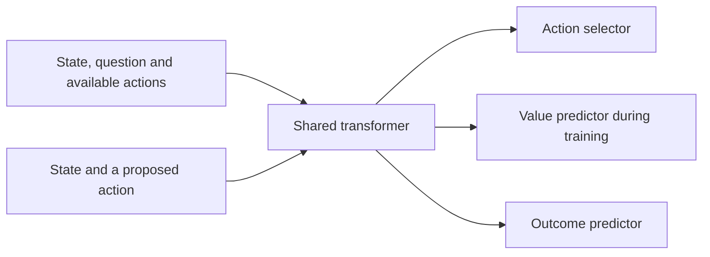

# Architecture as the experiment grows

DeBERTa and Qwen are both transformers. Classification is a training task, not
an alternative to a transformer architecture. First Instinct now has two
separate implementations:

| | Released small model | Larger experiment |
| --- | --- | --- |
| Foundation | DeBERTa encoder, about 141 million parameters | Qwen3.5, nominally four billion language parameters |
| Context | Question and state paired separately with each option | Question, state and all offered options in one context |
| Decision output | A learned scalar for each pair | Last-position scores for arbitrary option-label tokens |
| Adaptation | Encoder and scoring layer | Low-rank matrices throughout the language network |
| Inference | Options can be batched | One forward pass per question |

The Qwen experiment keeps its pretrained vocabulary projection and selects only
the logits of allowed labels. It does not generate an explanation. This gives
it a useful pretrained foundation and joint access to the offered options; it
does not establish a new architecture or reveal Jev's implementation. A larger
foundation also costs more to serve, so accuracy and latency both matter.

## Proposed next experiment: different targets on a shared foundation

The following components are **a proposal, not implemented by `scale_lab`**:

These tasks may use separate small output layers or separate typed questions.
Sharing weights does not mean every prediction can use the same input or that
one ordinary forward pass answers all questions.

| Output | Meaning | Training evidence |
| --- | --- | --- |
| Action distribution | Which action the policy will select | Demonstrations initially; sampled trajectories and rewards later |
| Outcome forecast | Probability of a specified event after a specified action | Observed or verified outcomes, with a defined time horizon and continuation policy |
| State value | Expected future reward under the current policy | Rewards and value targets from the current policy's trajectories |

An outcome could be “this retry creates a duplicate charge within this episode.”
Its probability is different from the probability of choosing `retry`. Forecasts
for different actions need not sum to one. A value may include inspection costs,
delays and penalties, and need not lie between zero and one.

Proximal Policy Optimization would update the selector from collected episodes
and use a learned value as a baseline for estimating which actions helped.
Outcome prediction would receive its own supervised loss and held-out outcome
evaluation. Sharing a network can introduce competing gradients; compare a
shared model with frozen or separately trained predictors before assuming the
combination helps. Proximal Policy Optimization alone does not produce calibrated
forecasts.

The environment must log what the policy actually knew, its available actions,
the selected action and sampling probability, observations received, costs,
rewards, and final verified outcomes. If only chosen actions are observed, the
data does not automatically reveal outcomes for unchosen actions. Randomized
exploration, recorded selection probabilities, or environments that can safely
evaluate alternatives make this distinction explicit. Future receipts belong
in targets and audit records, never in the earlier decision's input.

## Sharing computation across questions

For a causal model, a possible next optimization is a stable state prefix with
independent question branches that reuse its cached attention keys and values.
Each branch then reads the state and its own question/options. Independent
branches prevent one question's content from changing another's answer through
cross-question attention.

The current larger implementation does not do this: its prompt format is not
organized as a reusable state prefix, and it disables caching. A cached design
would need a revised prompt, careful cache ownership, and tests of cached versus
uncached predictions and cross-question independence. It should also be compared
with ordinary batching at the same workload; caching is not automatically faster.

The immediate research sequence is to establish the supervised baseline, collect
verified outcome trajectories, compare outcome forecasting and policy learning
under matched information, and then measure whether shared computation improves
the serving tradeoff. Data and experimental controls are as important as the
choice of transformer.
