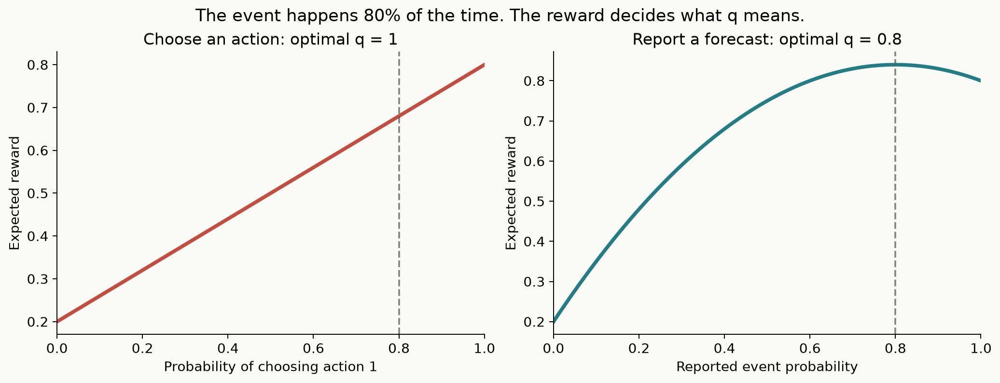
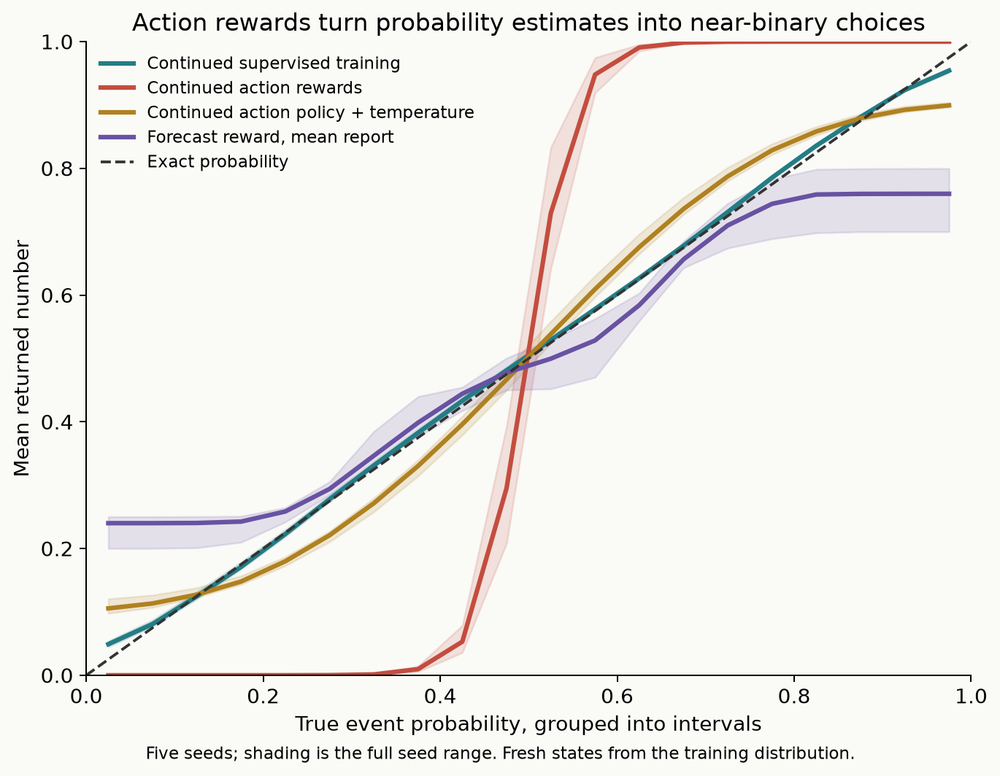
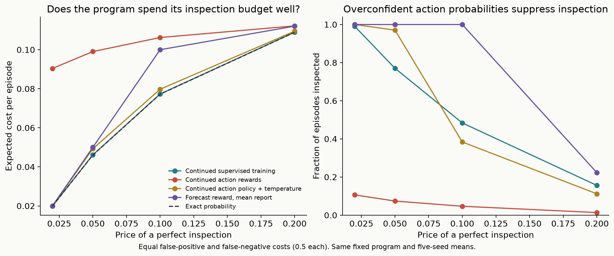
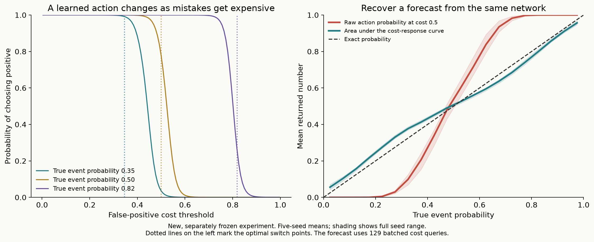
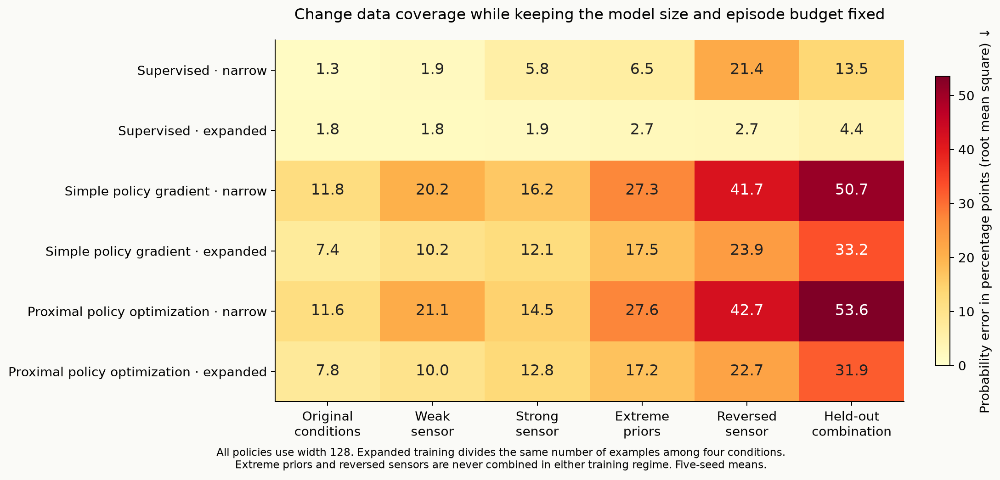
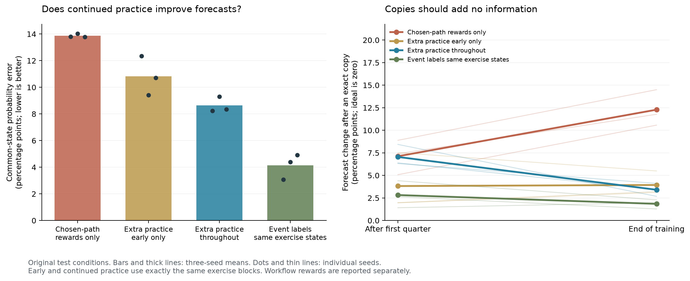

# A decision probability is not a confidence score

*Post draft · September 17, 2026 · [Code and experiments](https://github.com/catoenm/first-instinct)*

I trained two tiny models that both chose the right answer **77.43% of the time**.
Then I connected their outputs to the same program, which could pay for more
information before acting. Using one model cost the program more than twice as
much as using the other.

The difference was what their probabilities meant.

This started with [Jev's launch](https://typesafe.ai/blog/introducing-system-one-models-and-jev).
TypeSafe describes a model that returns structured decisions and probabilities,
trained with a method it calls Reinforcement Learning for Calibrated Decisions.
The public material I read does not disclose the exact reward or training
algorithm. I wanted to understand what such a training objective might need to
accomplish, so I built an inspectable experiment on my Mac.

I have not reverse-engineered Jev. What I can show is a small working laboratory
that separates choosing a good action from estimating how likely an event is.

## The 80% example

Suppose an event happens 80% of the time, and the model has no additional
information. There are two different questions we could ask it:

- **What is the probability of the event?** The right answer is 0.8.
- **Which answer should you choose to earn a point for being correct?** Always choose that the event happens.

If the model samples “yes” with probability 0.8, its chance of earning the point
is `0.8 × 0.8 + 0.2 × 0.2 = 0.68`. Always choosing “yes” earns 0.8.
Rewarding correct sampled actions therefore encourages its action probability
to approach 1, even though the event probability stays 0.8.

There is no contradiction. The model learned a good policy. The mistake is
reading “I choose yes almost every time” as “yes is almost certainly true.”

## A world where we can check the answer exactly

Each episode contains a hidden yes/no event and a noisy sensor. The model sees
three numbers: the event's prior probability, the sensor's reliability, and its
positive or negative reading. It never receives the exact probability after
the reading during training. We can calculate that probability with Bayes' rule
afterward to evaluate it.

The basic network has **1,217 parameters**. This is separate from First Instinct's
released text model: no language understanding, expensive hardware, or model
service is involved in this experiment.

I first trained a model on observed event labels using ordinary supervised
learning. Then I copied its weights into two runs. One continued the same
supervised training. The other sampled actions, received a scalar correctness
reward, and updated its action probabilities using a policy-gradient method.
Both saw the same fresh stream of episodes and the same additional training
budget.

The reward was detached from the computation graph. The gradient passed through
the probability of the sampled action, not through the environment. This is
actual one-step reinforcement learning. It does not require a game, a generated
explanation, or a long sequence of actions.

I repeated the comparison with five training seeds. Each stage used 2,048,000
synthetic episodes. Checkpoints were selected on separate observed validation
outcomes before opening a test of 32,768 new episodes. The complete protocol
was [committed before that test](https://github.com/catoenm/first-instinct/commit/7eb85468acc1eeac6a2ddcf41aee6fb9dd9452ea).

## Reward improved the policy, while changing the meaning of its output

| Continued training | Accuracy when taking the more likely action | Error against the true probability, root mean square | Expected Brier score |
| :--- | ---: | ---: | ---: |
| Supervised labels | 77.43% | 0.0125 | 0.1562 |
| Correctness rewards | 77.43% | 0.2327 | 0.2102 |
| Correctness rewards, then temperature correction | 77.43% | 0.0500 | 0.1586 |

These are five-seed means on fresh states from the training distribution. The
accuracy calculation integrates the simulator's outcome uncertainty. Both error
columns are better when smaller; the Brier score is squared probability error
against the event outcome, averaged over possible outcomes.

The reward-trained policy did improve at what it was trained to do. When actions
were **sampled** rather than chosen by taking the larger probability, expected
accuracy rose from about 68.8% to 77.3%. Its ordinary yes/no decision boundary
barely changed. Its probabilities did.

On roughly 85% of test cases, the reward policy assigned its preferred action
at least 99% probability. The expected correctness of those choices was about
81.4%. Again, that is a problem only if the action probability is presented as
confidence that the answer is true.

A standard [temperature correction](https://arxiv.org/abs/1706.04599), fitted on
8,192 separate labeled examples, repaired much of the distortion without
changing any yes/no choices. It did not fully recover the supervised model's
probability quality. This is an additional labeled-data step, not reward-only
training.

## Why a program cares

Now let code choose between acting immediately and buying a perfect inspection.
With equal mistake costs of 0.5 and an inspection price of 0.05, the program
should inspect whenever its uncertainty makes inspection cheaper than acting.

With the supervised model's forecast, the program inspected about **77%** of
episodes. With the reward policy's action probability substituted as a forecast,
it inspected only **7.4%**. It treated near-deterministic action selection as
near-certainty about the world.

Expected cost rose from **0.0461 to 0.0991 per episode**—about **2.15 times** as
much—despite the nearly identical yes/no accuracy. The rule for choosing actions
was identical in both cases.

That example is one of 25 prespecified combinations of mistake costs and
inspection prices. All settings and all seeds are included in the
[full results](calibration-results.md). The inspection program is fixed code;
we did not train a multi-step agent to operate it.

## Can we reward a probability forecast instead?

Yes. I also trained a policy whose actions were probability reports:
0, 0.05, 0.10, and so on up to 1. It sampled one report `q`, observed the
environment's scalar reward `1 - (q - outcome)^2`, and updated from that reward.

This reward belongs to a well-established family of
[proper scoring rules](https://sites.stat.washington.edu/people/raftery/Research/PDF/Gneiting2007jasa.pdf).
Its expected value is greatest at the true probability, or the nearest available
report on our grid. The policy probabilities over reports are still action
probabilities; the *report values* carry the event-probability meaning.

It worked better than treating a correctness policy as a forecaster, but ordinary
supervised learning was substantially better under the same from-scratch
episode budget. The forecast policy's mean report had an expected Brier score
of **0.1698**, versus **0.1563** for supervised log loss. Sampling reports actually
scored **0.1715**; averaging the reports removes some policy variance, so it is
important to report both.

In this binary toy world, knowing your action and whether it was correct already
reveals the event label. Reinforcement learning has no information advantage.
This experiment gives no reason to prefer a noisy reward estimator when direct
supervised feedback is available.

## A second experiment: ask the policy when it would change its mind

There is another way to connect actions to beliefs.

Keep the observation fixed and vary the relative cost of the two mistakes.
Let a false positive cost `t`, and a false negative cost `1-t`. An optimal policy
chooses positive when the event probability is greater than `t`.

For an event with probability 0.8, that policy chooses positive at 80% of the
thresholds between 0 and 1. **The area under its response across costs recovers
the event probability.** One fixed-cost action probability does not.

I tested this in a separately frozen follow-up with new validation and test
episodes. A 1,249-parameter network received the sensor observation plus a
random mistake-cost threshold, sampled an action, and learned from its realized
cost. At inference, I queried 129 thresholds and averaged the probabilities of
choosing positive.

On the fresh test from the training distribution, the same network's raw action
probability had a Brier score of **0.2175**. Integrating its responses across costs
reduced that to **0.1633**. Supervised learning still did better, at **0.1566**.

This is an illustration of established
[connections between probability losses and cost-sensitive decisions](https://jmlr.csail.mit.edu/papers/v12/reid11a.html),
not a new theorem. The finite trained network is imperfect, and those 129
queries cost real computation. On the stronger-sensor shift, integration
actually worsened the Brier score, from **0.0657 to 0.0855**. A sound principle
does not guarantee that a small trained model extrapolates correctly.

## I also tried a larger model and Proximal Policy Optimization

A fair objection was that the first result might depend on a particularly small
model or a simple training method. So I froze another experiment: **75 policy
runs**, five seeds, two sizes, and supervised learning versus simple policy
gradients versus [Proximal Policy Optimization](https://arxiv.org/abs/1707.06347).
The latter reuses sampled experience through a clipped update objective and
trains a separate network to estimate rewards.

The two widths give roughly 1,200–1,900 policy parameters and 17,000–20,000.
Every training stage still receives 2,048,000 episodes. Proximal Policy
Optimization does more updates and trains that additional value network, so
experience is matched but computation is not. These are comparisons of complete
training recipes, not a clean test of clipping alone.

On fresh ordinary conditions, the small forecast policy's average Brier score
improved from **0.1683 to 0.1657** with Proximal Policy Optimization. Results
varied across seeds, and supervised learning still scored **0.1562**. Increasing
width did not reliably help the reward-trained forecasts.

The original distinction also survived. After correctness-reward training,
both sizes and both reward methods made the right hard choice about **77.5%**
of the time. Reading their action probabilities as event forecasts still more
than doubled the example inspection program's cost compared with the supervised
continuation. A different optimizer does not change what a correctness reward
asks a policy to do.

The most useful additional result came from changing the data.

## Better coverage, with the same number of examples

Instead of only showing ordinary conditions, I divided the same training
budget among ordinary, weak or reversed, strong-sensor, and extreme-prior
conditions. A reversed sensor accurately announces that it is usually wrong;
its reading needs to be interpreted in the opposite direction.

I held out one combination entirely: **an extreme prior together with a reversed
sensor**. The broader training data contained both ingredients, but never in
the same episode. That tests whether the model can combine what it learned.

At the same width and budget, the supervised model's probability error on
reversed sensors fell from **21.4 to 2.7 percentage points**. On the unseen
combination, it fell from **13.5 to 4.4**. These errors are root mean squared
differences from the simulator's exact probability, averaged over five seeds.
Ordinary-condition error increased slightly, from 1.3 to 1.8 points, while the
broader mixture supplied fewer ordinary examples.

Both reward methods benefited from broader coverage too, but their probability
errors remained much larger. We published the failures as well as the gains.
This is a small controlled example of a practical data problem: **which situations
are missing from training?** Scraping another million unrelated documents would
not answer that question for this environment.

The environments run locally. They generate an observation, accept an action,
and return its score. No hosted game or external model service is needed.

[The full comparison](ppo-data-results.md) includes the frozen protocol, every
seed and test domain, saved weights, reproducible verification, and examples
you can run. The follow-up below adds a learned sequence of decisions.

## Learning to pay for evidence

I then built a two-step environment: stop with a report, or buy one additional
observation before reporting. Some sources provide independent evidence;
others explicitly copy the first reading. The eventual outcome reward credits
the earlier purchase decision.

The forecast learner initially stopped buying observations before it learned
to use them. An initial phase with a fixed 50% chance of inspecting helped.
Across three fresh training seeds, that data-collection change reduced lost
reward against the exact planner by **63%** under familiar conditions, at the
same root-episode budget. The model learned to inspect useful sources and paid
for copies in only **0.03% of copy cases**.

That did not make its reports generally reliable. On a common audit, forcing
it to see a copy still shifted its mean probability report by **11 percentage
points**, although the true event probability had not changed. It had learned
a useful acquisition policy while leaving substantial errors in forecasts on
states it rarely chose to visit. Direct-label training produced much better
forecasts, and unfamiliar reversed sensors exposed larger failures.

That is a useful distinction for a decision interface: good choices do not establish
that every number obtainable from the model is a calibrated belief. The
[complete follow-up](learned-inspection.md) includes all 12 models, the failed
no-exploration condition, four test domains, exact reconstruction, and a runnable
environment. It is still a small numeric simulation, not a language agent.

## Keeping forecasts in practice

I then changed the training data again. Alongside its normal decisions, the
model received exercises asking for a probability before and after an additional
observation, including copies. It had to practice forecasts even where its
own policy would usually choose a different action. The same outcome-based
reward scored each report.

I compared giving all these exercises early with spreading the **same examples,
in the same order**, throughout training. Across three fresh seeds, continued
practice reduced ordinary-condition probability error from **13.87 to 8.63
percentage points**, compared with 10.82 for early practice. Workflow return
improved in all three seeds versus chosen-path rewards alone. The network still
had 6,166 parameters. Direct-label learning on those exercise states remained
better, at 4.13 points, with a different output and training objective.

This did not solve calibration. A price increase that supplied no new evidence
still moved the continued-practice model's forecast by **5.07 percentage points**
on a separate paired test. On unfamiliar reversed sources, its probability error
improved but workflow reward declined in all three seeds. One decline exceeded
the meaningful-loss threshold fixed in advance. The early-practice models also
largely retained their initial gains, so this is not evidence that stopping
practice inevitably causes forgetting.

The practical question is about data coverage: **does training exercise all
the forecasts the calling program can ask for, or only the reports the policy
usually chooses to make?** Continued exercises helped here, but broader conditions
and stronger reference methods still matter. The
[full study](forecast-audit.md) preserves every model and failure. Its
[paired benchmark](probability-benchmark.md) also expresses 3,072 numeric cases
as 6,144 text requests, with exact answers kept separate. A Jev runner is ready;
no live Jev results have been collected.

## What this tells us about Jev—and what remains unknown

TypeSafe's claim about calibrated decisions is a meaningful training goal.
Simply rewarding a sampled choice for being correct does not establish that
its selection probability estimates truth. Proper forecast rewards, probability
estimation, and cost-sensitive policies offer different ways to connect decisions
to uncertainty. These experiments illustrate possibilities; they do not identify
the method Jev uses or test Jev itself.

The broader model idea also has precedents. First Instinct's text model is a
classifier with described candidate answers. Work on
[universal classifiers](https://arxiv.org/abs/2312.17543) and
[GLiClass](https://arxiv.org/abs/2508.07662) covers nearby ground; GLiClass already
studies reinforcement learning for classification. I am not claiming a new
architecture by adding a scorer or a reward loop.

What I can share is the experiment: tiny trained models, every training trace,
fresh tests, distribution shifts, and code that lets you change the price of
a mistake and see the resulting decision. The useful question for a decision
model is precise: **what quantity does this returned number estimate, and does
it remain useful when the surrounding program changes?**

[Run the laboratory and inspect the evidence →](calibration-results.md)
