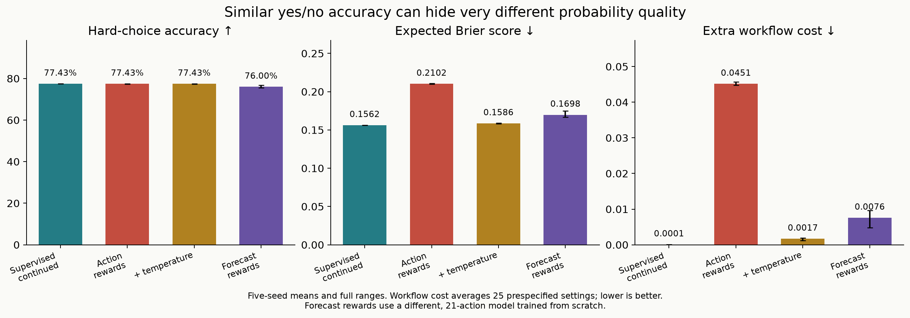

# Calibration laboratory: results and reproduction

**Action-selection probabilities and event probabilities are different quantities.**
In a paired continuation from the same supervised checkpoint, correctness rewards
preserved hard-choice accuracy at about 77.43% while greatly worsening the policy
output when interpreted as an event forecast. A separately tested cost-sensitive
policy recovered more useful forecasts by integrating its responses across costs.
Neither reward-based recipe beat ordinary supervised learning in this environment.

Read the [post draft](calibrated-decisions-post.md) for the explanation. This report
records the scope, denominators, controls, complete results, and reproduction steps.
These are small numeric experiments inspired by Jev's calibration claims; they
neither reproduce Jev nor update the released First Instinct v0.2 text model.

## Design and evidence

| Experiment | Main comparison | Follow-up |
| :--- | :--- | :--- |
| Frozen training code | [7eb8546](https://github.com/catoenm/first-instinct/commit/7eb85468acc1eeac6a2ddcf41aee6fb9dd9452ea) | [53c3389](https://github.com/catoenm/first-instinct/commit/53c3389) |
| Protocol | [Main protocol](calibration-experiment.md) | [Cost-policy protocol](calibration-thresholds-protocol.md) |
| Parameters | 1,217; 1,877 for the 21-report policy | 1,249 |
| New training recipes | Four from scratch, two continuations | One from scratch |
| Training seeds | 11, 23, 37, 53, 71 | Same five, separate environment streams |
| Budget per training stage | 2,000 updates × 1,024 episodes | Same |
| Validation | 8,192 episodes | 8,192 new episodes |
| Temperature fitting | 8,192 separate labeled episodes | Fixed main-experiment temperatures reused |
| Final tests | 32,768 states per domain × four domains | 32,768 new states per domain × four domains |

The two continued recipes each start from their seed's selected supervised-log-loss
model and receive an additional 2,048,000 episodes from a fresh matched stream.
They therefore consume twice the per-model training budget of a from-scratch
recipe. Temperature fitting is an extra labeled-data step. All methods within
each test share the same episodes. Training seeds characterize optimization
variability; they are not five independent samples of the evaluation population.

Primary errors are evaluated against the simulator's known conditional event
probabilities, integrating outcome uncertainty exactly on sampled states. These
are still finite samples of states, not exact population-wide measurements.
The models see only the prior, sensor reliability, reading, and—in the follow-up—
mistake threshold. Exact conditional probabilities never enter training,
checkpoint selection, or temperature fitting. Selection uses each recipe's own
observed validation objective, including the initial checkpoint.

The reward updates sample an action and receive a detached scalar reward.
An exact enumeration test verifies the independent-episode baseline's expected
policy gradient. In this simple binary world, action plus reward reveals the
event label; there is no hidden information advantage for reinforcement learning.
The downstream inspection program is fixed code, not a learned multi-step agent.

## Main test

| Recipe | Hard-choice accuracy | Expected Brier score ↓ | Root mean squared posterior error ↓ | Mean extra workflow cost ↓ |
| :--- | ---: | ---: | ---: | ---: |
| Supervised log loss, from scratch | 77.42% | 0.15627 | 0.01423 | 0.000081 |
| Supervised quadratic loss, from scratch | 77.42% | 0.15627 | 0.01426 | 0.000107 |
| Correctness reward, from scratch | 75.67% | 0.23733 | 0.28442 | 0.061980 |
| Forecast reward, mean report, from scratch | 76.00% | 0.16975 | 0.11631 | 0.007572 |
| Continued supervised training | 77.43% | 0.15622 | 0.01253 | 0.000068 |
| Continued correctness rewards | 77.43% | 0.21021 | 0.23268 | 0.045147 |
| Scratch correctness policy + temperature | 75.67% | 0.17726 | 0.14432 | 0.006208 |
| Continued correctness policy + temperature | 77.43% | 0.15857 | 0.05000 | 0.001688 |

Five-seed means on fresh states from the training distribution. Extra workflow
cost means expected cost above a policy using the exact posterior, averaged
equally across 25 prespecified settings. It is not a monetary estimate.
The full [tables](../results/calibration-v1/tables.md) include every seed,
all four domains, oracle references, and full seed ranges.

The continued supervised model's Brier range was 0.15620–0.15625; the continued
correctness policy's was 0.20973–0.21094. Hard-choice accuracy ranges overlapped:
77.423–77.439% versus 77.400–77.441%. This isolates the semantic issue much more
cleanly than the weaker from-scratch correctness-policy result.

The forecast policy returns the mean of its possible reports. Its actual
sampled-report Brier score was 0.17149, versus 0.16975 for the mean report and
0.17086 for the most probable report. An average can improve a noisy policy's
forecast; the published result does not hide that distinction.



## Distribution shifts

Training sensor reliability lies in 0.60–0.90 and priors in 0.15–0.85. Tests
separately weaken the sensor to 0.51–0.59, strengthen it to 0.91–0.99, or move
priors to 0.02–0.14 / 0.86–0.98. No shifted examples are used for training or
calibration.

| Main experiment, expected Brier score ↓ | Normal | Weaker sensor | Stronger sensor | Extreme priors |
| :--- | ---: | ---: | ---: | ---: |
| Continued supervised | 0.15622 | 0.20720 | 0.04730 | 0.06799 |
| Continued correctness rewards | 0.21021 | 0.29938 | 0.04948 | 0.07690 |
| Continued rewards + temperature | 0.15857 | 0.21245 | 0.05514 | 0.06844 |
| Forecast rewards, mean report | 0.16975 | 0.22631 | 0.09101 | 0.11588 |

The temperature that helps the normal distribution actually worsens Brier score
on the stronger-sensor shift relative to the uncorrected policy. Calibration
on one distribution does not establish reliable probabilities elsewhere.
Absolute scores across domains also reflect different intrinsic uncertainty;
compare methods within each domain.

## Cost-policy follow-up

The first experiment motivated this second one. Its protocol was committed
before opening its own fresh final test; it is not retroactively part of the
first experiment's preregistration. Original reference models were evaluated
on these new states without retraining or retuning.

| Follow-up, expected Brier score ↓ | Normal | Weaker sensor | Stronger sensor | Extreme priors |
| :--- | ---: | ---: | ---: | ---: |
| Cost policy's raw action probability at threshold 0.5 | 0.21751 | 0.35910 | 0.06568 | 0.07949 |
| Same policy, integrated across thresholds | 0.16335 | 0.23552 | 0.08548 | 0.07474 |
| Fixed supervised-log-loss reference | 0.15657 | 0.20731 | 0.04739 | 0.06850 |

Integration improves on the raw policy in three domains and worsens it in the
stronger-sensor domain. It does not match the supervised reference. Normal-domain
posterior error drops from 0.24727 to 0.08356; average extra workflow cost drops
from 0.04762 to 0.00227. Probability recovery is approximate, not a calibration
guarantee. No tested response curve increased with threshold by more than 0.0001
on the 129-point grid, but monotonicity alone does not establish correctness.

## Reproduce or inspect

Use Python 3.14 in the repository. The laboratory runs on the central processor,
with four PyTorch threads; it needs no accelerator or model service. Tested on
an Apple M5 Max. The numeric data is generated locally and the laboratory
weights and data are released under the repository's MIT license.

```bash
python -m pip install -r requirements-calibration.txt
python -m calibration_lab.download

python -m calibration_lab.demo \
  --main-run output/pretrained/first-instinct-calibration-v1/main \
  --threshold-run output/pretrained/first-instinct-calibration-v1/thresholds \
  --prior 0.5 --reliability 0.8 --signal 1 \
  --mistake-threshold 0.5 --inspection-cost 0.05
```

The [calibration-v1 release](https://github.com/catoenm/first-instinct/releases/tag/calibration-v1)
is approximately **345 MB**, mostly per-example evidence. It contains all 35
newly trained models, initial weights, 70,000 update records,
per-example forecasts, cost-response curves, and frozen code. The downloader
verifies the archive checksum, both experiment manifests, and every artifact.
This release is an experiment bundle, not a new version of the text model.

Reconstruct the results and make the five figures:

```bash
python -m pip install -r requirements-calibration-figures.txt
python -m calibration_lab.analyze \
  output/pretrained/first-instinct-calibration-v1/main \
  --output output/reconstructed-main --figures output/reconstructed-figures
python -m calibration_lab.analyze_thresholds \
  output/pretrained/first-instinct-calibration-v1/thresholds \
  --reference-run output/pretrained/first-instinct-calibration-v1/main \
  --output output/reconstructed-thresholds --figures output/reconstructed-figures
```

Retrain all recipes, using the first command's printed run directory in the second:

```bash
python -m calibration_lab.train
python -m calibration_lab.thresholds --reference-run output/calibration_runs/<printed-run-directory>
```

Use `--pilot --seeds 101` for development-only runs that do not open final tests.
If experimenting with new hyperparameters after reading these results, reserve
new evaluation seeds. Reusing this published test is reproduction, not fresh
evidence for a newly tuned method.

The [main verification](../results/calibration-v1/verification.json) reconstructed
160 model/domain evaluations; the [follow-up verification](../results/calibration-v1/thresholds/verification.json)
reconstructed 200. All reloaded predictions matched the saved values exactly
on the measured machine. Training streams, reward examples, selected checkpoints,
and cost calculations were also checked. Cross-platform floating-point identity
is not promised; package versions and frozen snapshots accompany each run.

## Limits and useful next experiments

This is one synthetic binary world. It tests neither language generalization
nor Jev, and the small networks do not establish an efficient production design.
Five seeds cannot capture all optimization variability. The finite forecast
grid, policy exploration, network capacity, and chosen budget may limit the
reward-trained recipes; these results are not universal rankings of algorithms.
Mean reliability curves can hide errors within each probability bin, which is
why per-example posterior error and decision cost are also reported.

A next independent experiment could learn the inspection action itself under
partial feedback, where information acquisition affects future observations.
Another could test verified textual decisions while preserving uncertainty
under task and wording changes. Those would require new protocols and fresh
tests; neither has been completed here.
