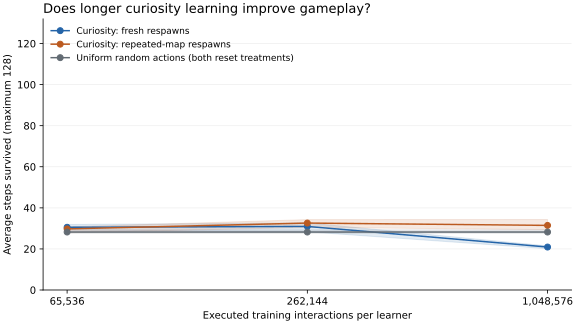

# Longer curiosity learning and repeated-map respawns

**Four times the per-agent training did not produce competent gameplay. With
fresh-map respawns, it made survival substantially worse. Repeated-map respawns
prevented most of that deterioration, but their average survival stayed near the
random-action baseline.** This narrows the diagnosis beyond simply needing more
training. It does not prove that curiosity cannot work.

This is the separate 40,042-parameter game experiment. The
[prospective protocol](curiosity-reset-v1.md) fixed the comparison before training:
equal curiosity weights, four conditions, three learner seeds, and three saved
stages. There was no genetic search or selection of a winning checkpoint.
The [audited aggregate results and receipts](../results/curiosity-reset-v1/summary.json)
include per-learner measurements and the preserved source/checkpoint identities.

## What changed

The previous learner combined novelty of observations, disagreement between three
predictors, and prediction improvement on the batch just used for learning. That
same formula and neural architecture were held fixed. Both treatments changed
all maps every 256 environment steps. Between those scheduled changes, respawning
either generated a fresh map or restored the current map's original state.

Uniform random-action controls trained predictors under both reset treatments.
Every learner received 1,048,576 executed interactions. Saved checkpoints at
65,536, 262,144, and 1,048,576 interactions preserve the same ongoing learning
trajectory, including environments, optimizers, and curiosity statistics.

No game score, survival reward, food bonus, or terminal penalty entered learning
or selection. Reset categories were recorded only for diagnostics. All model
choices were frozen before game evaluation. The internal curiosity reward remains
an objective; this is not learning without any optimization target.

## Gameplay on unseen maps

Each value averages 64 maps under three learner seeds. These are **64 unique
maps**, shared across all methods and stages, rather than 192 independent maps.
Survival is capped at 128 steps. The two random-action controls produce identical
gameplay because their uniform action rule is unchanged.

| Training interactions per learner | Curiosity, fresh respawns | Curiosity, repeated-map respawns | Random actions |
| ---: | ---: | ---: | ---: |
| 65,536 | 30.54 | 29.75 | 28.22 |
| 262,144 | 30.95 | 32.59 | 28.22 |
| 1,048,576 | **20.91** | **31.45** | **28.22** |

Lines show averages; bands span the three learner-seed means, not confidence
intervals. Fresh-respawn survival deteriorated under every seed: 32.67→20.11,
28.31→21.17, and 31.86→21.45 steps. Repeated-map results at the last stage were
34.30, 29.41, and 30.66 steps. Six of 192 repeated-map evaluation episodes lasted
the full 128 steps; none did for the final fresh-respawn agents or random actions.
This limited success does not establish robust survival.

The deterioration is visible in actions and outcomes. For fresh-respawn agents,
average food collected per episode fell from 0.92 to 0.22 between the middle and
last checkpoints. The fraction of executed actions ending on a hazard increased
from 5.86% to 10.61%. Repeated-map agents collected 1.14 food per episode at the
last stage, but their hazard exposure also increased, to 8.48%. Random actions
had 4.78% hazard exposure. These are frozen evaluation measurements, not training
rewards or signals used to choose the run's duration.

## Prediction improved while decisions deteriorated

The final prediction check excludes respawn transitions and measures ordinary
movement separately. It averages the fresh/repeated probe treatments equally,
under two predeclared action distributions. Lower error is better.

| Final learner | Ordinary prediction error, random-action probes | Ordinary prediction error, directional-sweep probes |
| --- | ---: | ---: |
| Curiosity, fresh respawns | 0.050559 | 0.051809 |
| Curiosity, repeated-map respawns | 0.049919 | 0.051209 |
| Random actions, fresh respawns | **0.045873** | **0.046945** |
| Random actions, repeated-map respawns | 0.045968 | 0.047056 |

Longer learning reduced fresh-curiosity error on ordinary random-action probes
from 0.056933 to 0.050559, even while its survival fell. Prediction learning and
useful action selection diverged within the same continued learners.

Repeated-map curiosity improved error by only 1.27% on random-action probes and
1.15% on sweep probes relative to fresh-map curiosity. It was 8.59% and 8.83%
worse than repeated-map random-action training. These percentages average the
three per-seed relative differences. The predefined check required at least 5%
improvement over both comparators on both probe distributions, with no seed
loss. **It failed.** No run extension or cloud rental followed.

## What the reset comparison establishes

The repeated-map intervention changes the reward pattern: late fresh-map
respawns receive 8.1% more curiosity reward than ordinary moves, while late
repeated-map respawns receive 5.6% less. These are event-count-weighted means over
the last 64 updates across three seeds. The treatment also changes how many distinct
maps agents encounter and how often observations repeat. We therefore cannot
attribute the gameplay difference specifically to a reset reward bonus.

The progress diagnostic also warrants attention. In those last 64 updates, mean
prediction error on the batch used for learning fell by about 0.00014 per update
for both curiosity treatments. On the fixed withheld observations, the sampled
before/after changes averaged a reduction of only 0.0000066 for fresh respawns
and an increase of 0.0000069 for repeated-map respawns. Monitoring covered two
updates per seed in this window. The withheld distribution also differs from
the agent's changing experience, so this is a generalization warning, not a
controlled proof that prediction progress is rewarding noise.

The evidence supports a narrower conclusion: **this reset policy materially
changes the outcome of prolonged curiosity training, and the fresh-map recipe
gets worse with more learning.** It does not establish that a reset correction
alone produces a useful objective, that larger models would fail, or that all
curiosity formulations behave this way.

The policy and predictors are separate networks. Predictors affect action learning
through curiosity rewards; the policy does not use their forecasts to plan future
action sequences. Improved prediction therefore need not translate into better
control. This architectural limit was unchanged between conditions.

## Consumption and verification

The run completed 12,582,912 training transitions across twelve learners. It made
73,728 actor optimizer minibatch updates and 24,576 predictor optimizer steps.
Repeated sample presentations were 18,874,368 for the actor and 37,748,736 across
the three bootstrapped predictors. The 36 milestone states are checkpoints of
twelve continuing learners; the final root saves duplicate the last milestone.
Separate probes consumed 32,768 transitions. Game evaluation executed 2,304
episodes and 66,337 actions on 64 unique maps. These are one authored game
mechanism, not millions of different tasks.

Training initialized 115,747 distinct world-seed identities; 115,651 received
actions. These identities are shared across matched conditions and exclude
repeat initialization presentations. The eight probe streams initialized 696
other worlds. All probe and game identities were disjoint from training.

Training and final evaluation finished in 452.67 seconds (7.5 minutes), with
peak resident memory below 536 MB and no added swap. Paid compute was $0. The
full suite passed 1,222 tests with 29 optional skips. Focused tests proved that
diagnostic observers and milestone saves preserve exact final and early weights;
the default learner also reproduced the frozen previous source's weights,
predictors, training log, and learning state exactly in a bounded comparison.
A separate-namespace end-to-end smoke run and independent audit passed before launch.

The final independent audit **passed**. Separate scalar dynamics replayed all
32,768 probe labels, all 2,304 game episodes, and the first 512 training ticks
of each lane (196,608 training actions), including scheduled world changes.
All 12,582,912 training actions were also replayed with the recorded environment
implementation to verify reset labels and world accounting. The audit checked
36 milestone states, continued learning counts, frozen choices, and 1,284
recorded animation decisions/probabilities. It did not replay optimizer gradients.
The audit took 243.22 seconds, peaked below 790 MB, and added no swap.

Qualified source revision: `fac0956`. Original source copies, probe banks,
checkpoints, training action/reset traces, and game trajectories remain under
ignored `output/curiosity-reset-v1/`. Earlier experiments and their hashes are
preserved. The original budget remains available; this run used no RunPod rental.

## Next useful test

Test the curiosity objective on a controlled choice between learnable dynamics
and unpredictable observations. In particular, compare improvement on the same
examples just used for training with improvement on independent observations of
the same mechanism. The current progress term uses the former and clips negative
changes to zero; it can reward changes that do not generalize. This is a plausible
failure mode, not a cause established by the present comparison.

That diagnostic should demonstrate a useful preference before another genetic
search, larger network, or rented training run. Keep task rewards excluded and
reserve new worlds for any subsequent gameplay claim; this evaluation bank has
now been exposed.
