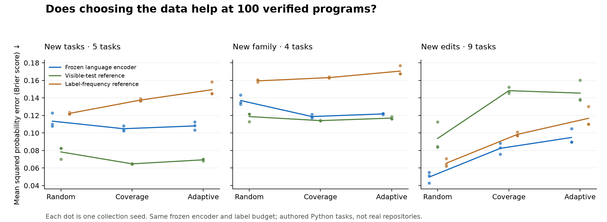

# Executable evidence: auditing the data before reinforcement learning

Can choosing which programs to verify teach a small model to make better
probability forecasts? We built a local pilot with **24 authored Python tasks**,
three data-collection strategies, and three collection seeds. Each collector
gets exactly **100 private-suite queries**. A frozen language encoder reads
the contract, candidate code and visible test results; a trained scalar head
predicts whether the candidate will pass a separate 32-input suite.

Coverage sampling modestly improved forecasts on new tasks. Random sampling
did better on unfamiliar edit mechanisms. A reference that only reads visible
test verdicts beat the language model on the main new-task comparison.
The more useful result is the audit trail: **which examples we collect, what
the verifier actually checks, and which evidence the model sees all matter.**

This is a data-collection experiment with direct-label learning. The
[earlier numeric experiments](forecast-audit.md) contain reinforcement learning;
this pilot does not. It does not identify Jev's training method.

## The comparison

Every recipe starts with the same seed-dependent 20 examples, then buys five
batches of 16 labels. Random sampling picks uniformly. Coverage balances
task-by-edit groups. Adaptive sampling favors uncertain forecasts and
inconsistency under copied evidence or changed inspection prices, with 25%
uniform exploration. It chooses before seeing the private outcome.

All recipes use the same frozen 141.3-million-parameter DeBERTa-v3-small encoder,
769-parameter prediction head, training steps, four text views per acquired
program, and final-round selection rule. The encoder was not fine-tuned.
The visible-test reference learns from three numbers: whether a check failed,
the fraction that failed, and the number of distinct checks. A third reference
always predicts the acquired labels' smoothed pass rate.

The table reports mean squared probability error, also called Brier score.
**Lower is better.** Values average collection seeds 11, 23 and 37.

| Final domain | Collection | Language encoder | Visible-test reference | Label-frequency reference |
| :--- | :--- | ---: | ---: | ---: |
| New tasks | Random | 0.11346 | 0.07837 | 0.12230 |
| New tasks | Coverage | **0.10483** | **0.06475** | 0.13754 |
| New tasks | Adaptive | 0.10802 | 0.06935 | 0.14931 |
| New family | Random | 0.13699 | 0.11868 | 0.15941 |
| New family | Coverage | **0.11871** | **0.11408** | 0.16312 |
| New family | Adaptive | 0.12171 | 0.11694 | 0.17057 |
| New edit mechanisms | Random | **0.04962** | **0.09371** | 0.06545 |
| New edit mechanisms | Coverage | 0.08243 | 0.14824 | 0.09835 |
| New edit mechanisms | Adaptive | 0.09484 | 0.14544 | 0.11674 |



The main comparison has **113 candidates across five new tasks**. The new-family
set has 61 candidates across four tasks. The edit-mechanism set has 35 candidates
across the same nine final tasks; it combines task transfer with new edit
mechanisms. Candidates and their four views are related, not independent trials.
Three collection seeds are a small sensitivity check, not a broad statistical
guarantee. [Every seed, view and domain is retained](../results/executable-evidence-v1/evaluation/results.json).

Coverage beat random sampling on the main language-model comparison in all
three seeds, reducing mean Brier score by about 7.6%. Adaptive sampling beat
random in two of three seeds. Both lost to random in every seed on new edit
mechanisms. The new-edit population contains only **2 private-suite passes in
35 cases**, so rejecting most programs already performs well there.

The collection rule also changed the acquired label mix. Random runs acquired
an average of **15.7 passing programs per 100**, coverage 26.3, and adaptive 30.3.
That is measured enrichment, not evidence of better calibration. Selection bias
is a plausible contributor to the transfer failure; this experiment does not
isolate it from the other differences in the selected programs. The logs retain
conditional draw probabilities, not marginal inclusion probabilities; simply
weighting examples by their inverse would not automatically correct the bias.

## What the verifier audit found

The final pool contains 211 candidate programs. Two have unstable detailed
private executions and are retained without a metric label, leaving 209 scored
candidates. Of those:

- **31 of 59** programs passing both visible checks fail the private suite.
- **12 of 191** scored mutation proposals pass the private suite. A mutation's
  intention is not a trustworthy failure label, and passing does not prove
  the mutation preserved the full contract.
- **Two** programs pass the private suite despite failing a visible check.
  The suites deliberately use different inputs. Private-suite success is
  therefore a narrower target than program correctness.

Here is a saved example. The contract asks whether a string is a palindrome:

```python
def solve(s):
    return s == s[::-2]
```

The `-2` skips characters while moving backward; reversing the string requires
`-1`. Both revealed examples were non-palindromes, and the candidate correctly
returned `False` on both. A private fixture, `"aba"`, exposes the mistake:
the candidate returns `False` when the contract requires `True`. Eight of its
32 private checks fail. This is a concrete reason to include targeted cases,
rather than treating two successful executions as a correctness label.

One reverse counterexample fails on the visible input `s="", needle=""` but
passes its private suite. We retain that result because the declared target is
private-suite passage. A system deciding whether to accept the program should
also enforce every already-known failing check. We have not silently changed
the target after seeing these cases.

The [analysis file](../results/executable-evidence-v1/analysis.json) contains all
31 visible-pass/private-fail examples, per-task scores, collection counts and
quarantined identifiers. The full receipts include both directions of mismatch.

## Probability consistency remains poor

Every acquired candidate produces four views: two visible checks; those checks
plus an explicitly identified copy; a third distinct check; and a higher price
assigned independently of correctness. All four share the same target label.

Even with these examples in training, a copy moved the coverage-trained model's
forecast by an average of **24.65 percentage points on the new family**. Its
mean copy change was 10.26 points on new tasks and 17.56 on new edit mechanisms.
Price changes had smaller effects, around 0.3 points. The engineered reference
ignores copies and prices by construction; its zero change is not a learned
capability. Its forecast accuracy must still be evaluated separately.

A new check did not consistently help either. For coverage, Brier score improved
from 0.10483 to 0.09498 on new tasks, but worsened from 0.11871 to 0.12206 on the
new family and from 0.08243 to 0.10308 on new edit mechanisms. Brier score combines
calibration and discrimination; it is not a pure calibration measurement.

**No model or reference assigned at least 90% pass probability to any scored
initial-view final candidate.** Zero erroneous automatic approvals at that
threshold therefore establishes no useful approval capability.

## What is preserved

The data factory records the contract, code hash, source parent, edit operation,
visible executions, exact request text, private receipt and query cost. It never
labels a program merely because an edit was intended to break it. Whole tasks
stay in one split. There are no exact training/final code-hash overlaps, but
these small programs share common patterns and are not a contamination-free
benchmark of code understanding.

Training has 188 candidates across ten tasks, with 76 candidates across five
other tasks for diagnostic validation. Validation never selects the final
checkpoint. The final artifacts contain source snapshots, every collection-round
head, predictions, cached language vectors, execution receipts and selection
logs. Cases and metadata are separate from the text passed to the encoder;
the model sees no task identifier, edit mechanism, split or private result.
The longest context was 463 tokens, and no input was truncated.

Each acquisition costs 64 private test executions: 32 inputs, each run twice.
Each collector therefore uses 6,400 logical private test executions. Shared
screening, feature extraction, validation and final evaluation have separate
costs. A cache saves repeated physical execution across collectors; both logical
costs and measured new execution time are reported. Query budgets match, not
wall-clock time or money. Nine collectors' fitting and training-label acquisition
took **16.9 seconds** on the personal Mac, excluding the shared work and development.

The first final attempt stopped on a verifier inconsistency before producing
aggregate metrics: a broken dictionary comprehension raised different exception
types depending on set iteration order. The
[protocol amendment](executable-evidence-protocol.md#verifier-amendment-after-the-first-final-attempt)
pins two distinct Python hash seeds and saves disagreement witnesses. Both
attempts and the development run are retained. The repair changed **none of
the parameters in all 54 collection-round checkpoints** or the development
feature bytes. [Comparison receipt →](../results/executable-evidence-v1/repair-comparison.json)

The original source freeze was `0e9115e`; the correction was frozen at
`33c30ba` before repeating the same experiment. This is a disclosed repair
using the same test definitions, not an untouched second holdout. Two hash
seeds and finite tests do not establish general determinism or correctness.
The worker accepts a limited authored Python subset; it is not a secure sandbox
for arbitrary downloaded code. Both reference paths were authored here, without
independent human review.

## Reproduce and inspect

The [artifact guide](../results/executable-evidence-v1/README.md) describes the
files and archives. The saved vectors let the verifier reconstruct selection,
all learned heads and final metrics without downloading the encoder:

```bash
python -m pip install -r requirements-calibration.txt
python -m evidence_lab.verify
python -m evidence_lab.demo
```

The replay executes candidate code again, checks source and data hashes, and
reconstructs 108 fitted heads and all 81 domain/reference/model result rows.
It checks the language-vector checksum and exact input text; it does not rerun
the encoder. See the [verification receipt](../results/executable-evidence-v1/verification.json).
All 86 offline unit tests passed on the training machine.

To rerun generation, encoding, training and evaluation in a new directory:

```bash
python -m pip install -r requirements-decision-lock.txt
hf download microsoft/deberta-v3-small \
  --revision a36c739020e01763fe789b4b85e2df55d6180012 \
  --include '*.json' --include '*.txt' --include 'spm.model' --include 'pytorch_model.bin'
HF_HUB_OFFLINE=1 python -m evidence_lab.study --output output/my-evidence-run --device mps
```

Use `--device cpu` without an Apple accelerator. Python 3.14 and the pinned
dependencies were used. Install `requirements-calibration-figures.txt` to redraw
the figure with `python -m evidence_lab.analysis --output output/evidence-analysis.json
--figure output/evidence-comparison.png`.

## Where this leads

The next useful experiment should strengthen the evidence before scaling the
learner: combine known failures with an explicit acceptance rule, add targeted
edge cases and independently reviewed references, and test collection on a
small number of real repositories held out by repository. Reserve a random
evaluation stream so an adaptive collector cannot redefine the population
on which its confidence is judged.

Then the same records can support an inspection environment: reveal another
check or stop, report a probability, and score that report against the declared
outcome while charging for inspection. The direct-label and visible-test
references here provide necessary comparisons for that reinforcement-learning
experiment. That software inspection policy has not yet been trained.

[SWE-smith](https://arxiv.org/html/2504.21798v1) is established prior work for
building executable software environments and synthesizing test-verified bugs
at scale. Our authored functions are a much smaller pilot; we did not import
its repository tasks. Neither active collection nor learning probability
forecasts from outcomes is presented as a new invention.

TypeSafe's [probability-returning primitives](https://docs.typesafe.ai/primitives)
motivate checking whether copies, costs and fresh evidence produce sensible
forecast behavior. These measurements concern our models. No Jev calls or
Jev accuracy results are included.
