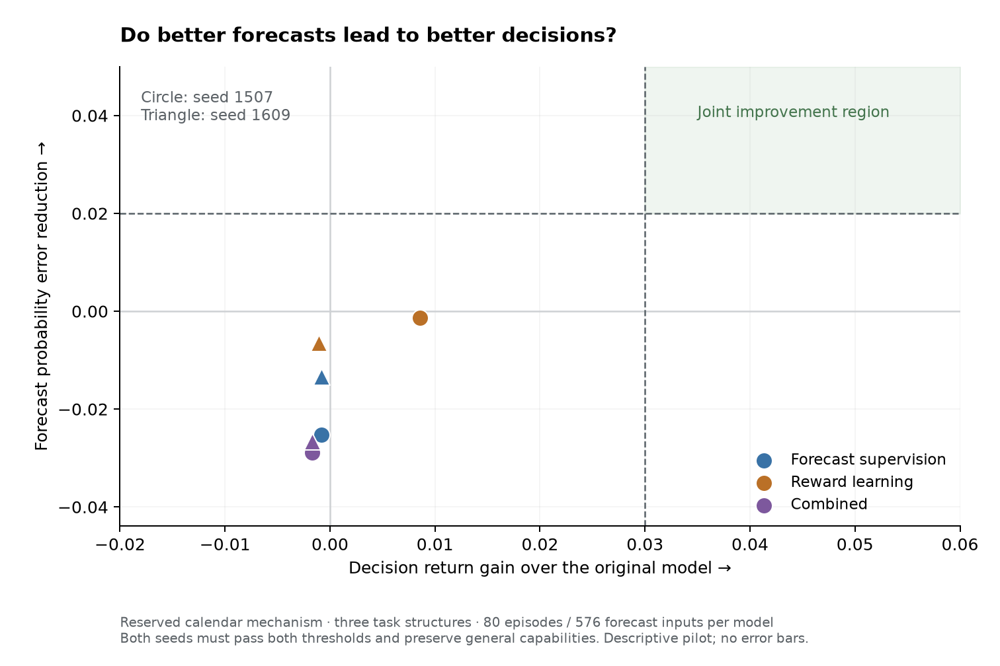
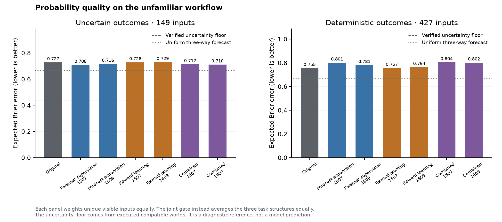

# More executable mechanisms did not produce joint transfer gains

**None of the three methods passed the predefined improvement gate.** Training
and the independent final audit completed. Forecast supervision, reward-only
Proximal Policy Optimization, and their combination all retained the original
model's 50 successful calendar episodes out of 80. Combined training improved
development decisions and forecasts, but its overall forecast error became worse
on the unfamiliar calendar mechanism. General-task performance stayed within
the allowed limits. The demo therefore keeps its supervised checkpoint.

This is a negative result for this particular learning recipe and small authored
curriculum, not proof that reinforcement learning cannot improve decision models.
We are not extending this run or renting more hardware to repeat it at scale.

## The complete comparison

Each method started from the identical original supervised step-2742 Qwen3.5-9B
adapter. Seeds, schedules, general replay, selection rules and transfer ownership
were frozen before launch. Calendar scores remained unopened during checkpoint
selection; the final audit opened them after complete recovery and pod deletion.

| Method / seed | Accepted updates | Selected update | Calendar return ↑ | Completed | Expected Brier error ↓ |
| --- | ---: | ---: | ---: | ---: | ---: |
| Original supervised model | 0 | 0 | 0.4546 | 50 / 80 | 0.7142 |
| Forecast supervision / 1507 | 40 | 40 | 0.4538 | 50 / 80 | 0.7395 |
| Forecast supervision / 1609 | 30 | 10 | 0.4538 | 50 / 80 | 0.7276 |
| Reward learning / 1507 | 40 | 20 | 0.4631 | 50 / 80 | 0.7156 |
| Reward learning / 1609 | 40 | 40 | 0.4535 | 50 / 80 | 0.7207 |
| Combined / 1507 | 40 | 40 | 0.4529 | 50 / 80 | 0.7431 |
| Combined / 1609 | 40 | 40 | 0.4529 | 50 / 80 | 0.7407 |

Return is verified terminal utility minus future action costs. Return and Brier
average the three calendar task structures equally. The completed column counts
actual episodes; it is not the structure-balanced success rate. The threshold
required return gain of at least **0.03** and expected-Brier reduction of at least
**0.02**, in both seeds, while preserving both general retention and general
transfer. No arm passed even the two calendar requirements together.

Reward-only seed 1507 avoided one incorrect mutation: nine rather than ten out
of 80 episodes. That explains most of its small return gain; it did not complete
another task, and the second seed did not reproduce that reduction. The combined
arms made the same number of successful and incorrect terminal decisions as the
original, while paying slightly more for observations/actions.

General retention accuracy ranged from **86.52% to 87.15%**, versus 87.05% at
the start. General-transfer accuracy ranged from **77.72% to 78.13%**, versus
77.94%. All corresponding accuracy and log-loss limits passed. The full
[audit](../results/expanded-decisions-v1-final/audit.json) records all measurements,
including case-weighted and per-regime results.

Forecast-only seed 1609 correctly stopped at update 30 after two non-improving
development evaluations and kept update 10. Reward-only seed 1507 stopped on
the same plateau rule at update 40 and kept update 20. There were **230 accepted
updates and zero rejected updates**. Earlier and later checkpoints remain saved
separately; no checkpoint was reselected using the opened calendar results.

## The probability result is not hidden by an overall average

The transfer set contains 576 distinct forecast inputs, including 149 whose
identical visible observations allow genuinely different executed outcomes.
Forecast-trained models modestly improved on that uncertain subset, but became
worse on the 427 deterministic inputs. Both combined seeds worsened the total
forecast score in **every** calendar task structure.

| Structure | Original return | Combined return, both seeds | Original Brier | Combined Brier, 1507 / 1609 |
| --- | ---: | ---: | ---: | ---: |
| Interval overlap / adjacency | 0.6373 | 0.6340 | 0.6964 | 0.7325 / 0.7297 |
| Repeated local-time occurrence | 0.2575 | 0.2556 | 0.8493 | 0.8932 / 0.8908 |
| Atomic rescheduling | 0.4690 | 0.4690 | 0.5969 | 0.6037 / 0.6017 |

A uniform three-way forecast has expected Brier error **2/3**, regardless of
the outcome distribution. Every model's aggregate calendar Brier was worse
than that simple reference, including the unchanged original. Forecasting here
is not yet a convincing calibrated capability. The executed finite-world prior
gives an irreducible structure-balanced error of 0.1117; on the uncertain subset
alone, the input-weighted floor is 0.4337. These diagnostic references do not use
model predictions as labels and did not select checkpoints.

Combined development return improved from 0.2622 to 0.4017/0.4039, and Brier
improved from 0.6411 to 0.5385/0.5400. That did not transfer. The development
mechanism shares conventions with parts of the training curriculum; doing better
there is insufficient evidence of a general decision engine. This is a possible
limitation of the experiment's coverage, not a demonstrated causal explanation.

## What was actually consumed

The prepared training pool comprised five mechanisms, six authored task-root
groups, 40 concrete world-and-goal tasks, and 268 context/cost/history cases.
Its 4,232 source forecast rows collapsed to 2,280 unique visible inputs, including
380 uncertain inputs. General replay had 4,096 questions. Preparation counts are
distinct from optimizer presentations:

| Arm | Live training episodes | Policy presentations / question IDs | Forecast presentations / unique inputs | Replay presentations / question IDs |
| --- | ---: | ---: | ---: | ---: |
| Forecast / 1507 | 0 | 0 / 0 | 800 / 800 | 640 / 589 |
| Forecast / 1609 | 0 | 0 / 0 | 600 / 600 | 480 / 451 |
| Reward / 1507 | 1,200 | 3,028 / 1,670 | 0 / 0 | 640 / 589 |
| Reward / 1609 | 1,200 | 2,965 / 1,645 | 0 / 0 | 640 / 592 |
| Combined / 1507 | 1,200 | 2,989 / 1,643 | 800 / 800 | 640 / 589 |
| Combined / 1609 | 1,200 | 2,956 / 1,629 | 800 / 800 | 640 / 592 |

Across all arms, the study executed **4,800 live training episodes** and 1,604
separate evaluation episodes. The optimizer consumed 11,938 policy presentations,
3,000 forecast presentations and 3,680 replay presentations. Their respective
unions contain 3,280 question identities, 1,241 forecast inputs and 1,100 replay
questions. Policy identities collapse further to **2,714 exact model token
inputs**: different hidden worlds can present the same question. Reuse across
updates and control arms is not additional data diversity. Another 852 backward
presentations measured component gradients without optimizer updates.

The consumed forecasts reference 2,521 distinct original branch receipts across
the five source mechanisms. These were preexecuted label branches, not new
counterfactual executions during training. Live policy trajectories are counted
separately. Related worlds, goals, histories, costs and wording remain within
their source ownership. The new calendar transfer mechanism represents only
12 initial databases, 16 world-and-goal tasks and three related structures;
its 80 cases are not 80 independent task families.

The executable workflows use actual shell commands, ToolSandbox application
tools, filesystem mutations and SQLite transactions. Independent state checks
determine rewards. Menus remain authored; this is not a dynamic-proposer study
or an official Harbor benchmark. The data and receipt bundle retains exactly
which history, command, continuation and compatible worlds support each label.

## Checkpoints, recovery and cost

All seven starts matched the original tensor hash, and every selected and latest
adapter passed independent byte, tensor and change checks. Each selected trained
checkpoint changed all 496 internal adapter tensors, with 43,278,336 trainable
elements available. The large foundation matrices remain frozen; internal
language transformations learn through those adapters. This was not merely
training a classifier after a frozen model's generated answer.

The foundation revision is `c202236235762e1c871ad0ccb60c8ee5ba337b9a`; original
adapter SHA256 is `882323ebe8a7c33edf89b7dd2938a977b00dfd7cb38551e8d68db4ae36128e1a`.
The [checkpoint audit](../results/expanded-decisions-v1-final/checkpoint-audit.json)
records every selected and latest hash. The
[mechanics note](expanded-decisions-v1-interpretation.md) explains the single-pass
policy update, detached critic and distinct forecast/actor continuation contracts.

All 514 files in the 1,983,749,467-byte archive were verified before deletion.
The original six-hour provider deadline stopped the GPU during a laptop
disconnect. An interrupted download required a separate bounded recovery restart;
no new training occurred. A zero-GPU request was ignored by the provider and
immediately stopped, then a timed restart recovered the archive. Both attempts
and the failed partial download were preserved. No rented pods remain.

Provider-reported charges were $27.74 for this pilot and $203.10 across known
project pods at reconciliation, but those records may not yet include the full
recovery restart. The separately recorded compute estimate, excluding storage,
is $27.94 for this pilot; it excludes the long stopped interval. The original
$40 pilot allowance and cumulative $500 authorization remain the limits. We
reserve the whole pilot allowance until billing settles; this is not a new
budget. See the [billing receipt](../results/expanded-decisions-v1-final/provider-billing.json)
and [recovery receipt](../results/expanded-decisions-v1-final/cloud-collection.json).

The first offline audit failed because a reporting helper expected a nonexistent
calendar `goal` field. The correction counts concrete databases plus requests,
with regression coverage; old reports and failure sources remain preserved.
All development audits were then reconstructed with the corrected auditor.
Twenty-eight distinct reporting tests passed. Frozen training sources, data,
model weights and selection rules were not changed by this correction.

The [public evidence directory](../results/expanded-decisions-v1-final/) contains
prepared inputs, learning and execution receipts, predictions, counts, lineage,
hashes and the failed reporting attempt. It excludes model weights. The complete
local archive SHA256 is
`04ce1cc38f42edb32484f6a9177e032ee0b7aa147a47f38e57437c0c50a4cd05`.

## The next local question

Keep the 9B foundation and the supervised demo. More updates on these same
authored roots are not justified by this result. A useful separate diagnostic
is whether explicit use of consequence forecasts can improve action selection,
under a precisely stated continuation and information budget. The current
combined arm only shares parameters between the two objectives; its actor never
consults its forecast answers before selecting an action.

Qualify that connection locally using already executed alternatives, without
another rental. Keep the costs used for selection public or predicted, group
indistinguishable worlds before choosing, and measure observation value against
a policy with the same information. Broader application mechanisms and arbitrary
user questions still require more genuinely different task programs. Any further
training comparison needs a fresh reserved mechanism: the calendar test is now
exposed and cannot serve again as an untouched test. None of these results
establishes Jev parity or reveals its private training method.
