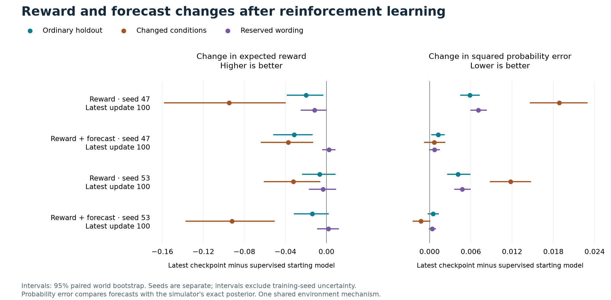

# Reinforcement learning in the 9B language network

The first controlled comparison **did not reliably improve held-out decisions**.
Three of four runs selected the unchanged supervised starting checkpoint. The
one run that selected reinforcement-trained weights showed a small validation
gain, followed by lower held-out reward point estimates and worse probability
estimates. The local demo therefore continues to serve the completed supervised
model. All selected and latest checkpoints are retained for inspection.

This is a negative result for this recipe and environment, not evidence that
reinforcement learning cannot work for decision models. The method uses known
techniques and does not reconstruct Jev's private training recipe.

## What actually trained

The [frozen protocol](general-training-v1-protocol.md) starts each run from the
same selected [supervised Qwen3.5-9B adapter](general-supervised-results.md).
Actions and binary forecasts use the language network's existing label-token
scores. Clipped Proximal Policy Optimization updates internal low-rank language
parameters; a training-only value head predicts return. It is not a separate
classifier trained on generated responses.

Each of the four runs completed **100 updates, 6,400 sampled episodes and
200 optimizer steps**. Both methods include value learning, entropy and a
small supervised replay loss. The hybrid adds binary outcome log loss on
6,400 independently sampled forecast exercises. Its labels are realized
events, not exact posterior probabilities or another model's confidence.
Each optimizer update also replays 64 supervised examples. The auxiliary data
is an additional stream, not an equal-total-data comparison.

Seeds 47 and 53 pair the two methods on the same root-world sequence and the
same starting weights. Their chosen actions can differ. Every run records
nonzero pure-policy gradients in the language network and changes to all
496 adapter tensors in its latest checkpoint. The release packager also checks
actual tensor fingerprints rather than relying only on training receipts.

There is **one environment mechanism** with eight domain wordings: a hidden
binary event, two paid conditionally independent readings, and a terminal
affirm/deny/abstain decision. Episodes end after at most two purchases and a
terminal decision. None of these actions changes the underlying event.

## Selection and held-out results

Selection uses exact expected validation reward, with the supervised start
included as update zero. It does not use test results or the analyses below.

| Run | Latest validation reward | Selected update |
| --- | ---: | ---: |
| Supervised start | 0.19771 | — |
| Reward, seed 47 | 0.17194 | 0 |
| Reward + forecast, seed 47 | 0.17793 | 0 |
| Reward, seed 53 | 0.20193 | 100 |
| Reward + forecast, seed 53 | 0.18367 | 0 |

The three update-zero selections are byte-identical adapter tensors to the
supervised start; they are not improved reinforcement-trained selections.
The table below shows **every latest trained checkpoint**, including the
discarded ones. Expected reward integrates actions, latent events and sensor
reports exactly for each sampled scenario, including evidence costs. Higher
reward is better.

| Latest checkpoint | Ordinary test | Shifted conditions | Reserved wording |
| --- | ---: | ---: | ---: |
| Supervised start | 0.27100 | 0.32523 | 0.34283 |
| Reward, seed 47 | 0.25117 | 0.23033 | 0.33135 |
| Reward + forecast, seed 47 | 0.23969 | 0.28793 | 0.34533 |
| Reward, seed 53 | 0.26433 | 0.29296 | 0.33951 |
| Reward + forecast, seed 53 | 0.25712 | 0.23303 | 0.34488 |

All four latest checkpoints lose reward under shifted sensor and cost
conditions; their paired world-bootstrap intervals exclude zero. The selected
seed-53 reward model changes shifted reward by **−0.03227**, with interval
**[−0.06026, −0.00650]**. Its ordinary-test change is −0.00667
[−0.02313, +0.00815]. The hybrids' small reserved-wording gains have intervals
that include zero.

The [selected-checkpoint figure](assets/general-reinforcement/best-reward-and-forecast.png)
shows zero changes for the three update-zero selections. Full measurements,
binary outcome Brier scores, log losses, and intervals are in the
[combined report](../results/general-reinforcement-v1/reports/foundation-to-supervised-test/report.json).

## Forecast preservation did not establish better decisions

Squared probability error below compares forecasts to the simulator's exact
conditional event probability. Lower is better. These are latest checkpoints.

| Latest checkpoint | Ordinary test | Shifted conditions | Reserved wording |
| --- | ---: | ---: | ---: |
| Supervised start | 0.002760 | 0.015093 | 0.002537 |
| Reward, seed 47 | 0.008625 | 0.033947 | 0.009642 |
| Reward + forecast, seed 47 | 0.004024 | 0.015783 | 0.003259 |
| Reward, seed 53 | 0.006869 | 0.026869 | 0.007290 |
| Reward + forecast, seed 53 | 0.003270 | 0.013838 | 0.002926 |

Across these two seeds, adding outcome exercises limits the probability drift
seen in reward-only training. It does not consistently improve forecasts over
the supervised start, and better-preserved forecasts do not consistently
produce better actions. Some individual measures improve: for example,
seed-53 hybrid has lower shifted posterior error and lower ordinary-test
sampled Brier score. That does not make it a better overall decision model.

## Retained general abilities

The broad language suite evaluates the **selected** checkpoints. Three are
the supervised model, so their outputs are unchanged. For the selected
seed-53 reward checkpoint:

| Evaluation | Supervised | Selected reinforcement model |
| --- | ---: | ---: |
| Test accuracy, 17,277 questions | 78.12% | 77.80% |
| Test set log loss | 0.4775 | 0.5148 |
| Challenge accuracy, 7,048 questions | 77.65% | 76.60% |
| Challenge set log loss | 0.6218 | 0.7439 |
| Prose questions correct | 58/64 | 57/64 |
| Prose pairs both correct | 26/32 | 26/32 |
| Reversed-option prose questions correct | 59/64 | 60/64 |

The mixed prose changes do not establish improved reasoning. Reversed-option
prose log loss also worsens, despite one additional correct answer. The
[retention reports](../results/general-reinforcement-v1/reports/supervised-to-rl-s53-reward-test/report.md)
preserve all task results. **Broad general retention was not evaluated for the
three discarded latest checkpoints**; their environment results above should
not be confused with an unchanged language model.

## A post-hoc check: use forecasts to make a fixed decision

An additional offline diagnostic uses the saved forecasts to choose affirm,
deny or abstain under the declared costs, then stops immediately. It isolates
decision consequences of probability errors without another model call.
It does not evaluate evidence acquisition, and it did not select checkpoints.

On shifted conditions, this controller's mean terminal regret is 0.03614
for the supervised model, 0.09780/0.08428 for reward-only seeds 47/53, and
0.02921/0.03245 for hybrid seeds 47/53. Both reward-only increases have
world-bootstrap intervals above zero. The hybrids' small decreases have
intervals containing zero. This supports examining the forecast-to-action
connection in a new experiment; it does not demonstrate a better sequential
policy.

The diagnostic reconstructs every recorded world, checks event labels and
posteriors, and uses all four correlated sampled evidence states with equal
weight. Its terminal-only oracle knows the exact posterior, not the realized
event. Its reward is not directly comparable to the sequential-policy reward
above, which includes acquisition costs and different state visitation.
See the [post-hoc report](../results/general-reinforcement-v1/forecast-decisions/report.md).

## Evidence, limits and next data

There are two training seeds and 64 root worlds per evaluation split. Each
world contributes four correlated forecast states. The reported 95% intervals
use 1,000 paired resamples of whole worlds; they do not cover training-seed
uncertainty, new mechanisms, multiple-comparison correction or foundation
pretraining contamination. The shifted-condition and reserved-wording suites
still use the same environment program.

The older general report helper leaves `same_data_receipt_verified=false` for
multi-split receipts. The release packager separately verifies manifest,
foundation, run and prediction hashes. Reinforcement summaries are recomputed
from raw forecasts and policy trees. Recorded evidence-cost and purchase counts
average actions conditional on each sampled report pair; only the stated
expected-reward metric integrates all latent events and reports.

The [recovery receipt](../results/general-reinforcement-v1/cloud-collection.json)
records **413 verified files** before stopping and deleting the rental.
The estimated GPU charge was **$64.27**, covering setup, supervised training,
reinforcement runs, evaluation and recovery time. Storage and the provider's
actual invoice are separate. No new paid training was launched after these
results.

The next work is [better outcome data and objective diagnostics](general-rl-data-next.md),
including a separate [executable retry pilot](retry-environment-pilot.md).
That pilot adds state-changing actions, late outcomes and duplicate side
effects. It has not been used to train or evaluate a model. We are not extending
this run merely to generate a more favorable result.

Reproduce the offline forecast diagnostic from recovered or released run
directories with `python -m general_lab.forecast_decisions --runs RUN... --output NEW_DIRECTORY`.
The [compact evidence index](../results/general-reinforcement-v1/ARTIFACTS.json)
records checksums for the committed receipts and reports. The portable model
archive is assembled using the [packaging guide](general-packaging.md). Download
the [adapters and complete prediction evidence](https://github.com/catoenm/first-instinct/releases/tag/general-decisions-v1)
to inspect every selected and latest checkpoint or run the
[local demo](general-demo.md). Foundation weights are downloaded separately;
optimizer state and raw training corpora are excluded.
The [release receipt](../results/general-reinforcement-v1/release.json) records
the archive checksum and independent adapter fingerprints, including all three
selected checkpoints that equal the supervised start.
