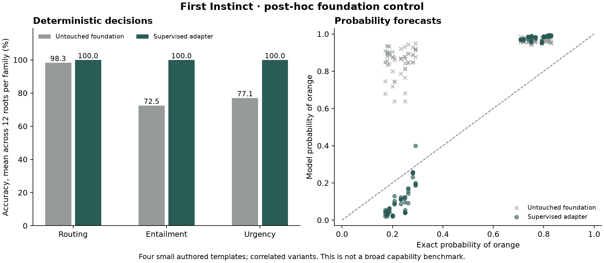

# Adaptation helped these decisions; probability error remains

On the same 48 authored configurations, the supervised adapter improved mean
deterministic accuracy from **82.6% to 100%** and reduced probability forecast
error from **46.9 to 17.6 percentage points** root mean squared error. This
comparison uses the untouched Qwen3.5-9B foundation and our supervised step-2,742
adapter with identical inputs and label-token scoring.

**This is a post-hoc control.** We planned it after observing the supervised
audit, then [froze its protocol](general-robustness-foundation-v1-protocol.md)
and published it before obtaining any foundation predictions. It does not
select a checkpoint, change the ongoing training experiment, or establish broad
generalization.



| Measurement | Untouched foundation | Supervised adapter |
|---|---:|---:|
| Routing accuracy | 98.3% | 100% |
| Partial-knowledge entailment accuracy | 72.5% | 100% |
| Ordered urgency accuracy | 77.1% | 100% |
| Mean deterministic accuracy across roots | 82.6% | 100% |
| Finite-forecast modal accuracy | 50.0% | 100% |
| Probability forecast error, root mean squared | 46.9 percentage points | 17.6 percentage points |
| Exact expected forecast Brier score | 0.785 | 0.406 |
| Exact expected clipped forecast log loss | 1.198 | 0.779 |
| Evidence-change pairs with both required modal answers correct | 49.0% | 100% |

Each deterministic family has 12 roots. Mean accuracy averages within each root
and then across roots; the different question counts per family mean this is
not the same as pooling every question. Forecast metrics cover 12 additional
roots and their 120 correlated variants. Log loss uses the unchanged 1e-12
probability floor. The expected scores account for the experiment's actual
randomness, so a perfect forecast still has positive expected loss.

The foundation strongly favored orange even on the changed-evidence experiments
where blue was more likely. The adapter followed the evidence and selected the
correct mode, but often pushed its probabilities too far toward zero or one.
The [original worked example](general-robustness-results.md) still matters: a
70.8% event was assigned 97.0%, which can change the right decision when failures
are costly.

Equivalent wording, metadata, and choice order produced mean total-variation
changes of 7.34, 8.00, and 10.98 percentage points in the foundation, versus
0.75, 0.30, and 0.41 in the adapter. Opaque-ID variants are identical prompts by
construction and do not count as learned semantic robustness.

## Interpretation

The adapter changed behavior in a useful direction on these particular inputs.
This control does not separate learning the supplied question/answer format
from improving reasoning. It also does not show that all arbitrary supplied
questions are reliable: the separate [shared-state fixture](shared-prefix-results.md)
contains a simple box-sizing error that survived every inference condition.

The remaining probability error supports measuring event forecasts separately
from selected-answer accuracy. Whether the new outcome and reinforcement
training improves those forecasts across domains remains an open experimental
question. No claim about Jev's private recipe follows from this comparison.

## Execution and reproduction

The foundation ran offline on the same Mac in float32, without an adapter or
trainable parameters. All 456 planned forwards completed; every input and
response is preserved. Cached runtime artifacts, source, token streams and
parameter version counters were checked before/after execution. No model
download, paid endpoint, new rental, or training was involved. The supervised
demo was restored and its health prediction checked afterward.

Preparation initially stopped because a whole-repository cache lookup required
optional repository documents. Before freezing, we changed that lookup to
require the pinned configuration, tokenizer and every indexed weight shard.
No foundation inference occurred during that failed preflight. The measured
run had no retries. Different timing boundaries for the resident supervised
server and the fresh foundation process prevent a controlled latency comparison.

The [freeze and encoded inputs](../results/general-robustness-foundation-v1/)
were published in commit `a89db0e` before inference. The
[complete raw results](../results/general-robustness-foundation-v1/results/)
and [comparison summary](../results/general-robustness-foundation-v1/results/comparison.json)
are public. With the recorded dependency versions, recompute and redraw without
loading a model:

```sh
python results/general-robustness-foundation-v1/compare.py \
  --output output/reproduced-foundation-comparison
```
