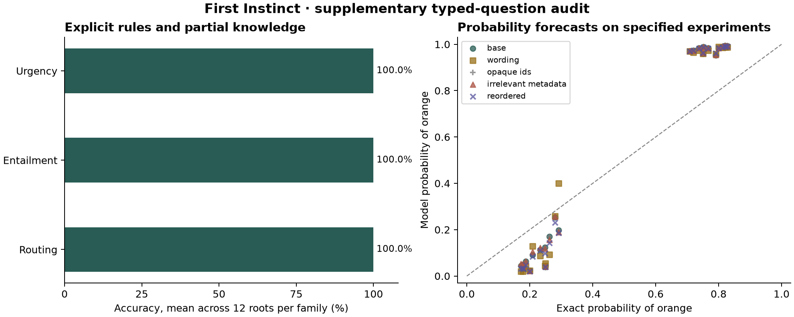

# Correct choices can conceal poor probability forecasts

The supervised nine-billion-parameter model answered all 336 deterministic
questions in this small audit correctly. It also picked the more likely outcome
on all 120 questions about specified random experiments. Nevertheless, its
probability forecasts had a **17.6 percentage-point root mean squared error**
against the exact probabilities.

This is a useful diagnostic of the gap between choosing an answer and forecasting
an event. It is not evidence of parity with Jev or of improvement over the
untouched foundation: only the supervised checkpoint was evaluated here.



## What was measured

The [prospective protocol](general-robustness-v1-protocol.md), corpus, source
hashes, model identity, and scoring rules were published before inference.
The local demo's supervised checkpoint at step 2,742 answered all 456 questions
in 313 seconds on Apple graphics hardware. This separate audit does not select
checkpoints or change the running reinforcement-learning experiment.

| Family | Authored configurations | Questions | Correct selected answers |
|---|---:|---:|---:|
| Compositional routing rules | 12 | 120 | 120/120 |
| Entailment with partial knowledge | 12 | 120 | 120/120 |
| Ordered urgency levels | 12 | 96 | 96/96 |
| Finite random-experiment forecasts | 12 | 120 | 120/120 modal outcomes |

Each configuration has original and changed evidence, with equivalent wording,
opaque option identifiers, irrelevant metadata, and reordered choices where
appropriate. All changed-evidence pairs received the required changed answer.
Equivalent variants never changed the selected answer. Their probabilities did
move: mean total variation across families was 0.75 percentage points for
wording, 0.30 for metadata, and 0.41 for choice order. Opaque identifiers are
omitted from the model prompt, so their zero difference is a serialization check.

The 120 probability questions are correlated views of only 12 authored random
experiments. The error above is the square root of mean per-option squared
error, averaged within and across these roots. It measures distance from a
known conditional distribution, rather than observed accuracy or a calibration
curve estimated from many independent events. Exact expected clipped log loss
was 0.779 and expected Brier score was 0.406; randomness makes even optimal
expected loss positive. Log probabilities use the predeclared floor of 1e-12.

## A concrete consequence

In the first predefined probability fixture, choose one of two bags with equal
probability, then draw uniformly from that bag. One bag contains three orange
balls and one blue ball; the other contains two orange balls and one blue ball.
The model is explicitly asked to forecast this experiment through its yes/no
distribution.

The exact probability of orange is `(3/4 + 2/3) / 2 = 17/24`, or **70.8%**.
The model assigns **97.0%** to orange. Orange is still the correct modal choice,
so ordinary answer accuracy misses the error.

For a post-hoc worked example, suppose committing earns 1 if orange is drawn
and loses 3 otherwise, while skipping earns 0. A probability above 75% would
justify committing. The model's forecast implies an expected reward of about
0.882, but the true expected reward is -1/6. This calculation illustrates a
possible consequence; it is not an executed policy experiment or a newly
introduced checkpoint-selection metric.

## What this changes

These results support keeping outcome forecasts separate from action
preferences and measuring both. They also motivate the existing frozen
comparison of reward training, outcome training, and their combination. They do
not tell us which method will win, or whether improvements in those two
environments will transfer to these probability questions.

The authored fixtures are short and simple. Four templates and one checkpoint
cannot establish broad robustness or calibration. No confidence interval based
on treating 456 correlated views as independent is reported. Server metadata
and checkpoint files were checked, but those checks do not attest to tensors
already resident in server memory.

Raw [responses and receipts](../results/general-robustness-v1/supervised/),
[machine-readable summary](../results/general-robustness-v1/supervised/summary.json),
and [corpus and freeze](../results/general-robustness-v1/) are published. Recompute
all aggregates and the figure without model inference:

```sh
python -m general_lab.robustness_report \
  --run results/general-robustness-v1/supervised \
  --output output/reproduced-general-robustness-v1
```

The reporter rejects incomplete responses, mismatched frozen inputs/source,
changed model provenance, invalid timings, and aggregates that do not reproduce.
