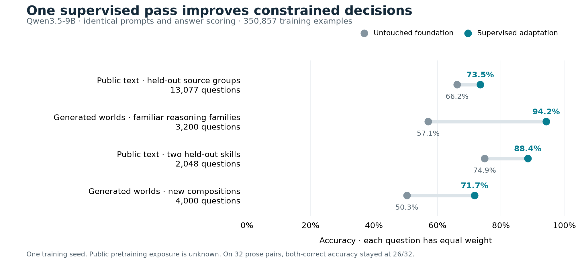

# First Instinct: completed supervised results

Measured on 18 September 2026. The completed supervised adaptation improves
the aggregate held-out scores, especially on generated worlds from familiar
families. Transfer to reserved compositions is weaker, several public sources
regress, and the small prose probe set gives limited evidence of improvement.
The [completed reinforcement-learning comparison](general-reinforcement-results.md)
did not reliably improve held-out decisions. This page contains only the
untouched foundation and the selected supervised checkpoint, which remains
the demo's default model.

Both models use the same constrained, single-forward-pass interface: read the
state, question and supplied options, then score choice labels without generating
reasoning. The baseline is untouched Qwen3.5-9B under this interface. These
results do not compare against its best prompted or thinking-mode performance.

## Completed run and selection

The [frozen protocol](general-training-v1-protocol.md) specified the mixture,
selection rule and held-out evaluations. Starting from pretrained
`Qwen/Qwen3.5-9B` revision `c202236235762e1c871ad0ccb60c8ee5ba337b9a`, seed 41
completed one visit to all **350,857 training rows and 112,309,610 input tokens**.
There were 2,742 optimizer updates, with effective batch 128, on four GPUs;
recorded training time was 6,111 seconds, about 102 minutes.

Rank-16 adaptation trained **43,278,336 low-rank internal parameters** while the
foundation matrices stayed frozen. This is adaptation of a pretrained 9B model;
it is neither training 9B parameters from scratch nor full-parameter fine-tuning.
The initial and final trainable-parameter hashes differ in the
[run receipt](../results/general-supervised-v1/run.json).

The selected checkpoint is the final step, 2,742. Selection used the lowest
equal-task validation log loss on 1,642 fixed validation rows, with at most
twelve rows per task and the foundation included as step zero. This selection
score fell from 1.2203 to 0.3339. Test, challenge and prose scores did not select
the checkpoint. The [training log](../results/general-supervised-v1/training.jsonl)
preserves the intermediate measurements.

## Held-out results

All arrows below mean foundation → supervised. Accuracy is a percentage.
“Macro” gives each instruction task equal weight; row accuracy gives each row
equal weight. Tasks sharing a source or world are not independent domains.
Set log loss is the negative log of total probability assigned to acceptable
answers; lower is better.

| Evaluation | Rows / groups / tasks | Row accuracy | Task macro accuracy | Row set log loss |
| --- | ---: | ---: | ---: | ---: |
| Entire test mixture | 17,277 / 15,048 / 80 | 63.33 → 78.12 | 60.62 → 79.91 | 0.7513 → 0.4775 |
| Public, source-held-out test | 13,077 / 12,448 / 46 | 66.18 → 73.46 | 63.70 → 69.63 | 0.6924 → 0.5796 |
| Executable, familiar families | 3,200 / 1,600 / 32 | 57.09 → 94.22 | 57.09 → 94.22 | 0.8632 → 0.1220 |
| Environment, test | 1,000 / 1,000 / 2 | 46.10 → 87.60 | 46.10 → 87.60 | 1.1625 → 0.2801 |
| Entire challenge mixture | 7,048 / 5,048 / 14 | 56.81 → 77.65 | 56.69 → 77.58 | 0.9007 → 0.6218 |
| Public, skill-held-out challenge | 2,048 / 2,048 / 4 | 74.85 → 88.43 | 74.85 → 88.43 | 0.6391 → 0.3334 |
| Executable, reserved compositions | 4,000 / 2,000 / 8 | 50.35 → 71.68 | 50.35 → 71.68 | 0.9663 → 0.7927 |
| Environment, challenge | 1,000 / 1,000 / 2 | 45.70 → 79.50 | 45.70 → 79.50 | 1.1737 → 0.5289 |

The paired 95% group-bootstrap intervals for row-accuracy changes are
**+13.98 to +15.62 percentage points** on the full test mixture and
**+19.47 to +22.16 points** on the full challenge mixture. For public test rows,
the interval is +6.39 to +8.26 points; for reserved compositions it is +19.35
to +23.40 points. These are 1,000 resamples of complete world/document groups,
keeping the two models paired. They describe sampling variation over the
observed groups, conditional on this one trained model. They do not measure
training-seed uncertainty, uncertainty over new tasks or sources, or possible
pretraining contamination. The macro means have no reported bootstrap interval.

Full task results and intervals are in the
[test report](../results/general-supervised-v1/reports/test/report.md) and
[challenge report](../results/general-supervised-v1/reports/challenge/report.md).

### Public sources and reserved skills

The test public portion reserves **12 source components** from adaptation.
Giving each source component equal weight yields 67.70 → 74.41% accuracy.
Seven components improve and five regress: AdversarialQA, COD3S, SciTail,
SherLIiC and WinoWhy. Across the 46 instruction tasks, 29 improve in accuracy
and 17 regress; 19 have worse log loss. For example, the combined SciTail
component falls from 80.66% to 73.83% and its log loss rises from 0.4066 to
0.5598. The connected ATOMIC/Defeasible-NLI/e-SNLI component contains 27 tasks;
its accuracy improves from 63.57% to 66.43% while log loss slightly worsens,
0.7356 → 0.7390. Aggregate gains therefore do not establish uniform improvement.

The challenge reserves two whole public categories and their connected sources:

| Reserved skill / source | Rows / tasks | Accuracy | Set log loss |
| --- | ---: | ---: | ---: |
| Coherence Classification / TimeTravel | 1,024 / 2 | 80.27 → 95.12 | 0.4240 → 0.1200 |
| Word Relation Classification / BLESS | 1,024 / 2 | 69.43 → 81.74 | 0.8543 → 0.5468 |

These scores measure agreement with upstream annotations. The
[source audit](general-data-sources.md) groups known aliases, ancestry and
document reuse, but cannot rule out unknown relationships or paraphrases.
Public benchmarks may already occur in Qwen's pretraining; “held out” here
means held out from this adaptation mixture. Several other public benchmarks
are explicitly in training. These are not uncontaminated benchmark claims.

### Executable compositions

The four composition families are absent from adaptation. Each has 500 worlds
with two questions per world; “both correct” requires both answers to be right.
Accuracy and loss below pool the two equally sized tasks within each family.

| Reserved composition | Accuracy | Both correct | Set log loss |
| --- | ---: | ---: | ---: |
| Constrained route | 46.10 → 71.70 | 22.60 → 56.80 | 1.0876 → 0.7054 |
| Inventory policy | 42.40 → 68.40 | 13.20 → 50.00 | 1.1378 → 0.8695 |
| Joined access | 62.00 → 78.70 | 39.40 → 65.60 | 0.7433 → 0.7798 |
| Temporal evidence | 50.90 → 67.90 | 27.00 → 54.20 | 0.8966 → 0.8162 |

Across reserved compositions, both-correct worlds increase from 511/2,000
(25.55%) to 1,133/2,000 (56.65%). Familiar families reach 1,449/1,600 (90.56%),
up from 525/1,600 (32.81%). Even familiar families remain uneven: supervised
inventory-ledger accuracy is 65%, date-deadline accuracy 75%, and state-machine
accuracy 82.5%.

Joined access is a clear probability-quality regression despite more correct
choices. Its check task's log loss rises from 0.6615 to 0.8176; temporal-evidence
checks likewise rise from 0.7373 to 0.8021. Better aggregate accuracy does not
guarantee better probability estimates for each task.

### Prose and option order

The [frozen prose probes](general-probes.md) comprise 64 agent-authored,
independently agent-reviewed rows: four in each of 16 families and two per
contrast pair. They were authored before predictions were inspected. Their
answers have no executable verifier or independent human annotation.

| Ordering | Correct rows; also family macro accuracy | Both members correct | Set log loss | Multiclass Brier |
| --- | ---: | ---: | ---: | ---: |
| Original | 56 → 58 / 64; 87.50 → 90.63% | 26 → 26 / 32; 81.25 → 81.25% | 0.3503 → 0.2858 | 0.1795 → 0.1542 |
| Reversed | 54 → 59 / 64; 84.38 → 92.19% | 24 → 27 / 32; 75.00 → 84.38% | 0.3772 → 0.2595 | 0.2121 → 0.1123 |

In the original ordering the model fixes six errors and introduces four.
The paired row-accuracy change interval is −6.29 to +14.06 percentage points;
with reversed options it is −3.13 to +18.75 points. Both orders' log-loss and
Brier change intervals also cross zero. This small set does not establish a
reliable general prose improvement.

Choice agreement between the two orderings rises from 50/64 (78.13%) to 63/64
(98.44%); mean probability total variation falls from 0.1504 to 0.0405. This is
one reversed ordering of the same cases, not 64 additional independent cases
or proof of invariance under every permutation. Five supervised errors persist
in both orders. The sixth, delegation probe 038, becomes correct when reversed.

All six original-order supervised errors are retained here. Percentages are
the probability assigned to the selected, incorrect option:

| Probe suffix | Error | Wrong-option probability |
| --- | --- | ---: |
| 017 | Chooses 09:15 despite an existing meeting through 09:30 | 94.14% |
| 020 | Chooses 13:10 for a 20-minute slot despite a lock beginning at 13:20 | 69.15% |
| 030 | Chooses “Watch” despite two blockers explicitly requiring “Stop” | 80.49% |
| 036 | Retains the disposable file instead of the file without a backup | 98.76% |
| 038 | Gives an amount-limit reason instead of the explicit delegation revocation | 63.13% |
| 055 | Answers “Nobody” when the quotation attributes the assertion to Rafi | 80.53% |

Probe 036 is still wrong at 99.78% under reversal. Structured interval-scheduling
accuracy is 97%, but prose scheduling remains 2/4 in both orderings. These
failures show limits in transferring learned decision behavior into prose.
The [original](../results/general-supervised-v1/reports/probes/report.md) and
[reversed](../results/general-supervised-v1/reports/probes_reversed/report.md)
reports preserve all family scores and paired intervals.

## Probability scores and their scope

The full test's single-label multiclass Brier falls from 0.4757 to 0.3043;
challenge falls from 0.5369 to 0.3325. This score sums squared errors across
options, ranges from 0 to 2, and excludes the 147 test and 184 challenge rows
with multiple acceptable answers. It is distinct from binary event Brier.
Answer-option probabilities are conditional on the supplied choices; they
should not be presented as calibrated probabilities of real-world success.

The environment forecast rows specifically predict sampled binary events.
Their binary event Brier is the mean squared error of `P(Yes)` against the
observed event, half the two-option multiclass Brier above. Each split has
500 forecast rows and a separate 500 exact-planner action rows:

| Environment split | Planner-action accuracy | Event log loss | Binary event Brier |
| --- | ---: | ---: | ---: |
| Test | 35.40 → 93.40% | 0.7399 → 0.3810 | 0.2667 → 0.1226 |
| Challenge | 35.80 → 83.00% | 0.7714 → 0.4908 | 0.2786 → 0.1628 |

These proper scores improve on the sampled outcomes in this simulation.
Planner-action agreement alone does not measure achieved reward over an
interactive episode. Domain wordings share one environment mechanism;
neither these forecasts nor the prose probes establish calibration across
arbitrary user questions. Reward and posterior-error comparisons belong to
the [completed reinforcement-learning evaluation](general-reinforcement-results.md).

## Evidence and reproducibility

The tracked [foundation metrics](../results/general-supervised-v1/foundation-metrics.json),
[supervised metrics](../results/general-supervised-v1/supervised-metrics.json),
run receipt and paired reports contain the measured scores and artifact hashes.
Both evaluation receipts name the same model revision and prepared manifest
`59cf10b64d67ad81ea1ad7f61a7e0e006432563b7a42e59be1678b8eb7ef0c42`.
The supervised receipt's run hash matches the recovered run receipt, and both
probe receipts name the frozen reviewed probe hash
`db653c41bc715fe89b1fe5d2eaba8348d94e6af32df1b9117d367c05bbbb5bcf`.

The paired report helper checks prediction IDs, groups, tasks, acceptable
answers and option IDs, then computes changes from the recovered predictions.
Its `same_data_receipt_verified` field remains `false`: the helper recognizes
an older single-split receipt format, so the newer multi-split receipts required
separate hash checks. The field must not be read as an automated receipt
verification success. Raw prediction hashes are recorded in each report JSON;
raw predictions and adapters are pending the combined release and are not
currently downloadable merely because their hashes are present here.

This is one training seed and one fixed evaluation design. The evidence supports
improved decisions within that design, with meaningful failures and limited
prose evidence. It does not establish general intelligence, universal
calibration, or equivalence to a private training recipe.
