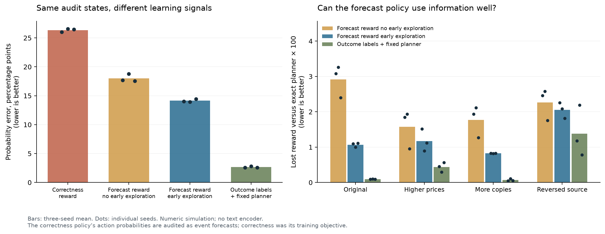

# Can an outcome reward teach a model when to look?

We trained tiny policies to decide whether to purchase another observation and
then report a probability. The task combines learning what to believe with
learning which data to acquire. Everything runs locally on a Mac.

**Early exploration made information gathering work, while leaving substantial forecast errors.**
Across three training seeds, a forecast policy with an initial exploration phase
lost **63.4% less reward** against the exact planner under original conditions
than the same setup without that phase. It inspected **19.3%**
of cases, versus **0.007%**, and paid for an announced copy in
only **0.029%** of copy cases.

But avoiding copies did not make its forecasts consistent. Showing it a copy
anyway moved its mean probability report by **11.00 percentage points**
on average, even though a copy leaves the exact event probability unchanged.
The direct-label reference moved **1.58 points**.
These are hypothetical acquired states from the common audit, not states the
learned policy often chooses to visit. This measures output consistency, not an
unobserved internal belief. The result does not establish why that inconsistency
arose during training.



### Same situations, different probability estimates

Original-condition probability error on the common audit states, in percentage
points. Each entry is the mean, followed by the minimum and maximum training seed.
Lower is better.

| Learning signal | Probability error | Change after an exact copy |
| :--- | ---: | ---: |
| Correctness reward | 26.35 (26.03–26.55) | 11.86 |
| Forecast reward, no early exploration | 18.02 (17.57–18.79) | 5.98 |
| Forecast reward, early exploration | 14.14 (13.95–14.45) | 11.00 |
| Outcome labels + fixed planner | 2.65 (2.58–2.79) | 1.58 |

The correctness policy was trained to choose the right answer, so its action
probability is deliberately being interpreted as a forecast here. The label
reference's planner is not involved in this common-state forecast measurement.

### Information gathering under the forecast objective

These policies all execute reports on the same 21-value grid. Values are
three-seed means on original conditions; regret is lost expected reward against
the exact planner, including the information price and report sampling.

| Policy | Net return | Regret | Inspections |
| :--- | ---: | ---: | ---: |
| Forecast reward, no early exploration | 0.82199 | 0.02914 | 0.01% |
| Forecast reward, early exploration | 0.84045 | 0.01068 | 19.32% |
| Outcome labels + fixed planner | 0.85018 | 0.00095 | 27.04% |
| Exact planner | 0.85113 | 0 | 27.19% |

The exploration policy's net return was **0.84045**; forcing that
same trained model to always stop with its initial report distribution reduced
return to **0.82758**. Its learned purchases add value.
The larger improvement over the no-exploration learner combines changes in
reporting and acquisition; it cannot be attributed to buying alone.

### The unfamiliar-source failure

Mean common-audit probability error in percentage points:

| Test conditions | No early exploration | Early exploration | Outcome labels |
| :--- | ---: | ---: | ---: |
| Original | 18.02 | 14.14 | 2.65 |
| Higher prices | 17.94 | 14.09 | 6.91 |
| 80% copies | 15.36 | 14.12 | 2.65 |
| Reversed independent source | 20.62 | 28.66 | 8.66 |

Exploration improved original-condition forecast error in every seed, but
**worsened it on reversed sources in every seed** compared with no early
exploration. The source announces reliability below one half, so its reading
is informative when interpreted in reverse. That condition was absent during
training. Both reward learners almost always declined this source, masking
much of the forecast failure in their actual terminal-state distribution.
The supervised reference also degraded. We did not change training after
opening these final tests.

### Scope and counts

The final experiment contains 12 models and nine value networks. Each model
received 2,048,000 root episodes: 24,576,000 episode presentations over
**6,144,000 unique matched potential worlds**. Reward learners collected
22,390,095 transitions; the label reference used 9,214,474 labeled state
presentations. Those are different feedback and computation budgets.

Training and checkpoint selection took **242 seconds total** on the central
processor of an Apple M5 Max, using one thread per model. No rented compute
was used. Every checkpoint was selected before four final domains of 16,384
worlds each were opened. The verifier reconstructed **all 60 evaluations
exactly**, regenerated all training-world batches and replayed all 18 saved
trajectory batches. The project passed **67 offline tests**.


## The environment

Imagine a hidden switch that is either on or off. A noisy sensor gives one
reading. Another source is available for a stated price. Sometimes that source
has independent evidence; sometimes it explicitly copies the first reading.

The model sees the initial reading, announced sensor qualities, a prior,
the source's provenance and price. It can stop now, or pay, see the additional
reading, and then stop. The hidden switch and unpurchased reading never enter
its inputs. The source qualities and copy flag are honest; inferring whether
sources themselves are trustworthy is outside this experiment.

The simulator generates a hidden event and both potential readings before the
policy acts. Different policies receive matched potential worlds but see
different amounts of evidence. This makes it possible to change data collection
without changing the underlying situations.

## A reward for a forecast

When the model reports probability `q`, it receives:

```text
reward = 1 - (q - observed_outcome)²
```

The outcome is either 0 or 1. A report of 0.7 earns 0.91 when the event happens
and 0.51 when it does not. Across repeated uncertain outcomes, the best expected
reward comes from reporting the true probability, rounded to the available
grid. This is the familiar quadratic scoring rule, not a new reward algorithm.

One policy can choose among 21 reports from 0 to 1. Another is restricted to
0 or 1: its reward is exactly whether it answered correctly. That restriction
changes the objective. If an event has probability 0.7, the correctness policy
should always answer yes; its probability of choosing yes is not a calibrated
forecast of the event.

Buying an observation incurs its price immediately. The training return for
that first decision includes the eventual report reward minus the price. We
use **Proximal Policy Optimization**, with a separate network estimating future
return, to update the action probabilities from complete one- or two-step
episodes. There is no learned reward model and no preference dataset.

## Data collection is part of the experiment

The first development forecast policy almost never bought an observation. It
therefore got little practice interpreting the additional evidence. A separate
development run with twice the episode budget also almost never inspected.

We added an initial exploration phase: for the first quarter of training, each
episode has a fixed 50% probability of acquiring the extra reading. The report
network learns from outcome rewards during this phase; the buying head receives
no gradient. Then the learned buying head takes control. Both main reward
conditions use this schedule.

A separate forecast policy omits the phase. It starts with identical weights,
receives the same root worlds, and has the same episode budget and optimizer
settings. Its acquired states, sampled rewards and transition count differ.
This is a comparison of data-collection strategies, not a comparison at equal
transition count or equal computation.

The supervised reference learns event labels on initial observations and a
random half of acquired observations. A fixed planner uses its forecasts and
the known sensor mechanism to decide whether to buy. That planner explicitly
knows a copy adds no information. It is a strong reference with different
feedback and planning assistance, not an equal-budget algorithm ranking.

## What the measurements mean

**Probability error** is root-mean-square distance from the exact event
probability. Every model is audited on the same distribution: half initial
states and half acquired states, with possible readings weighted by their
probabilities. A model cannot improve this score merely by avoiding difficult
observations. This is stronger than checking whether forecasts agree with
outcome frequencies within a few broad bins.

The audit includes the report a model would give if made to stop on an initial
state where it usually buys, and the report after a copy it usually declines.
Outcome reward only directly trains reports when they are actually selected.
Good acquisition can therefore coexist with weak reports on these hypothetical
decisions. The common audit asks about a broader forecast interface than the
policy's normal execution path.

For reward policies, the forecast being audited is the **mean of the report
distribution**. The correctness policy's probability of choosing yes is tested
as if it were an event forecast to expose that interpretation error. This does
not mean the correctness policy failed at its own training objective.

**Net return** includes the sampled report's squared error and the inspection
price. It also includes variability from sampling different reports; evaluating
only the mean report would hide that cost. **Regret** is the return lost against
an exact planner with the same available reports. The correctness and forecast
action sets have different optimal returns and values of information, so their
raw returns should not be compared as one common task.

All final results integrate over stopping, buying, both potential readings,
and report sampling. Exact posteriors are used only for this evaluation;
training and checkpoint selection use realized outcomes. Tests disable the
posterior calculation during training and selection to check that separation.

## Reproduce it

The [frozen protocol](learned-inspection-protocol.md) defines the experiment.
The [public artifacts](../results/learned-inspection-v1) include every selected
and initial model, selected and initial value networks, compressed training
traces, sampled trajectories, validation histories and a source snapshot.
Per-example final predictions can be reconstructed from the saved models;
the original arrays are retained with the local run.

```bash
python -m pip install -r requirements-calibration.txt

# No download or service key: these tiny weights are in the repository.
python -m calibration_lab.inspection_demo
python -m calibration_lab.inspection_verify

# Start a fresh complete experiment, with all seeds and final domains.
python -m calibration_lab.inspection_train --output output/my-inspection-run

# Save regenerated per-example final worlds and predictions elsewhere.
python -m calibration_lab.inspection_evaluate \
  --run results/learned-inspection-v1 --output output/inspection-recheck
```

Use Python 3.14 and the pinned dependencies for reproduction. For figures,
install `requirements-calibration-figures.txt` and run
`python -m calibration_lab.inspection_analysis --figures docs/assets/learned-inspection`.
The demo uses four fixed authored situations and seed 11 by default; these
examples are separate from the measured benchmark.

## What this says about calibrated-outcome reinforcement learning

It is a concrete candidate implementation: generate uncertain situations,
let an agent acquire evidence, score a forecast against the eventual outcome,
and train through the sampled decisions. We can inspect the full data path and
compare it with an exact answer in a small world.

TypeSafe describes reinforcement learning for calibrated decisions in its
[machine-learning primer](https://docs.typesafe.ai/introduction/machine-learning-primer)
and [Jev announcement](https://typesafe.ai/blog/introducing-system-one-models-and-jev).
Those public descriptions do not provide the reward and optimizer recipe used
here. This experiment does not establish how Jev is trained, reproduce its
architecture, or demonstrate its language capabilities.

Proper scoring rules and information gathering are established ideas. The
contribution here is an inspectable experiment about their interaction with
selective experience, including failures. See the primary references on
[proper scoring rules](https://sites.stat.washington.edu/people/raftery/Research/PDF/Gneiting2007jasa.pdf)
and [Proximal Policy Optimization](https://arxiv.org/abs/1707.06347).

## Limits worth keeping attached

- These are numeric networks with 4,931 or 6,166 policy parameters, not language
  models. The released text encoder has not been trained by this experiment.
- A proper reward defines the optimal report; it does not guarantee that a
  finite training run finds it or that forecasts remain reliable after a shift.
- Given the chosen report, most rewards in this binary simulator also identify
  the event label. We restrict reward learners to policy-gradient updates; we
  are not claiming their feedback contains strictly less information.
- The supervised reference receives explicit labels and an engineered planner.
  The reward policies learn acquisition, but the initial exploration schedule
  is engineered too.
- Copy provenance and reliability are announced accurately. Real tools can
  be wrong about both. Only one additional observation is available here.
- Three training seeds show variation, not a tight estimate of broad reliability.
  Development pilots guided the design; final domains were evaluated only after
  all checkpoints were sealed. We did not retrain in response to final results.

A useful follow-up would keep collecting forecast-only audit episodes throughout
training, including initial states and copied observations, rather than relying
on the acquisition policy to visit every state that a probability interface
might expose. Broader source conditions would test the reversed-sensor failure.
Those interventions have not been tested in this release.
