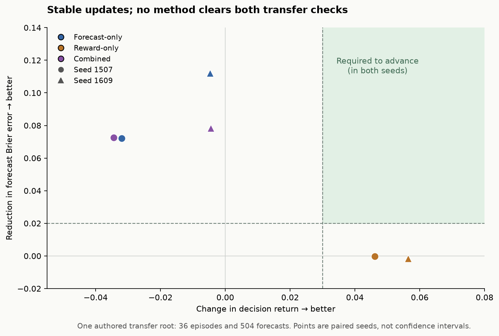

# Stable learning, but no joint transfer gain

The six-arm comparison finished. **None of the three methods passed the
predefined requirement to improve both decisions and consequence forecasts on
the reserved mechanism in both seeds.** Reward-only learning improved decision
return slightly. Forecast supervision improved probability error. Combining
these objectives did not improve both on transfer. We are keeping the demo's
supervised checkpoint and revising the data before another rental.

All six arms completed 40 accepted optimizer updates with zero rejected updates.
This resolves the immediate instability seen in the earlier
[evidence-decisions-v2 pilot](evidence-decisions-v2-results.md), but stable updates
are not evidence of useful generalization.

## The held-out comparison

All arms started from the identical original supervised Qwen3.5-9B step-2742
adapter, used paired schedules and general-task replay, and selected checkpoints
using the frozen validation rule. The table reports those selected checkpoints,
not a later checkpoint chosen after seeing transfer scores.

| Method / seed | Selected update | Transfer return ↑ | Completed episodes | Forecast Brier ↓ | General retention accuracy |
| --- | ---: | ---: | ---: | ---: | ---: |
| Original supervised model | 0 | -0.1183 | 18 / 36 | 0.5511 | 87.05% |
| Forecast-only / 1507 | 20 | -0.1503 | 17 / 36 | 0.4789 | 87.05% |
| Forecast-only / 1609 | 30 | -0.1231 | 17 / 36 | 0.4390 | 86.68% |
| Reward-only / 1507 | 40 | -0.0722 | 19 / 36 | 0.5513 | 87.15% |
| Reward-only / 1609 | 40 | -0.0619 | 19 / 36 | 0.5528 | 87.37% |
| Combined / 1507 | 20 | -0.1528 | 17 / 36 | 0.4787 | 87.00% |
| Combined / 1609 | 20 | -0.1228 | 18 / 36 | 0.4729 | 87.05% |

The advancement gate required **return gain ≥ 0.03 and Brier reduction ≥ 0.02
in each seed**, while limiting general accuracy loss to 0.02 and general
log-loss increase to 0.05. All arms passed retention. Reward-only passed the
return threshold and failed the forecast threshold; the other methods did the
opposite. The combined method had looked promising on validation: seed 1507
selected a checkpoint with return 0.4017 and Brier 0.5277, versus the original
0.2622 and 0.6518. That joint validation gain did not transfer.

Return is verified terminal reward minus future command costs. Brier is the
**sum of squared probability errors across three mutually exclusive outcomes**;
it is not directly comparable to v2's single binary-component Brier. The
transfer set contains 36 episodes and 504 forecast questions from **one authored
publication root**. Reward-only gained just one completed episode. Worlds,
goals, costs and prefixes are correlated, so these are pilot results, not
independent-task confidence intervals or evidence of general tool competence.

Retention uses 622 general questions. A separate 1,128-question general transfer
set ranged from 77.67% to 78.22% macro accuracy, versus 77.94% originally; the
[full audit](../results/mixed-decisions-v1-final/audit.json) retains every task
measurement and log loss. None of these evaluations measures parity with Jev.

## The data gap this revealed

The [forecast coverage audit](../results/mixed-decisions-v1-final/forecast-coverage.json)
found that **all 308 distinct public forecast inputs in the publication transfer
set had deterministic outcomes across their compatible worlds**. Its 504
questions included 196 completed and 308 unfinished labels, with **zero incorrect
irreversible outcomes**. This does not mean the live policy could not publish
incorrectly; it means the separately authored forecast branches missed those
states. They were mostly asked before staging/validation, when direct commit
fails harmlessly or the declared continuation gathers evidence.

Training preserved uncertain cases: 188 public-input groups had differing actual
outcomes under identical model-visible input. Validation had 40 such groups,
covering 80 questions. However, uncertainty handling on a new mechanism remains
untested. Even on those 80 ambiguous validation questions, selected forecast-only
Brier was 0.889–1.011, while the enumerated-world frequency reference scores 0.5.
Lower overall forecast error does not establish good calibration in ambiguous
situations.

A constant distribution estimated from training labels scores 0.5329 on transfer.
The original and reward-only models do not beat it; forecast-trained models do.
The conditional-frequency reference in the
[probability audit](../results/mixed-decisions-v1-final/probability-audit.json)
uses evaluation-world labels only to diagnose uncertainty. It is not a deployable
baseline, a training label supplied by a model, or a checkpoint-selection rule.

This coverage gap does **not** prove why the combined method failed. Initial
combined-arm diagnostics also found larger forecast than actor gradient norms
(35.98 versus 5.55 for seed 1507; 16.78 versus 5.18 for seed 1609). Those are
single initial diagnostic batches, not causal evidence or a reason to tune on
the opened transfer set.

## What was actually trained

Prepared curriculum: five mechanism roots, 17 concrete initial worlds, 34
world-and-goal tasks and 228 context cases. Of 3,756 prepared questions, 3,528
were forecasts and 228 were decision/observation-value diagnostics. There were
2,520 training forecasts; the diagnostic questions were not supervised targets.
Training covered only three roots and 26 underlying world-and-goal tasks. The
4096-row general replay pool was separate.

| Arm | Live training episodes | Policy presentations / distinct IDs | Forecast presentations / distinct IDs | General replay presentations / distinct IDs |
| --- | ---: | ---: | ---: | ---: |
| Forecast-only 1507 | 0 | 0 / 0 | 1,034 / 1,034 | 640 / 589 |
| Forecast-only 1609 | 0 | 0 / 0 | 1,026 / 1,026 | 640 / 592 |
| Reward-only 1507 | 960 | 2,460 / 1,197 | 0 / 0 | 640 / 589 |
| Reward-only 1609 | 960 | 2,510 / 1,213 | 0 / 0 | 640 / 592 |
| Combined 1507 | 960 | 2,435 / 1,175 | 1,034 / 1,034 | 640 / 589 |
| Combined 1609 | 960 | 2,441 / 1,185 | 1,026 / 1,026 | 640 / 592 |

Across the study: **3,840 executed training episodes**, 1,332 separate evaluation
episodes, 240 accepted optimizer updates and zero rejected updates. The unions
contain 2,771 policy-question IDs, 1,612 forecast IDs and 1,100 replay IDs. Their
respective presentation counts are 9,846, 4,120 and 3,840. The differences are
repeated presentations, including reuse across arms; they are not new tasks.
The forecast IDs reference 1,612 distinct preexecuted branches. Training did not
execute additional branches to create those forecast labels. Gradient diagnostic
passes are recorded separately from optimizer presentations.

The shell tasks execute a fixed authored command catalog. The application family
uses actual pinned ToolSandbox tools and independently verified database state.
These are neither dynamic command proposals nor an official Harbor benchmark.
The model selected every live action after observing prior tool results; rewards
came from final files/database state and actual command costs, not a model judge.

## Lineage, checks and cost

The foundation is `Qwen/Qwen3.5-9B` revision
`c202236235762e1c871ad0ccb60c8ee5ba337b9a`. Its large base matrices remain frozen;
43,278,336 parameters in internal adapters are trainable. The recovered selected
checkpoint of every arm has changed bytes in all 496 adapter tensors compared
with the common original. This is a tensor count, not a count of individually
changed scalar parameters. Pure actor gradients reached the language adapters;
critic gradients into them were zero. We did not only train a final classifier.

Original adapter SHA-256:
`882323ebe8a7c33edf89b7dd2938a977b00dfd7cb38551e8d68db4ae36128e1a`.
The [checkpoint audit](../results/mixed-decisions-v1-final/checkpoint-audit.json)
records all selected hashes and checks the shared starting lineage.

The offline audit verified frozen source/input hashes, actual saved histories,
terminal state checks, reward accounting, probability targets, all consumed
question IDs, checkpoint selection and both-seed advancement. Fourteen reporting
tests passed. These reporting tools were added after training upload; they did
not change the frozen experiment.

One protocol wording discrepancy remains explicit: the change guard bounded the
**80% model / 20% uniform behavior distribution**, despite the frozen document's
word “native.” The same mixture was used for action sampling and rescoring.
Forecast probabilities were native. We did not retroactively edit that protocol
or claim a bound on unsmoothed policy probabilities.

The 1,979,132,952-byte full archive and all 459 files were hash-verified locally
before the H200 was stopped and deleted. Provider enumeration confirmed zero
remaining pods. Estimated compute was **$12.83 for the successful attempt** and
**$13.73 including both earlier setup failures**, excluding storage. This used
the existing $40 pilot allocation within the original cumulative $500 cap.
Prior reported charges plus this compute estimate total $175.49; storage and
provider adjustments still require reconciliation before another rental.

The [public evidence directory](../results/mixed-decisions-v1-final/) contains
226 execution/evaluation/learning receipt files in a 23.7 MB compressed bundle,
per-file hashes, audits, counts and the recovery receipt. It excludes weights.
The full verified local archive has SHA-256
`cf3a43af328ab4a99b989f46298f570f6825695fc76e3495e109befbdd373ea2`.
The earlier [interim report](mixed-decisions-v1-interim.md) remains historical.

## Next qualification

Keep the 9B foundation. Before spending more, collect counterfactual forecasts
from **intermediate executed histories**, including staged-but-unverified states,
failed/recovered commands and states immediately before an irreversible action.
Preserve all compatible hidden worlds and the exact continuation contract.
Broaden mechanisms and roots before multiplying presentations. The next reserved
mechanism must include both uncertain outcome groups and verified wrong actions;
publication has now been exposed and cannot serve as a pristine new test.

Continue reusing the installed ToolSandbox adapter for application workflows.
For filesystem workflows, qualify operations whose effects depend on shared-file
identity and the requested mutation scope. Their state verifier can check actual
bytes, alias relationships and preservation independently of exit codes. Keep
free-form command proposals and Harbor integration as a separate, measured stage.
No larger model, new rental, demo promotion or extended training is justified by
this pilot alone.
