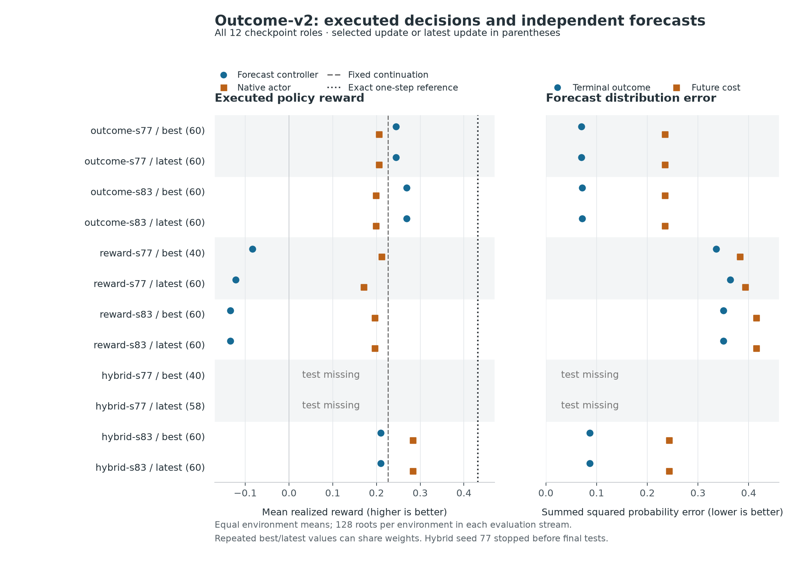

# Outcome-v2: useful outcome forecasts, incomplete hybrid evidence

In these two authored environments, the models trained with executed outcome
labels had better forecasts and better forecast-controller returns than the
reward-only models. Adding reward optimization did not improve the primary
controller result in the one completed hybrid seed: **0.2100** mean realized
reward, versus **0.2686** for outcome-only. The hybrid model's direct action
choices were stronger at **0.2827**, a secondary result. Choosing actions and
forecasting their consequences remain distinct capabilities.

This is a **partial experiment**, not a completed two-seed hybrid comparison.
Five runs completed 60 updates. Hybrid seed 77 stopped with 58 updates committed;
its original selected checkpoint remains update 40, and neither its selected
nor latest checkpoint has final test results. No missing result is imputed.
There is also **no starting supervised-adapter test evaluation** in this run,
so these numbers do not measure improvement over that starting model.

The [prospective protocol](outcome-v2-protocol.md),
[hardware amendment](outcome-v2-hardware-amendment.md), and
[H100 freeze](../results/outcome-v2/freeze-h100.json) precede these evaluations.
The [full recovered report](../results/outcome-v2/report.md) and
[machine-readable report](../results/outcome-v2/report.json) retain all roles,
per-environment metrics, missing artifacts, run counters, and input checksums.



The left panel shows executed returns, with the same sampled test worlds for
each policy. The right panel measures distributions for the explicitly stated
fixed continuation on a separate exploratory-state audit stream. Neither is a
measurement of general real-world calibration. Identical selected/latest
checkpoints are retained as roles; repeated points are not independent evidence.
Known singleton cost distributions are included in the frozen audit averages.

## What was trained and evaluated

All arms began with the same Qwen3.5-9B supervised adapter, step 2,742, on
foundation revision `c202236235762e1c871ad0ccb60c8ee5ba337b9a`.
Rank-16 adapters inside the language network were trainable; the original
foundation matrices stayed frozen. The recovered parameter audits show changed
values in all 496 adapter tensors, with about 43.28 million trainable elements.
This changes the language network itself, rather than a classifier reading
generated answers. The value head used detached language features; its
diagnostic language-gradient norm was zero in all six runs.

- **Outcome:** executed categorical outcome and future-cost labels, plus general
  replay; no reward-policy objective.
- **Reward:** Proximal Policy Optimization, entropy, and general replay; no
  outcome or cost labels in optimization.
- **Hybrid:** both sets of objectives, using the same outcome-label schedule as
  outcome-only for the corresponding seed.

The native actor directly picks an offered action. The forecast controller asks
for the terminal-outcome and future-cost distributions for each action, computes
expected terminal utility minus expected cost, acts, and replans after observing
what happened. Each forecast describes a fixed executable continuation, **not**
the eventual return of this adaptive controller. The fixed reference follows
that continuation. The exact reference uses verifier probabilities for the same
one-step calculation and replans; it is not a fully optimal planner.

Each completed checkpoint was evaluated on 128 retry roots and 128 workflow
roots. Means below weight the two environments equally. Rewards are realized
execution cents divided by 100, in artificial research units; they are not
money earned or latent expected returns. Validation alone selected checkpoints,
subject to the frozen general-task retention gate. The native actor and test
metrics did not select them.

## All runs and checkpoint roles

| Run | Role | Checkpoint update / optimizer steps | Final test | Forecast controller | Native actor | Fixed continuation | Exact reference |
| --- | --- | ---: | --- | ---: | ---: | ---: | ---: |
| Outcome 77 | Selected | 60 / 120 | Complete | 0.2448 | 0.2055 | 0.2264 | 0.4320 |
| Outcome 77 | Latest | 60 / 120 | Complete | 0.2448 | 0.2055 | 0.2264 | 0.4320 |
| Outcome 83 | Selected | 60 / 120 | Complete | 0.2686 | 0.1981 | 0.2264 | 0.4320 |
| Outcome 83 | Latest | 60 / 120 | Complete | 0.2686 | 0.1981 | 0.2264 | 0.4320 |
| Reward 77 | Selected | 40 / 80 | Complete | -0.0835 | 0.2120 | 0.2264 | 0.4320 |
| Reward 77 | Latest | 60 / 120 | Complete | -0.1216 | 0.1709 | 0.2264 | 0.4320 |
| Reward 83 | Selected | 60 / 120 | Complete | -0.1343 | 0.1961 | 0.2264 | 0.4320 |
| Reward 83 | Latest | 60 / 120 | Complete | -0.1343 | 0.1961 | 0.2264 | 0.4320 |
| Hybrid 77 | Selected | 40 / 80 | Missing | — | — | — | — |
| Hybrid 77 | Latest | 58 / 116 | Missing | — | — | — | — |
| Hybrid 83 | Selected | 60 / 120 | Complete | 0.2100 | 0.2827 | 0.2264 | 0.4320 |
| Hybrid 83 | Latest | 60 / 120 | Complete | 0.2100 | 0.2827 | 0.2264 | 0.4320 |

The artifacts call the selected role `best`; this always means best under the
original validation rule, not best on these tests. Selected/latest adapter
weights and configuration bytes match for Outcome 77, Outcome 83, Reward 83,
and Hybrid 83. Their copied final evaluations count once as evidence. Reward 77
has two distinct tested checkpoints. Hybrid 77 has two distinct saved adapters,
but no final tests or final checkpoint-retention files; it is not relabeled as
complete or as retention-failed.

The outer pipeline receipt is `failed`: it records Hybrid 83 as `timed_out`
with process return code 0 and then cancellation of Hybrid 77. Hybrid 83's
trainer receipt and complete final artifacts record 60 updates. Hybrid 77's
trainer receipt records `bounded_stop`, 58 fully completed updates, no partial
optimizer update, and about 111.6 minutes elapsed. This should not be described
as Hybrid 77 independently exhausting its own 120-minute bound. Both the outer
pipeline outcome and the individual trainer receipts are preserved.

### Environment-level returns

The following tables merge byte-identical selected/latest roles only for
readability. All twelve roles remain listed above.

| Checkpoint roles | Retry: controller | Retry: native | Workflow: controller | Workflow: native |
| --- | ---: | ---: | ---: | ---: |
| Outcome 77, selected/latest | 0.3169 | 0.2441 | 0.1727 | 0.1670 |
| Outcome 83, selected/latest | 0.3501 | 0.2310 | 0.1871 | 0.1652 |
| Reward 77, selected@40 | 0.2730 | 0.2356 | -0.4401 | 0.1883 |
| Reward 77, latest@60 | 0.1942 | 0.1462 | -0.4373 | 0.1956 |
| Reward 83, selected/latest | 0.1701 | 0.1921 | -0.4387 | 0.2000 |
| Hybrid 77, selected@40/latest@58 | — | — | — | — |
| Hybrid 83, selected/latest | 0.2706 | 0.3383 | 0.1493 | 0.2271 |
| Fixed continuation | 0.2944 | — | 0.1585 | — |
| Exact one-step reference | 0.5362 | — | 0.3277 | — |

The reward-only forecast controllers completed **zero of 128 workflow jobs**
at each tested checkpoint, despite positive returns from their native actors.
The outcome-only controllers exceeded the fixed continuation's observed mean
in both environments, while remaining well below the exact reference. Those
are descriptive comparisons; the frozen paired intervals below address the
predeclared hybrid comparisons.

### Paired controller comparisons

Only seed 83 has complete hybrid tests. These 95% intervals use the frozen
paired bootstrap: 2,000 resamples, random seed 101, equal environment weighting,
and root draws paired across compared policies. They describe variation over
roots in these environment families, not new mechanisms or training seeds.

| Comparison, seed 83 | Selected difference | 95% interval | Latest difference | 95% interval |
| --- | ---: | --- | ---: | --- |
| Hybrid minus reward | +0.3443 | [+0.2294, +0.4614] | +0.3443 | [+0.2294, +0.4614] |
| Hybrid minus outcome | -0.0586 | [-0.1294, +0.0052] | -0.0586 | [-0.1294, +0.0052] |

The selected and latest seed-83 comparisons are the same checkpoint comparisons,
not replications. All seed-77 hybrid comparisons and all planned two-seed hybrid
aggregates are unavailable. The second interval does not establish that the
hybrid and outcome-only controllers are equivalent. The first does not isolate
a benefit from reward optimization: hybrid also receives outcome/cost labels
and additional simulator and model work that reward-only does not receive.

## Forecast quality

The independent test audit has 256 exploratory roots and 1,168 offered-action
records. Every record has an outcome and cost distribution; **1,900 questions
use the model**, and 436 singleton cost distributions are filled in exactly.
The frozen scorer averages candidate actions within roots, roots within
environments, then environments equally. Cost means below include those known
singleton zeros, so they are not model-only cost-error averages.

“Brier” is summed squared error against a fresh realized categorical target;
“log loss” uses the same target and natural logarithms. “Exact excess” is
`sum((predicted_probability - exact_probability)**2)`, also the excess expected
Brier score over the exact distribution. It removes irreducible sampling
uncertainty. We do not compare outcome and cost errors as though they had the
same option count. Utility error is mean absolute error in the offered action's
fixed-continuation expected net utility, in reward units. All columns are lower
when better.

| Checkpoint roles | Outcome Brier | Outcome log loss | Outcome exact excess | Cost Brier | Cost log loss | Cost exact excess | Utility absolute error |
| --- | ---: | ---: | ---: | ---: | ---: | ---: | ---: |
| Outcome 77, selected/latest | 0.2988 | 0.4968 | 0.0700 | 0.4323 | 0.8768 | 0.2345 | 0.2668 |
| Outcome 83, selected/latest | 0.3004 | 0.5019 | 0.0719 | 0.4320 | 0.8782 | 0.2346 | 0.2706 |
| Reward 77, selected@40 | 0.5798 | 1.0790 | 0.3362 | 0.5788 | 1.5665 | 0.3826 | 0.5180 |
| Reward 77, latest@60 | 0.6088 | 1.1928 | 0.3636 | 0.5891 | 1.6589 | 0.3933 | 0.5265 |
| Reward 83, selected/latest | 0.5940 | 1.1548 | 0.3505 | 0.6121 | 1.8112 | 0.4149 | 0.5192 |
| Hybrid 77, selected@40/latest@58 | — | — | — | — | — | — | — |
| Hybrid 83, selected/latest | 0.3170 | 0.5330 | 0.0868 | 0.4403 | 0.8963 | 0.2426 | 0.2831 |

The outcome-label arms have much lower terminal-distribution error than the
reward-only arms. Hybrid 83 is slightly worse than Outcome 83 on each forecast
column and on controller reward, while its native actor is stronger. This
motivates examining which forecast mistakes change action rankings, rather than
assuming that a competent action policy automatically supplies useful outcome
probabilities. The separate [first-divergence analysis](outcome-v2-divergence-results.md)
uses saved common-state trajectories for that narrower diagnostic; it does not
run repaired policies or establish a causal training benefit.

## General-task retention

The common baseline on 622 validation questions across 157 tasks has macro
accuracy **86.677%** and macro log loss **0.34963**. The engineering gate allows
at most 3 percentage points of accuracy loss and 0.10 additional log loss.
All ten finalized checkpoint roles pass. This validation gate is not a new
untouched general-capability test or a guarantee of retained ability.

| Checkpoint roles | Macro accuracy | Macro log loss | Accuracy change, percentage points | Log-loss change | Gate |
| --- | ---: | ---: | ---: | ---: | --- |
| Outcome 77, selected/latest | 86.200% | 0.35599 | -0.478 | +0.00636 | Pass |
| Outcome 83, selected/latest | 85.881% | 0.35542 | -0.796 | +0.00579 | Pass |
| Reward 77, selected@40 | 86.890% | 0.34981 | +0.212 | +0.00018 | Pass |
| Reward 77, latest@60 | 87.049% | 0.35126 | +0.372 | +0.00163 | Pass |
| Reward 83, selected/latest | 87.314% | 0.34937 | +0.637 | -0.00026 | Pass |
| Hybrid 77, selected@40/latest@58 | — | — | — | — | Final receipts missing |
| Hybrid 83, selected/latest | 86.040% | 0.35359 | -0.637 | +0.00396 | Pass |

Hybrid 77's original update-40 validation event passed the selection-time gate;
its absent final checkpoint-retention receipts are not a failed gate. Its
latest update-58 checkpoint has no final retention evaluation. None of these
roles is promoted using test performance.

## Data and compute actually consumed

The available pool contained 8,192 training roots and 59,993 prepared forecast
questions. A completed outcome-label arm drew **1,920 distinct roots**, not the
whole pool. Counts below refer to completed update-log events before reusing
their examples in two optimizer epochs. They are not counts of new labels per
epoch, and matching outcome/hybrid draws are not independent data acquisitions.

| Run | Updates / optimizer steps | Outcome labels | Cost labels | Policy episodes in completed updates | General replay draws | Process minutes |
| --- | ---: | ---: | ---: | ---: | ---: | ---: |
| Outcome 77 | 60 / 120 | 8,853 | 5,349 | 0 | 1,920 | 95.41 |
| Outcome 83 | 60 / 120 | 8,751 | 5,236 | 0 | 1,920 | 93.35 |
| Reward 77 | 60 / 120 | 0 | 0 | 1,920 | 1,920 | 55.89 |
| Reward 83 | 60 / 120 | 0 | 0 | 1,920 | 1,920 | 49.61 |
| Hybrid 77 | 58 / 116 | 8,564 | 5,164 | 1,856 | 1,856 | 111.63 |
| Hybrid 83 | 60 / 120 | 8,751 | 5,236 | 1,920 | 1,920 | 120.07 |

Both outcome-only runs also collected 32 diagnostic-only policy episodes. Hybrid
77 saved **1,888 collected episodes**, including 32 at update 59, but no optimizer
step at update 59 committed. Those extra episodes are collection work, not an
additional trained update. Process minutes include initialization, diagnostics,
validation and any final evaluation; the two seed workers overlapped.

| Run | Policy forward batches | Policy question passes | Unpadded policy input tokens | Separate retention question passes |
| --- | ---: | ---: | ---: | ---: |
| Outcome 77 | 3,125 | 47,997 | 32,680,628 | 3,110 |
| Outcome 83 | 3,112 | 47,667 | 32,375,526 | 3,110 |
| Reward 77 | 3,363 | 49,957 | 30,750,407 | 3,732 |
| Reward 83 | 2,902 | 42,584 | 25,879,076 | 3,110 |
| Hybrid 77 | 4,349 | 64,310 | 41,516,717 | 1,866 |
| Hybrid 83 | 4,969 | 73,949 | 48,277,026 | 3,110 |

The policy counters cover completed training, rollout and diagnostic forwards,
including repeated passes over questions; they exclude backward recomputation.
Retention adds 5,577,541 input tokens in total. Validation/test predictor work
has separate receipts in the machine-readable report and is not included in
these policy counts. Copied selected/latest evaluations must not be counted as
two executions. Across the six processes, the policy counters record 21,820
batches, 326,464 question passes and 211,479,380 unpadded input tokens. These are
not a count of unique data, a hardware throughput benchmark, or a complete
floating-point operation estimate.

The two-H100 rental rate was **$6.98/hour total**. The recovered collection
receipt estimates **$33.21563653 compute, excluding storage**, through the
provider's stopped-or-absent observation. Adding the previously recorded
$64.26682508 gives **$97.48246161 estimated cumulative compute**, still excluding
storage. The archive contains 294 verified files; the exact rental was deleted,
and the recorded subsequent provider inventory has zero pods. These are
recovery receipts, not a final provider invoice.

## What this supports

Executed outcome supervision is a promising component of this decision model:
its forecasts and forecast-based choices are useful on held-out combinations
within the two authored mechanisms. The completed comparison does not show that
adding Proximal Policy Optimization makes this forecast controller better. The
hybrid's stronger native actions are worth investigating, but do not replace
the predeclared primary endpoint or the missing second hybrid seed.

The study does not establish broad transfer, real-world calibration, Jev's
architecture or training method, equal-total-data efficiency, or an improvement
over the starting supervised model on these tests. There are only two authored
mechanisms; many related root variants do not turn them into hundreds of
independent tasks. No checkpoint is chosen for deployment or later evaluation
because of this report. A subsequent experiment needs a separate prospective
question and data design, rather than silently filling in missing outcomes.

## Reproduction and provenance

The [research release](https://github.com/catoenm/first-instinct/releases/tag/outcome-decisions-v2)
provides the original adapter/evidence archive together with a required
license and source-attribution companion. Check both assets against the
[release manifest](../results/outcome-v2/release-manifest.json). This release
preserves the partial run and does not replace the supervised demo checkpoint.

This writeup uses only recovered files and read-only analysis, dated 2026-09-18.
An independent audit rehashed all 294 files and recomputed all ten tested roles'
policy returns and forecast metrics, plus original selection and retention.
The role-level totals of 2,560 trajectories and 11,680 forecast records include
copied selected/latest aliases; they are not independent sample counts.

```bash
python -m general_lab.outcome_report \
  --root output/outcome-cloud-v2 --output output/outcome-report-v2-reproduced
python docs/assets/outcome-v2/render.py \
  --report results/outcome-v2/report.json --output /path/to/new-figure-directory
```

The report builder needs the recovered artifact tree; the figure needs
Matplotlib and the published report only. The [figure data](assets/outcome-v2/figure-data.json)
and [renderer](assets/outcome-v2/render.py) preserve all twelve roles and bind the
exact report checksum. No model, environment or provider is called to render it.

| Artifact | SHA-256 |
| --- | --- |
| H100 training freeze | `22d68712a79054b7f87227de7383d8ec3954d4eb649612f79823ae4c2b364daa` |
| Recovered archive | `54c35c5a98b83a1311f4ece94c52c95ea03948cf94d1980477eadc815eafd78e` |
| Recovered artifact manifest | `33ba8bb4c887f426edcf6ca5cc292e1b57c4bb78bd1f5f9120db31b8ec9c847b` |
| Collection receipt | `f4aacbd22b83d8578cae9214baee1dc8febaac48e4de85ed910272ae7a279939` |
| Recomputed report JSON | `d3cb611be8519263243d8d3093f90b6eee949d3e31810cd653daddf79694787b` |
