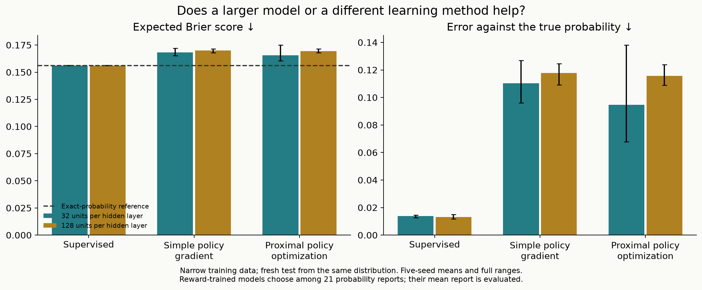
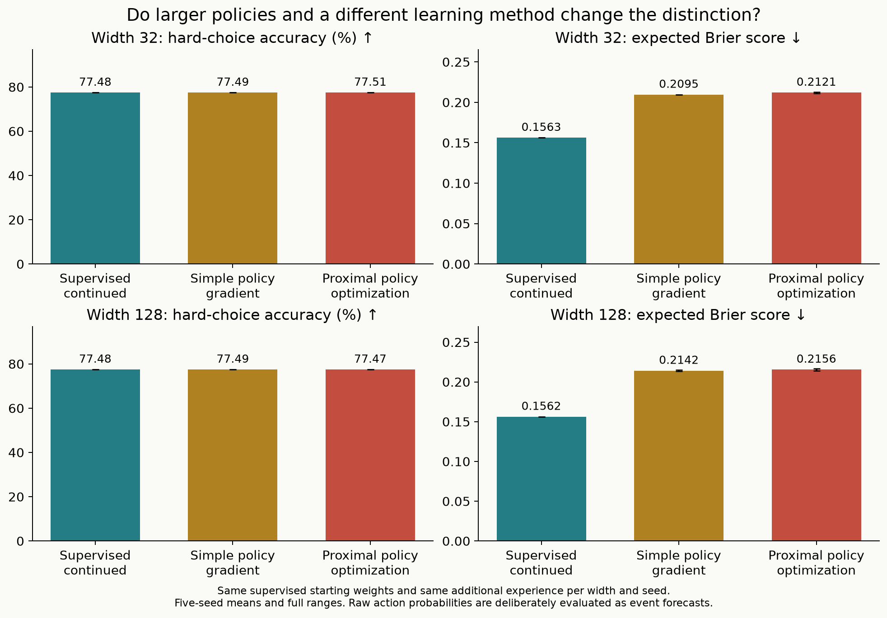

# A larger model, a different learning method, or better data coverage?

This is a controlled follow-up to the [calibration laboratory](calibration-results.md).
It tests Proximal Policy Optimization, two model sizes, and broader training-data
coverage. It uses small numeric networks, independently of First Instinct's
released text encoder and of Jev.

The strongest result is about **which situations appear in the data**. At the
same model size and episode budget, broader coverage greatly improved the
supervised model on reversed sensors and on a combination absent from training.
Proximal Policy Optimization lowered the small forecast policy's average error
on the original distribution, but did not catch the supervised baseline. Increasing width alone
did not reliably improve the reward-trained forecasters.

## The comparison on ordinary conditions

| Training from scratch | Width 32: Brier | Width 128: Brier |
| :--- | ---: | ---: |
| Supervised labels | 0.156235 | 0.156213 |
| Simple policy gradient, mean report | 0.168298 | 0.169924 |
| Proximal Policy Optimization, mean report | 0.165662 | 0.169432 |

Lower is better. The exact-probability reference scores 0.156041.
The larger reward-trained models did worse on this measure with the declared
recipes. This does not show that added capacity is inherently harmful or that
better optimization could not use it.

The small Proximal Policy Optimization model's Brier score ranged from
0.160638 to 0.175137 across seeds, versus 0.165287 to 0.172124 for the simpler
policy-gradient method. The paired difference averaged −0.002636 and ranged
from −0.006844 to +0.003013: improvement was not consistent across every seed.
The actually sampled report scored 0.167399 and 0.170143 respectively; taking
the mean report removes some action variance from the primary forecast measure.



## Broader data helps, including on an unseen combination

This table holds width at 128 and reports probability error in percentage
points, measured as root mean square. Each cell compares narrow → expanded
training at exactly the same episode budget.

| Test conditions | Supervised labels | Simple policy gradient | Proximal Policy Optimization |
| :--- | ---: | ---: | ---: |
| Original conditions | 1.31 → 1.80 | 11.77 → 7.40 | 11.56 → 7.75 |
| Weak sensor | 1.95 → 1.85 | 20.18 → 10.20 | 21.09 → 9.96 |
| Strong sensor | 5.79 → 1.89 | 16.25 → 12.10 | 14.54 → 12.82 |
| Extreme prior | 6.46 → 2.72 | 27.25 → 17.45 | 27.58 → 17.22 |
| Reversed sensor | 21.37 → 2.74 | 41.74 → 23.90 | 42.66 → 22.65 |
| Extreme prior + reversed sensor, never combined in training | 13.46 → 4.38 | 50.65 → 33.20 | 53.57 → 31.88 |

The supervised model pays a small price on ordinary conditions, where the
expanded mixture supplies only one quarter as many examples. It gains substantially
on strong sensors, extreme priors, reversed sensors, and their reserved combination.
The reward-trained models also benefit from wider coverage, but remain much
less accurate as forecasters. A useful data intervention does not remove the
need for a training objective and optimizer that learn from it effectively.


For the supervised model, mean extra cost across the 25 fixed cost settings
falls from **0.012095 to 0.000322** on reversed sensors, and from
**0.014169 to 0.001143** on the held-out combination. This is the effect
of better forecasts inside the same decision program; inspection behavior itself
was not trained.

## The original probability distinction survives both changes

Correctness-reward continuations still produce good binary choices and poor
event forecasts when their action probabilities are read as confidence. All
rows below start from the corresponding selected supervised weights and consume
another matched stage of experience. These are fresh test results, separate
from the previous calibration-v1 results.

| Width | Continued training | Hard-choice accuracy | Brier of returned probability | Inspection example cost |
| ---: | :--- | ---: | ---: | ---: |
| 32 | Supervised labels | 77.482% | 0.156252 | 0.046170 |
| 32 | Simple policy gradient | 77.491% | 0.209542 | 0.098636 |
| 32 | Proximal Policy Optimization | 77.507% | 0.212146 | 0.101080 |
| 128 | Supervised labels | 77.484% | 0.156247 | 0.046183 |
| 128 | Simple policy gradient | 77.486% | 0.214154 | 0.102881 |
| 128 | Proximal Policy Optimization | 77.475% | 0.215629 | 0.104094 |

The inspection example uses equal mistake costs of 0.5 and inspection price
0.05. With Proximal Policy Optimization, substituting action probabilities for
forecasts more than doubles this cost at both widths. The distinctions between
an event probability and a policy probability persist with a larger model and
a different training recipe.

Temperature correction on additional labeled data lowers the Proximal Policy
Optimization policies' Brier scores to 0.157891 and 0.158935 at widths 32 and 128.
It does not change their hard choices. All corrected variants and their shifted
domain results are included in the full tables.



## What was trained

The full matrix contains **75 policy training runs across five seeds**, plus
**25 separate value networks** used by Proximal Policy Optimization. Each stage
uses 2,000 fresh batches of 1,024 one-step episodes: **2,048,000 episodes**.
There are 15 distinct training streams, reused across matched recipes and sizes,
for **30,720,000 unique generated training episodes**. Counting every policy's
stage gives 153,600,000 episode presentations, many deliberately repeated
between comparison conditions.

| Comparison | Conditions |
| :--- | :--- |
| Capacity | Two hidden layers of width 32 or 128 |
| Learning from scratch | Supervised event labels; simple policy gradient; Proximal Policy Optimization |
| Forecast-reward action | One of 21 probability reports, from 0 to 1 in increments of 0.05 |
| Data coverage at width 128 | Narrow generator versus an equal mixture of four conditions, same total budget |
| Paired correctness continuation | Copy each selected supervised model, then continue supervised training or use either reward method |

The small policy has 1,217 parameters with a binary output or 1,877 with 21
reports. The larger one has 17,153 or 19,733. A Proximal Policy Optimization
value network adds 1,217 or 17,153 training-only parameters, without sharing
weights with the policy. A continued policy inherits a supervised stage and
receives another stage, for 4,096,000 episodes of total experience.

The Proximal Policy Optimization implementation uses the
[clipped probability-ratio objective](https://arxiv.org/abs/1707.06347), fixed
detached rollout advantages, a learned value baseline, up to four policy updates
per rollout, and four value updates. All episodes terminate after one action,
so the reward is the complete return. The simpler policy-gradient recipe uses
one update and an independent-episode reward baseline.

**Experience is matched; computation is not.** The complete recipes also differ
in learning rate and advantage normalization. A difference cannot be attributed
to clipping alone. No entropy bonus or reference-policy penalty was used.
This is one declared recipe for each method, not an exhaustive comparison of
the best possible versions of either algorithm.

## The data intervention

Every model receives only three numbers: the event's prior probability, the
sensor's reliability, and its reading. The narrow generator has priors from
0.15 to 0.85 and reliability from 0.60 to 0.90. The expanded generator divides
the same episode budget equally between:

- Those original conditions.
- Weak or reversed sensors, reliability 0.10–0.60.
- Strong sensors, reliability 0.91–0.99.
- Rare or very common events, priors 0.02–0.14 or 0.86–0.98.

Reversed sensors announce their true reliability: a sensor that is usually
wrong can be useful if its reading is interpreted in reverse. We never combine
extreme priors and reversed sensors in training. The final test includes that
held-out combination, plus five individual domains. Each domain has **32,768
fresh states**, shared across all models for paired comparison.

All recipes select checkpoints using the same 8,192 narrow validation examples
and their own observed objective. Selection does not use exact conditional
probabilities. Using narrow validation for expanded training holds selection
data fixed; it does not choose the checkpoint that performs best on every new
condition. Twenty temperature-corrected correctness policies are additional
derived variants, fitted on 8,192 separate labeled examples.

The [protocol and training implementation were committed before final testing](https://github.com/catoenm/first-instinct/commit/74e2c62ec7f656c04a828752965dbfcc222ce253).
All 75 checkpoint choices and 20 temperatures were recorded before generating
any final-test sample. No recipe was retuned after observing the test.

## Reading the measurements

Probability error is the root mean squared difference from the simulator's
exact conditional event probability. It is not the binned calibration error;
it asks for accurate probabilities on each state. The Brier score is squared
forecast error against an outcome, averaged over possible outcomes. Both are
better when smaller. Compare Brier scores within a domain because domains have
different amounts of inherent uncertainty.

A forecast policy's primary forecast is its **mean report**. We separately
publish the score of actually sampling a report and of taking its most likely
report. Its distribution over report actions is not itself an event forecast.
Hard-choice accuracy uses a threshold of one half; sampled-action accuracy
measures the policy's expected correctness when it samples its binary choice.

The same fixed program also decides whether to act or purchase a perfect
inspection under **25 combinations of mistake costs and inspection prices**.
The reported regret is extra expected cost above an exact-probability decision.
This evaluates the forecasts in changed cost settings; the program is fixed
code, not a learned sequence of tool calls.

All headline numbers are means over seeds 11, 23, 37, 53, and 71. Full ranges,
sample standard deviations, paired differences, individual seeds, derived
temperature variants, and exact-probability references are published in
[the tables](../results/ppo-data-v1/tables.md) and
[machine-readable summary](../results/ppo-data-v1/summary.json). Seed ranges
describe these five runs, not confidence intervals or uncertainty over all
possible tasks.

## Run the saved models

From the repository, with Python 3.14:

```bash
python -m pip install -r requirements-calibration.txt
python -m calibration_lab.download --version ppo-data-v1
python -m calibration_lab.ppo_demo \
  --run output/pretrained/first-instinct-ppo-data-v1 \
  --case combined
```

Use `--all-cases` for the authored examples or change `--inspection-cost` and
`--mistake-threshold` to inspect the fixed program's decisions. The prose in
these examples is explanatory metadata; it is not fed to the numeric networks.

To reconstruct the published evidence from the downloaded weights:

```bash
python -m calibration_lab.ppo_analysis \
  output/pretrained/first-instinct-ppo-data-v1 \
  --output output/reproduced-ppo-data
```

To retrain all conditions:

```bash
python -m calibration_lab.ppo_study
```

The command writes a new directory under `output/ppo_study_runs`. It preserves
initial and selected weights, each rollout's hashes and update statistics,
validation histories, source snapshots, and every final prediction. The test
seeds in this version are now public; new hypotheses need a newly reserved
evaluation rather than tuning to these results. Floating-point training can
differ across platforms or library versions.

Install `matplotlib==3.11.2` and add `--figures output/ppo-figures` to the analysis
command to redraw the figures. Plotting is optional for training and verification.

## Evidence and verification

The [public evidence bundle](https://github.com/catoenm/first-instinct/releases/tag/ppo-data-v1)
is approximately 155 MB and includes all selected and initial weights, rollout
traces, raw test predictions, and frozen training code. It is licensed under
MIT, including the synthetic examples and tiny numeric weights. Downloading
does not require an account. The downloader checks the archive checksum and
every sealed artifact before installation. The archive is delivered in 20 parts
of at most 8 MB to keep transfers manageable. The downloader checks each part,
joins them in order, and verifies the unchanged complete archive checksum.

The [verification record](../results/ppo-data-v1/verification.json) confirms:

- All 1,087 sealed artifact hashes and the frozen training sources match.
- All 15 complete training streams regenerate and agree between matched models.
- All selected validation objectives reproduce, as do the 20 fitted temperatures.
- The first actual update of each of the 25 Proximal Policy Optimization runs
  replays from saved initial policy and value weights, including sampled actions,
  rewards, and update statistics.
- All 570 model/domain evaluations reproduce from saved weights, with zero
  difference in predictions in the recorded runtime. Every recorded metric
  recomputes; an independent Bayes calculation and Brier identity also agree,
  along with independent reconstruction of all downstream costs.

Across the study, the policies made 300,000 optimizer updates and their value
networks made 200,000. Every Proximal Policy Optimization rollout used four
policy updates; its divergence stopping threshold was never triggered. In
29,205 of its 50,000 rollouts, at least one recorded sampled-action probability
ratio left the 0.8–1.2 clipping interval. Those logs include the ratio after
the final update, so this count is not a count of gradients suppressed by
clipping. Exact gradient tests check the clipping rule separately.

The repository's 58 offline tests passed locally. Frozen training code also
passed the macOS and Linux checks before the final experiment. All training
ran on the personal Mac's central processor with four PyTorch threads.
No graphics processor service was rented.

Archive SHA-256:
`07a20f8c9ac7014a2da207a1535b7cc2e84d1ec288bc8a4402c01b0f65aab67c`.
The [release manifest](../releases/ppo-data-v1.json) also pins its size and
the inner artifact-manifest checksum.

## What this adds, and what comes next

We now have actual Proximal Policy Optimization running in local decision
environments, a capacity comparison, and a controlled data-coverage experiment.
The environment generates observation/action/reward data without scraping or
renting compute. More rows are easy; covering the right situations and checking
generalization are the substantive data problems.

The next useful extension is an environment where the model can pay for
another observation and then decide when to stop. That introduces a learned
sequence and makes the value of information part of training. Connecting that
to the text encoder will require verified records, diverse language, and
careful separation of related examples. See the [data and environments plan](data-environments.md).

This study does not establish Jev's training method, a new reinforcement-learning
algorithm, general language understanding, or calibrated behavior outside the
tested conditions. The earlier text checkpoint remains supervised-only.
