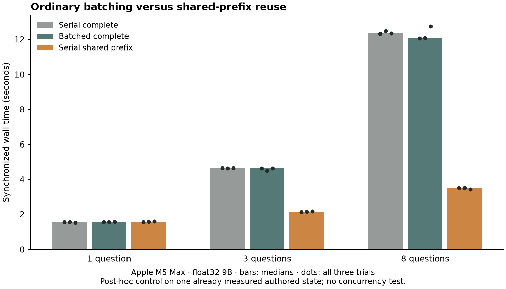

# Shared-prefix reuse versus ordinary batching

For eight questions about one shared state, serial cache reuse took **3.50
seconds**, compared with **12.07 seconds for an ordinary batched complete
forward**. The ratio of median wall times was **3.45×** on this Apple M5 Max
runtime. Serial complete forwards took 12.33 seconds. All three methods chose
the same answers, including the same incorrect answer on one of the eight
questions. No weights changed.

This is a **post-hoc performance control**. We designed it after the earlier
[serial-cache experiment](shared-prefix-results.md), which reported a 3.47×
serial-baseline ratio and explicitly lacked a batched baseline. The new control
reuses that exact fixture and token streams; it adds no independent quality
examples. All ratios below compare conditions within this new run.



## Timing and what was compared

Each cell reports the median in seconds and the full minimum–maximum range of
three interleaved measured trials. Separate warmups and independence checks are
excluded. Batch/cache greater than one means cache reuse was faster.

| Questions | Serial complete | Batched complete | Serial shared prefix | Batch/cache |
|---|---:|---:|---:|---:|
| 1 | 1.550 (1.510–1.551) | 1.543 (1.542–1.559) | 1.570 (1.541–1.591) | 0.98× |
| 3 | 4.640 (4.621–4.647) | 4.626 (4.486–4.634) | 2.137 (2.131–2.152) | 2.16× |
| 8 | 12.333 (12.326–12.463) | 12.072 (12.049–12.741) | 3.500 (3.431–3.501) | 3.45× |

Ordinary batching barely reduced the median here: the eight-question
serial/batch ratio was 1.02×. Cache reuse reduced median latency relative to
serial complete forwards by a ratio of 3.52×. A single question has no shared
prefix to reuse, and showed no caching benefit.

All conditions used identical state-first prompts on the same resident model.
Serial complete processed each question separately. Batched complete used one
left-padded forward with the existing production batch/scoring functions and a
separate allowed-label mask for each question. Shared-prefix inference processed
the common prefix once, then ran suffixes serially with independent deep copies
of the attention, recurrent and convolution cache. This did not test batched
cache branches.

The eight full prompts contain 4,248 real input tokens. Ordinary batching adds
56 padding positions. Reusing the 467-token common prefix reduces real submitted
tokens to 979. That accounts for submitted input positions, not floating-point
operations or attention work. Synchronized wall times include tensor setup,
padding, transfers, scoring, probability conversion and cache copying.

## Equivalence and the retained failure

The predeclared gate required exact selected-answer agreement and an absolute
probability difference no greater than 0.0001. Every comparison passed.

| Comparison | Maximum absolute probability difference |
|---|---:|
| Batched versus serial complete, all measured trials | 0.000002742 |
| Cached versus serial complete, all measured trials | 0.000002354 |
| Reversed versus original question order, batch and cache | 0 |
| Batch versus each question alone | 0.000002742 |
| Cache versus each question alone | 0.000002354 |

Warmup checks also passed; the largest difference across all checks was
0.000002742. Probabilities here are constrained label scores, not evidence of
empirical calibration.

All three conditions scored **7/8 in every eight-question repetition**. The
preassigned repetition-zero answers are shown in full:

| Question | Correct answer | All three methods chose |
|---|---|---|
| Dispatch route | Protected | Protected |
| Restock inventory? | Yes | Yes |
| Urgency | Elevated, level 1 | Elevated, level 1 |
| Temperature safe? | Yes | Yes |
| Smallest carton that fits | **Medium** | **Small — incorrect** |
| Signed delivery guaranteed? | No | No |
| Warranty coverage | Basic, level 1 | Basic, level 1 |
| Cheapest eligible carrier | Priority | Priority |

The carton question describes an 18-centimeter item and cartons measuring 16,
20 and 30 centimeters. Choosing the 16-centimeter carton is the same known
failure retained from the original experiment. Batching and caching preserve
the model's error; they do not make the underlying reasoning better. These are
eight correlated questions about one authored state, not eight new independent
test cases.

## Runtime, scope and reproduction

The checkpoint was the same supervised Qwen3.5-9B adapter selected at step 2,742,
with its pinned foundation revision and unchanged adapter hashes. One model
instance ran in float32, including its output head, on an **Apple M5 Max with
128 GiB unified memory**, using Metal Performance Shaders. Runtime: Python
3.14.6, PyTorch 2.14.0, Transformers 5.17.0, PEFT 0.21.0 and six PyTorch threads.
The runtime used reference PyTorch implementations for the linear-attention
operations; no optional optimized kernels were installed for this control.

This establishes a useful local implementation result. It does **not** establish
that batching is generally ineffective, or that this ratio transfers to CUDA,
optimized kernels, quantized weights, longer states, other batch sizes or
concurrent serving. Three trials per condition are descriptive. We have not
isolated which runtime operations limit batching here. A broader prompt-order
quality evaluation is still needed before adopting state-first prompts in the
demo. This experiment neither deploys the prototype nor identifies Jev's private
architecture or training method.

All planned work completed: **156 question forwards, 123 model calls, 63,698
real submitted tokens and 64,038 positions including padding**. The 40 retained
observations comprise three warmups, 27 measured trials, two reversed-order
checks and eight singleton checks. Model parameter version counters remained
unchanged. Memory receipts contain before/after current and driver allocations;
they do not measure a peak on this runtime.

The [protocol](shared-prefix-batch-control-v1-protocol.md) and
[fixture, streams, plan and freeze](../results/shared-prefix-batch-control-v1/)
were published in commit `e2aaf4a` before this run. The freeze content hash is
`951e5fe59bbec09d156eaf27916b23c8f3c3dcc614fe56244d71e4a41da7053e`.
The [raw measurements](../results/shared-prefix-batch-control-v1/measurements/)
retain every trial, per-option distribution and failure.

The standalone [analysis script](../results/shared-prefix-batch-control-v1/analyze.py)
imports no training or inference code. It independently reconstructs the seeded
schedule, token/padding/call counts, every timing statistic and ratio, every
per-option delta, order/alone checks and all target correctness values, then
checks them against the receipts. It also records hashes of the input receipts.
The analyzer accepted the complete run and rejected eight synthetic corrupted
receipt cases during verification. Reproduce the summary and figure without
loading a model:

```sh
python results/shared-prefix-batch-control-v1/analyze.py \
  --output output/reproduced-batch-control --plot
```

Omit `--plot` to use only the Python standard library. Reproduction writes a new
output directory and never changes the frozen inputs or measurements.
