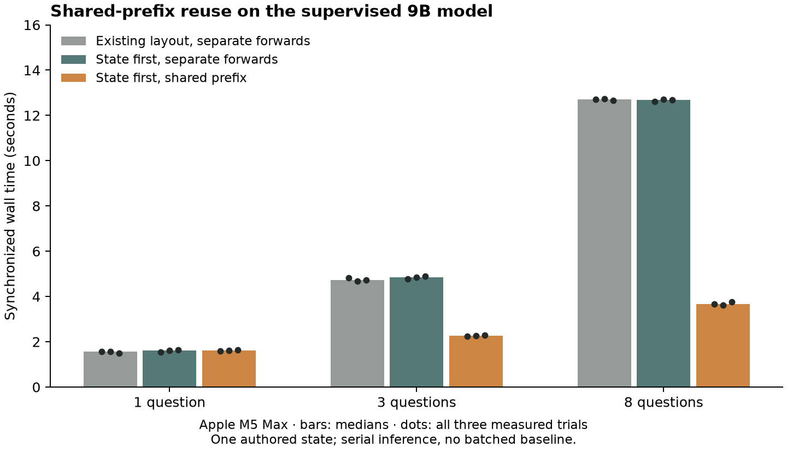

# Reusing one state across independent questions

An isolated inference prototype answered eight questions about one shared state
in **3.65 seconds**, versus **12.69 seconds** for serial complete forwards of the
identical prompts. That is a 3.47× ratio of median wall times on an Apple M5 Max.
Cache reuse preserved all selected answers; the largest probability difference
was 0.00000236. No weights changed.

This is a supplementary mechanics and timing result on one authored state. It
is not a benchmark of Jev, a throughput measurement, or a comparison against a
batched baseline. The existing demo was restored to its original supervised
checkpoint after the experiment; this prototype has not been deployed.



## What changed

The existing prompt places options before the supplied state. We tested a second
layout with state first, allowing questions to share a longer exact token prefix.
The model processes that prefix once. Each question then receives its own deep
copy of the attention, recurrent, and convolution cache and processes its suffix.
Question branches execute serially and cannot mutate one another's cache.

The [published prospective protocol](shared-prefix-v1-protocol.md) separates two
interventions. Existing layout versus state-first complete forwards changes the
prompt. State-first complete forwards versus cached forwards tests caching on
identical tokens. Only the second comparison isolates the effect of cache reuse.

The supervised Qwen3.5-9B checkpoint at step 2,742 ran in float32 on Apple graphics
hardware with 128 GiB unified memory. Runtime versions, checkpoint identities,
raw timings, memory observations, and per-option distributions are saved in the
[receipts](../results/shared-prefix-v1/measurements/). The local runtime used
reference PyTorch implementations of the linear-attention operations.

## Timing

Each cell gives the median in seconds, followed by the range of three
interleaved measured trials. Separate warmups are excluded.

| Questions | Existing layout, separate | State first, separate | State first, cached | Same-layout ratio |
|---|---:|---:|---:|---:|
| 1 | 1.572 (1.499–1.574) | 1.607 (1.546–1.647) | 1.605 (1.582–1.643) | 1.00× |
| 3 | 4.733 (4.675–4.823) | 4.840 (4.765–4.900) | 2.267 (2.242–2.293) | 2.14× |
| 8 | 12.710 (12.662–12.730) | 12.687 (12.617–12.719) | 3.655 (3.612–3.765) | 3.47× |

The eight-question state-first inputs contain 4,248 tokens in total. Reusing a
467-token prefix reduces forwarded logical input tokens to 979, a 77.0% reduction.
That accounting does not measure floating-point operations or attention work.
There is no shared prefix to reuse for the one-question condition.

All prescribed work completed: 148 question forwards and 156 model calls,
including warmups, reversed-order checks, and individual-question checks.
Only the 27 measured trials contribute to the timing table. Three observations
per condition support a descriptive comparison, not statistical significance.

## Answers and probabilities

Caching passed the predeclared 0.02 probability-difference threshold by a wide
margin. Across measured subsets and repetitions, maximum difference was
2.3544e-6 with identical selected answers. Reversing question order produced zero
difference. Running the questions individually also preserved answers and stayed
within 2.3544e-6.

**All three conditions answered seven of the eight authored questions correctly.**
For an 18-centimeter item and boxes of length 16, 20, and 30 centimeters, every
condition incorrectly chose the smallest box. The correct answer was the medium
box: the smallest one that actually fits. This failure is retained in the raw
results and is not repaired by caching.

Changing prompt order moved some probabilities substantially: maximum absolute
difference was 0.1889, or 18.9 percentage points, even though no selected answer
changed here. Therefore cache equivalence alone does not justify adopting the
new layout across arbitrary questions. The quality summary uses the preassigned
repetition-zero trial, as specified before inference; the eight questions are
correlated views of one shipment state.

## What remains

A batched complete-forward baseline is still needed: batching may substantially
reduce the serial baseline's latency. A broader prompt-order evaluation is also
needed before deployment. The measured ratio need not transfer to different
hardware, quantized weights, longer contexts, or concurrent serving.

This demonstrates a workable way to reuse shared computation with independent
questions in this model. It does not reveal Jev's private architecture or prove
that our model has its capabilities.

Recompute the saved timing summaries, per-option comparisons, independence checks,
and figure without loading a model:

```sh
python results/shared-prefix-v1/analyze.py \
  --output output/reproduced-shared-prefix-v1
```

The pre-inference [fixture, token streams, plan and freeze](../results/shared-prefix-v1/)
were published in commit `14e3bcb` before the measured run began.
