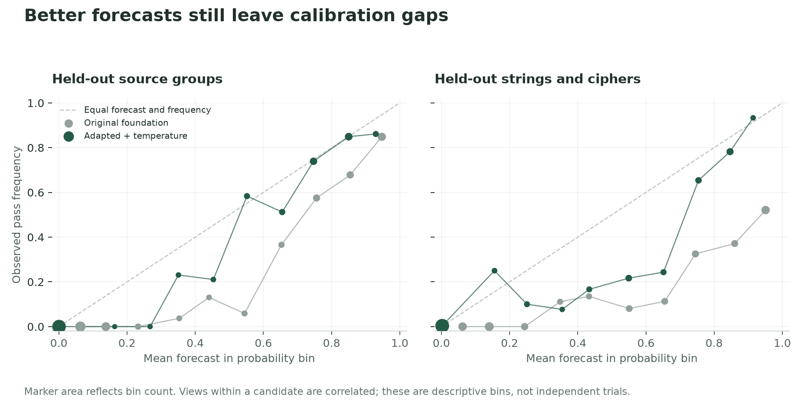

# A four-billion-parameter forecaster for verified software outcomes

This experiment adapts Qwen3.5-4B to read a candidate program and its visible
checks, then estimate whether the complete fixed test suite passes. The model
returns scores for two complementary answers. It generates no explanation and
executes no code during inference.

The foundation is pretrained; this is a short adaptation experiment, not
training four billion parameters from scratch. It is also **outcome-supervised
training, not reinforcement learning of the language model**. The separate
[inspection-policy study](software-inspection.md) contains the actual
Proximal Policy Optimization experiments.

## Try the local evidence room

```bash
python -m pip install -r requirements-scale.txt
python -m inspection_lab.download
python -m scale_lab.download
python -m inspection_lab.serve --device mps
```

Open `http://127.0.0.1:8765`. Choose a held-out function, inspect the initial
evidence, and decide whether to reveal more checks before committing the
forecast. You can choose manually or follow a separately trained small inspector. Each inspection costs simulated reward. An explicitly copied check
provides no new execution. The final outcome stays in the controller until the
episode ends.

The small inspector uses its most likely action from the frozen-forecaster
training condition, seed 17. It was trained using Proximal Policy Optimization
with a different predictor; the large forecaster and inspector were not jointly
trained. The resident language model provides forecasts. The display includes raw and validation-adjusted forecasts;
the final report is rounded to the environment's 0.05 grid. These estimates can
still be wrong. Passing the suite means compatibility with this finite collection
of checks, not proof that a program is correct on every input.

The 125 MB adapter download includes its selected weights, evidence, source
snapshots and hashes. The pinned foundation weights are downloaded separately on first
use. This is a local demonstration; no hosted service is required. The measured
Mac has an M5 Max and 128 GB of memory. A minimum memory configuration has not
been established. The supported Mac loader uses full-precision weights; it is
not a quantized deployment.

For one raw forecast without the browser or temperature adjustment:

```bash
python -m scale_lab.infer \
  --run output/pretrained/first-instinct-software-outcome-v1/model \
  --input examples/software-inspection.json --device mps
```

## Data and evaluation

The [verified corpus](software-inspection.md) contains 7,793 program variants
from 369 functions in one public repository. Its seven possible evidence views
are correlated. After excluding overlong inputs, the training partition has
36,189 views and 34.6 million input tokens. A short training run visits a subset
of those views; dataset size and tokens actually processed are reported separately.

All variants from connected source modules stay in one split. The ordinary
test holds out source groups; the challenge holds out strings and ciphers.
From each, we select 128 candidates by an outcome-blind hash, requiring all seven
views to fit the 2,048-token limit: 896 requests per split. Results therefore
apply to that complete-view subset, not every excluded long program.

Checkpoint selection uses 256 validation views covering 39 candidates and 19
source groups. Temperature fitting uses the other six validation source groups:
166 candidates and 1,162 views. It does not reuse checkpoint-selection groups
or final-test labels. A single temperature cannot repair all forms of
miscalibration, and six calibration groups offer limited coverage.

## Measured results

| Forecaster | Group-test Brier score | Family-test Brier score |
| --- | ---: | ---: |
| Original foundation | 0.1110 | 0.2136 |
| Training-only evidence-frequency reference | 0.0839 | 0.1110 |
| Selected adapter, raw | 0.0711 | 0.0864 |
| Selected adapter, validation-adjusted | **0.0700** | **0.0835** |

The same adapter raises accuracy from **84.5% to 90.2%** on held-out source
groups and **68.9% to 86.5%** on the family holdout. Temperature adjustment
preserves the chosen label, including the scorer's original tie handling.
There are 22 source groups in the selected ordinary test and 30 in the family
sample. All comparisons above use exactly the same candidates and evidence states.


The selected checkpoint is update **150**: 4,800 distinct training views from
3,271 program variants and 170 source groups, containing **4,565,626 input tokens**.
The complete job stopped at its 30-minute deadline after 189 updates, 6,048 view
visits and 5,827,516 input tokens. Its final weights were saved but not evaluated
for checkpoint selection; the released adapter is the lowest-loss checkpoint
among the recorded validation evaluations. This was not a full pass over the
available training data.

Low-rank adaptation trains 32,464,896 parameters. Peak allocated accelerator
memory was 19.2 GB. The H100 rental ran for about 49 minutes including setup,
training, evaluation and collection. The rate-based compute estimate is **US$2.36,
excluding storage**, not a final billing statement. All 36 collected artifact
hashes matched before the rental was stopped and deleted.

The fitted temperatures are 1.0162 for the foundation and 1.2937 for the adapter.
Relative to the evidence-frequency reference, the adjusted adapter improves
source-group-weighted Brier score by 0.0162 in each test. The source-group
bootstrap intervals are [0.0060, 0.0269] and [0.0003, 0.0315], respectively.
These are conditional on this corpus and one adapter-training seed. They use
equal group weighting, while the table averages requests, so the numerical
differences need not match.

The model learned an important logical constraint: a visible failed check rules
out passing the complete suite. Its raw mean pass forecast on those states is
below 0.01% in both tests, versus 15.3% and 23.4% for the foundation. It also
improves on states where no failure has yet been observed: Brier score falls
from 0.2150 to 0.1771 and from 0.4024 to 0.2144 after adjustment.

An announced copied check changes the raw forecast by an average of **1.36
percentage points**, versus 5.82 for the foundation, on 69 matched-order pairs
in the group test. The family result is 1.92 versus 6.93 points on 68 pairs.
Sensitivity is reduced, not eliminated.

Calibration also remains imperfect. On the family holdout, one adjusted bin
has a mean forecast near 55% but an observed pass frequency near 22% across 60
correlated views. Better aggregate scores do not make every forecast reliable.



## Combining forecasts with learned inspection

With the adjusted large-model forecasts fixed, the previously trained small
inspectors improve workflow reward over stopping immediately. No policy is
retrained or selected on these language-model test results.

| Inspection strategy | Group-test reward | Family-test reward |
| --- | ---: | ---: |
| Stop immediately | 0.9068 | 0.8792 |
| Inspect probes once if the initial check passes | 0.9215 | 0.9139 |
| Previously trained inspector, mean of three seeds | 0.9403 | 0.9296 |
| Empirical planner's inspection choices | **0.9531** | **0.9544** |

The planner's terminal reports here also come from the large forecaster. It
chooses inspections with its original training-frequency model. The learned
inspectors almost never purchase the announced duplicate. This supports a
useful composite system, while the simple planner still makes better acquisition
choices in this experiment.

These numbers use the 128-candidate subsets and a fixed price of 0.01 per
inspection. They are not directly comparable with the earlier full-corpus,
random-price policy table. Evaluation integrates all possible action paths;
the browser follows one inspector's most likely action.

On the M5 Max, eight fixed requests of 618–853 tokens took 1.39–1.93 seconds
apiece, excluding model loading. A second portability check covered 13 requests
selected across the cloud model's probability range; its largest probability
difference was 1.68 percentage points. The Mac uses full precision and the cloud
uses reduced precision and different batching. These checks do not establish
identical full-test metrics across devices or a representative latency benchmark.


## Interpretation and limits

Brier score is squared forecast error against the realized binary event. Lower
is better, but it combines calibration with informativeness. Accuracy alone
cannot tell whether probabilities are useful. We also retain log loss,
calibration bins, forecasts after a known visible failure and copy sensitivity.
The copy comparison uses only pairs with the same option order, because label
order is another intervention.

The empirical reference uses training-set pass frequencies and the logical fact
that one visible failed check falsifies the complete-suite event. It reads no
code. Beating the original foundation is not the same as beating that reference.

There is one adapter-training seed. The original foundation may have seen this
public repository during pretraining. Exact function clones and known problem
variants are grouped, but semantic near-duplicates are not fully excluded.
Synthetic mutations are not a measured production bug distribution. This
software-specific adapter has not been evaluated for broad tool selection or
for parity with Jev.

The optional workflow transfer diagnostic combines saved language forecasts
with three previously trained small acquisition policies. Those policies were
trained with a different predictor, receive no new fitting here, and use prices
fixed at 0.01 to match the language prompts. It is a composite of separately
trained components, not joint reinforcement training of the large network.

## Reproduce the measurements

The released `evaluation` directory retains prepared evaluation requests,
predictions, selected calibration groups, training traces, package versions,
source snapshots and the analysis outputs. The visited training rows are
reconstructed from the recorded seed and batching algorithm, with visits and
real/padded token totals checked against the trainer receipt. Foundation weights are referenced
by immutable revision, not copied into the release.

```bash
python -m inspection_lab.scale_report \
  --cloud-results output/pretrained/first-instinct-software-outcome-v1/evaluation \
  --data output/pretrained/first-instinct-software-inspection-v1/curated \
  --output output/reproduced-language-report.json
python -m inspection_lab.language_workflow \
  --cloud-results output/pretrained/first-instinct-software-outcome-v1/evaluation \
  --data output/pretrained/first-instinct-software-inspection-v1/curated \
  --hybrid output/pretrained/first-instinct-software-inspection-v1/hybrid \
  --output output/reproduced-language-workflow.json
```

The [development protocol](software-inspection-protocol.md#bounded-language-model-pilot)
records the population selection and the separate calibration pass. See the
[data research brief](data-research-brief.md) for the next questions to test.

To regenerate the figures, install `matplotlib==3.11.2` and run
`python -m inspection_lab.plot_language --report results/software-outcome-v1/report.json --out docs/assets/software-outcome`.
