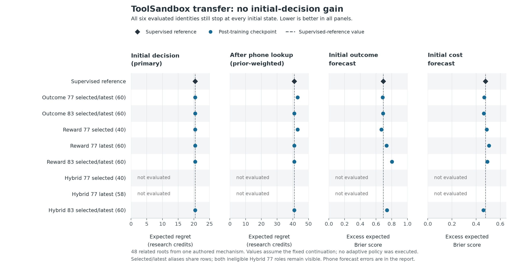

# ToolSandbox transfer: no initial-decision gain

**None of the six evaluated post-training checkpoints improved the primary
initial-state decision endpoint over the supervised reference.** Every one still
chose `stop` at all 48 initial states. Mean expected value stayed at **0.2083**
research credits and mean expected regret at **20.4063**. Stopping was optimal
among the offered actions at only **17 of 48** initial states.

Forecast probabilities changed, with mixed improvements and regressions, but
those changes did not improve the initial choices. Outcome seed 77 and the
selected reward seed 77 checkpoint also made the same unfavorable change in
one supplied phone history. This is evidence of a remaining transfer failure
on this particular mechanism, despite the stronger results in the
[training environments' held-out combinations](outcome-v2-results.md).

All six eligible checkpoint identities completed their fixed 720-question
evaluations. They represent ten original selected/latest roles. Both Hybrid 77
roles remain ineligible because their training run was not finalized. The
aggregate report is therefore `partial`; no eligible inference unit is
unfinished. No checkpoint was chosen, promoted, retrained or tuned using these
results.

[Full report](../results/toolsandbox-transfer-outcome-execution-v1/report.md) ·
[Report JSON](../results/toolsandbox-transfer-outcome-execution-v1/report.json) ·
[Raw units and freeze](../results/toolsandbox-transfer-outcome-execution-v1/) ·
[Original supervised reference](toolsandbox-transfer-supervised-results.md)



The two decision panels are separate expected-value calculations. The forecast
panels show initial-state distribution error, not realized policy returns.
Selected/latest roles with byte-identical adapter weights and configuration
share a row; they are not independent replications. Both unevaluated Hybrid 77
roles remain visible. Lower is better in each panel.

## What this evaluation measures

The unchanged [scoring protocol](toolsandbox-transfer-v1-protocol.md) uses 48
related variants of **one authored four-world mechanism**, with create, update
and delete operations in real third-party ToolSandbox reminder/contact code.
Verified saved executions establish how bounded content search, time filtering,
contact lookup, writes and their costs affect outcomes. The finite prior,
costs and relevant tool semantics are supplied in each question.

All 48 roots are evaluation-only, including the 16 create roots whose original
collection label is `train`. The original labels also distinguish update/
`validation` and delete/`test`, with 16 roots each. None of this corpus or its
derivatives entered training, prompt tuning, probability calibration or
checkpoint selection. This is a holdout from our training pipeline, not a claim
that the foundation model has never seen the public tool code.

Each model predicts terminal-outcome and future-cost distributions for every
offered action. The selector maximizes predicted terminal utility minus
predicted future cost. Its choice is scored with exact expectations from the
retained execution labels, under the specified `fast_then_act/v1` continuation.
The exact comparator maximizes expected value over that same menu and
continuation. It does not observe the hidden world or solve unrestricted
planning. **No learned adaptive policy was executed in this evaluation.**

Initial values average the 48 roots equally and are primary. The separate phone
endpoint conditions on the two possible phone-lookup results, weights them by
their declared observation probability within each root, and then averages
roots equally. Already-paid lookup costs are excluded. These supplied histories
do not describe a deployed policy that chose to look up the phone number; in
fact, the initial selector always stopped.

## Supervised reference and every original role

All decision values below are exact expectations in artificial research
credits, not dollars or realized execution rewards. Regret is the exact menu's
best expected value minus the chosen action's expected value. The original
training selector determined `best`; here it is called **selected**. Updates
refer to outcome-v2 training, while the supervised reference is step 2,742 from
the earlier supervised run.

| Role | Update | Status | Initial value | Initial regret | Phone-weighted value | Phone-weighted regret |
| --- | ---: | --- | ---: | ---: | ---: | ---: |
| Supervised reference | — | Complete | 0.2083 | 20.4063 | 0.2083 | 40.9870 |
| Outcome 77 selected | 60 | Complete | 0.2083 | 20.4063 | -1.7943 | 42.9896 |
| Outcome 77 latest | 60 | Complete, alias | 0.2083 | 20.4063 | -1.7943 | 42.9896 |
| Outcome 83 selected | 60 | Complete | 0.2083 | 20.4063 | 0.2083 | 40.9870 |
| Outcome 83 latest | 60 | Complete, alias | 0.2083 | 20.4063 | 0.2083 | 40.9870 |
| Reward 77 selected | 40 | Complete | 0.2083 | 20.4063 | -1.7943 | 42.9896 |
| Reward 77 latest | 60 | Complete | 0.2083 | 20.4063 | 0.2083 | 40.9870 |
| Reward 83 selected | 60 | Complete | 0.2083 | 20.4063 | 0.2083 | 40.9870 |
| Reward 83 latest | 60 | Complete, alias | 0.2083 | 20.4063 | 0.2083 | 40.9870 |
| Hybrid 77 selected | 40 | Ineligible | — | — | — | — |
| Hybrid 77 latest | 58 | Ineligible | — | — | — | — |
| Hybrid 83 selected | 60 | Complete | 0.2083 | 20.4063 | 0.2083 | 40.9870 |
| Hybrid 83 latest | 60 | Complete, alias | 0.2083 | 20.4063 | 0.2083 | 40.9870 |

Every paired initial value and regret change versus the supervised reference
is exactly zero, including every individual root. The initial regret by
operation remains 5.5938 for create and 27.8125 for both update and delete.
The JSON retains all operation strata, original split strata and paired-root
records; no favorable subset is selected.

Hybrid 77's exclusion follows the frozen eligibility rule, not its scores.
The saved selected@40 and latest@58 adapters were not evaluated here. Its
selection-time retention passed, but it has no finalized training run or final
checkpoint-retention receipts. This is neither an imputed failed test nor a
reason to omit the two original roles.

### Simple baselines

The stopped model choices match the always-stop baseline. Always choosing a
different fixed action is not a solution either: its value depends on costs,
priors and the observed history. The exact menu can choose differently for
each context.

| Baseline | Initial value | Initial regret | Phone-weighted value | Phone-weighted regret |
| --- | ---: | ---: | ---: | ---: |
| Always stop | 0.2083 | 20.4063 | 0.2083 | 40.9870 |
| Always complete time query | -36.0651 | 56.6797 | -24.8151 | 66.0104 |
| Cheap continuation | -3.6693 | 24.2839 | 7.5807 | 33.6146 |
| Uniform random offered action | -13.1753 | 33.7899 | -5.6753 | 46.8707 |
| Exact menu optimum | 20.6146 | 0.0000 | 41.1953 | 0.0000 |

Cheap continuation means contact lookup at the initial state and the fast
query after a phone lookup. Uniform-action values are exact averages of the
offered-action values, not new sampled executions.

### The one changed phone history

The supervised reference stops in all 96 supplied phone histories. Four new
checkpoint identities do the same. Outcome 77 and Reward 77 selected@40 each
stop in 95 histories and choose `query_fast` in the same remaining history,
at root `toolsandbox-partial-v1:create:4`. Its observation probability is 1/2.
The retained exact values are:

| Action in that history | Exact expected value |
| --- | ---: |
| Stop | 75.00 |
| Fast query | -117.25 |
| Complete time query | 63.75 |

Both models rank the fast query slightly above stopping. The conditional value
loss is 192.25 credits; weighting by 1/2 gives 96.125 for that root, and averaging
all 48 roots gives **2.002604** additional phone-weighted regret. This accounts
for the entire observed conditional regression. It is one shared diagnostic
case, not two independent failures. It does not affect the primary initial
endpoint because neither model chooses the phone lookup initially.

## Probability quality: mixed changes, no decision gain

Each identity answers 720 model questions: 432 outcome and 288 cost forecasts.
Another 144 known singleton stop-cost distributions bypass prediction and
**never enter the forecast-score denominators**. Initial-state scores use 144
outcome and 96 cost questions; phone scores use 288 outcome and 192 cost
questions, with the within-root observation weights described above.

Excess expected Brier score is the **sum** of squared differences between
predicted and exact probabilities. Expected log loss integrates the exact
finite target distribution, with the frozen probability floor of `1e-12` and
natural logarithms. These are not scores against one sampled outcome. Both
metrics are lower when better; expected log loss retains irreducible
uncertainty, while excess Brier removes it. Outcome and cost menus differ, so
their absolute error magnitudes are kept separate. Averaging is over questions
within each history, then weighted histories and equally weighted roots.

The tables group only byte-identical role aliases. Both Hybrid 77 roles have
no forecast results and are not assigned zero error.

| Initial-state checkpoint roles | Outcome excess Brier | Outcome expected log loss | Cost excess Brier | Cost expected log loss |
| --- | ---: | ---: | ---: | ---: |
| Supervised reference | 0.692584 | 3.268207 | 0.477684 | 3.636835 |
| Outcome 77 selected/latest | 0.683752 | 3.116421 | 0.467864 | 3.727246 |
| Outcome 83 selected/latest | 0.688718 | 3.224349 | 0.464518 | 3.639972 |
| Reward 77 selected@40 | 0.668179 | 2.793896 | 0.487438 | 3.717899 |
| Reward 77 latest@60 | 0.735370 | 3.051780 | 0.507139 | 3.892596 |
| Reward 83 selected/latest | 0.803702 | 3.868702 | 0.492309 | 3.672786 |
| Hybrid 83 selected/latest | 0.738712 | 3.202186 | 0.460560 | 3.596160 |

| Phone-prior-weighted checkpoint roles | Outcome excess Brier | Outcome expected log loss | Cost excess Brier | Cost expected log loss |
| --- | ---: | ---: | ---: | ---: |
| Supervised reference | 0.863023 | 4.791154 | 0.557636 | 3.122176 |
| Outcome 77 selected/latest | 0.789335 | 4.840804 | 0.560595 | 3.310481 |
| Outcome 83 selected/latest | 0.784513 | 4.808203 | 0.555310 | 3.209504 |
| Reward 77 selected@40 | 0.941081 | 4.768110 | 0.549360 | 3.009330 |
| Reward 77 latest@60 | 1.017217 | 5.221786 | 0.554260 | 3.020844 |
| Reward 83 selected/latest | 1.034456 | 5.395125 | 0.549065 | 2.972900 |
| Hybrid 83 selected/latest | 0.898387 | 4.892503 | 0.552410 | 3.170934 |

Outcome-only training slightly reduces initial outcome and cost excess Brier
scores versus the supervised reference, but the resulting selector still stops
everywhere. On the phone histories it reduces outcome excess Brier while
slightly worsening outcome expected log loss. These aggregate metrics answer
different questions and do not imply that the decisions improved. The hybrid
also has mixed forecast changes rather than a consistent advantage. No arm is
selected from these diagnostics.

## Scope, completion and reproducibility

The result is narrow: outcome/reward training on our retry/workflow environments
did not resolve this specified third-party tool mechanism's initial choices.
It does not establish that such training cannot transfer elsewhere, nor that
more of the same training would fix this problem. The visible priors and
semantics make the finite task programmatically solvable; this is not a broad
test of arbitrary questions, general tool use, real-world calibration or Jev.
The 48 roots, 144 histories and 720 questions are related views of one authored
mechanism. No confidence interval treats them as independent mechanisms.

This evaluation retains the **original frozen option order**. The earlier
[supervised option-order diagnostic](toolsandbox-transfer-order-results.md)
does not provide an option-order control for these post-training checkpoints.
There was no checkpoint-specific prompt change, retry, menu pruning, fitting,
or result-dependent subset. All selected/latest roles were fixed by the
previous training experiment and the unchanged cohort eligibility rules.

The six unique eligible identities made **4,320 new single-question forwards**;
their recorded inference time sums to 13,819.26 seconds (about 3.84 hours).
The original 720-question supervised reference is retained separately. Four
selected/latest alias pairs reuse their identity's completed result; there
were not ten independent 720-question runs. The locked runtime uses the pinned
Qwen3.5-9B revision, Apple graphics processing, float32, single-question batches,
the same serializer, and no cache. Fresh-process inference timings are not a
controlled speed comparison with the historical supervised HTTP service.

The published read-only reporter verifies all six completed 720-row attempts,
received and validated-response journals, their hashes and input order, then
rescores every probability map. Independent review also reconstructed targets
from retained execution labels and public histories/priors and reproduced every
aggregate and paired-root difference without using the scorer. No third-party
tool or model was rerun to prepare this writeup. The reports establish saved
provenance and arithmetic reproducibility, not an attestation of tensors that
were resident in memory during inference.

```bash
python -m general_lab.toolsandbox_transfer_report \
  --execution results/toolsandbox-transfer-outcome-execution-v1 \
  --sft-reference results/toolsandbox-transfer-supervised-v1 \
  --corpus results/toolsandbox-partial-v1 \
  --freeze-sha256 f0036925a79b6ff3ead11d72016963b9ad1429a4c9117874eb18c20a8c45eb6f \
  --output /path/to/new-report-directory
python docs/assets/toolsandbox-transfer-outcome-v1/render.py \
  --report results/toolsandbox-transfer-outcome-execution-v1/report.json \
  --output /path/to/new-figure-directory
```

Public rescoring uses the standard library and retained artifacts. The figure
additionally needs Matplotlib. Its [data](assets/toolsandbox-transfer-outcome-v1/figure-data.json)
and [render source](assets/toolsandbox-transfer-outcome-v1/render.py) bind the
reviewed report hash and retain all role aliases and exclusions.

| Artifact | SHA-256 |
| --- | --- |
| Execution freeze file | `f0036925a79b6ff3ead11d72016963b9ad1429a4c9117874eb18c20a8c45eb6f` |
| Execution freeze content | `f0ba205fc6a7f152c2416fa1269a1d3cdff1fe6cf89ceaf9f32306bfeb509773` |
| Original supervised freeze file | `cd83e94da4d800cb2d793a03da3f138a95b4f12a70e5d43fba3708e6b49d4ae0` |
| ToolSandbox corpus freeze | `8dd4cad766f6434cc86034561d245e1f051170cdc425d42aadf1eccb97e1b258` |
| Recomputed cohort report JSON | `1b3b4c71c7bfd82570155f7469bb77f83da18ad5100eb1a484b932b93fe0e037` |
