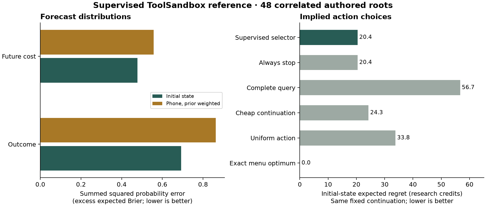

# Supervised ToolSandbox transfer reference

The frozen supervised Qwen3.5-9B checkpoint at step 2,742 completed all 720 questions in 40.5 minutes. All 48 authored roots were retained; 144 singleton cost answers bypassed prediction. No reinforcement-learning checkpoint is included in this reference.

**The forecast-based selector stopped at all 48 initial states and all 96 supplied phone histories.** Stopping was exact-menu optimal at only 17 of the 48 initial states. The initial choices therefore match the always-stop baseline, with mean expected regret of 20.406 research credits. This is a transfer failure on the declared mechanism, not evidence of general calibrated decision-making. These action counts come from the retained `decision_contexts` in the [raw metrics](../results/toolsandbox-transfer-supervised-v1/results/metrics.json).

The primary endpoint is expected value at the initial state, averaged equally across roots. Each choice is followed by the fixed, fallible continuation in the protocol.

| Selector | Initial expected value | Initial expected regret | Phone-conditioned expected regret |
|---|---:|---:|---:|
| Supervised forecast selector | 0.208 | 20.406 | 40.987 |
| Always stop | 0.208 | 20.406 | 40.987 |
| Always complete query | -36.065 | 56.680 | 66.010 |
| Cheap continuation | -3.669 | 24.284 | 33.615 |
| Uniform random action | -13.175 | 33.790 | 46.871 |
| Exact menu optimum | 20.615 | 0.000 | 0.000 |

The exact menu optimum maximizes expected value under the same continuation and visible prior. It is not an omniscient hidden-world oracle. These are values implied by retained execution forecasts, not realized returns from running a learned policy. Phone histories are weighted by their probability within each root; already-paid lookup costs are excluded.

| Forecast at initial state | Model questions | Summed probability error / excess Brier | Expected Brier | Expected clipped log loss |
|---|---:|---:|---:|---:|
| outcome | 144 | 0.692584 | 1.257688 | 3.268207 |
| cost | 96 | 0.477684 | 1.055809 | 3.636835 |

Summed probability error avoids rewarding larger menus merely by dividing by more classes. Exact expected losses integrate the stated finite distribution and retain irreducible uncertainty. Log scores clip probabilities at 1e-12. Singleton costs are excluded from learned forecast scores.

| Operation | Roots | Initial selector regret | Prior-weighted phone selector regret |
|---|---:|---:|---:|
| create | 16 | 5.594 | 30.586 |
| update | 16 | 27.812 | 46.188 |
| delete | 16 | 27.812 | 46.188 |

All original collection splits—including create/train—were evaluation-only. The mechanism, finite prior, costs and tool semantics are explicitly supplied. The 48 roots share one authored four-world mechanism; 720 questions and 144 histories are correlated views. This is not broad calibration evidence, a test of arbitrary tool use, or a comparison with Jev.

The outcome/reward/hybrid checkpoints have not been compared in this report. This supervised reference cannot establish improvement due to executed-outcome training.

Every aggregate was recomputed from all 720 retained responses, matched to the pre-request input-hash ledger and published mapping. Available adapter files: **verified**; available tokenizer files: **verified**. Frozen source and recorded identity plus available disk hashes, not an attestation of server-resident tensors.

[Scoring protocol](toolsandbox-transfer-v1-protocol.md) · [Local run protocol](toolsandbox-transfer-local-v1-protocol.md) · [Frozen artifacts](../results/toolsandbox-transfer-supervised-v1/)
