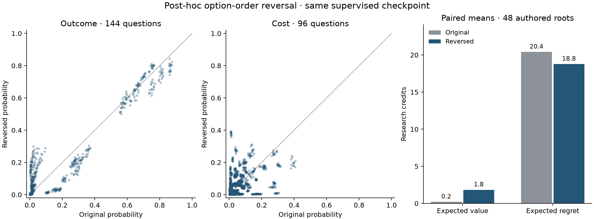

# One option-order reversal

Post-hoc sensitivity diagnostic motivated by the completed supervised reference. One reversal of every nontrivial root-state menu; no prompt tuning, model selection, training-gain claim, new tool execution, or change to the primary 720-question result.

All 240 nontrivial initial-state questions across the same 48 authored roots are retained: 144 outcome forecasts and 96 future-cost forecasts. The original answers are reused from the completed reference; only reversed menus were queried again. The 48 singleton stop costs remain exact bypasses. Phone states are not compared.

| Forecast | Questions | Mean total variation | Largest probability drift | Modal flips | Modal-set changes | Original / reversed ties |
|---|---:|---:|---:|---:|---:|---:|
| outcome | 144 | 0.151517 | 0.276461 | 0 | 0 | 0 / 0 |
| cost | 96 | 0.447877 | 0.382322 | 69 | 69 | 0 / 0 |

Modal flips respect the first presented option when probabilities tie; modal-set changes distinguish changes in the tied set.

| Presentation | Mean expected value | Mean expected regret | Exact-menu optimal action fraction |
|---|---:|---:|---:|
| Original | 0.208333 | 20.406250 | 0.354167 |
| Reversed | 1.838542 | 18.776042 | 0.416667 |

Implied initial action changes: 3/48. Values and regrets are in **research credits**, averaged equally across the paired 48 roots. They describe choosing once and following the fixed continuation, not newly executed policy returns.

| Forecast | Original excess Brier | Reversed excess Brier | Original expected log loss | Reversed expected log loss |
|---|---:|---:|---:|---:|
| outcome | 0.692584 | 0.605979 | 3.268207 | 2.811071 |
| cost | 0.477684 | 0.450670 | 3.636835 | 4.050052 |

Excess expected Brier is summed squared probability error against the stated finite distribution. Expected log loss uses the frozen probability floor. These are separate from option-order drift, which compares the two predictions directly.

Each scatter point is one semantic option, matched by ID across presentation orders; every question contributes all its options. Points on the diagonal have unchanged probabilities. The bars show equal-root means over the same 48 authored roots. Neither ordering is selected or promoted.

One nonrandomized reversal, with original/reversed calls at different times. No contemporaneous original repeats: temporal/numerical variation is not separately estimated. Authored exact distributions are not empirical general calibration. Equal-root implied fixed-continuation values, not newly executed policy returns. No ordering is selected or promoted.

This is one post-hoc, nonrandomized reversal at a later time, without contemporaneous original-order repeats. Temporal or numerical variation is not separately measured. The roots share one authored four-world mechanism, so this is not broad calibration evidence or 240 independent tasks.

The JSON summary retains all question and root records plus the frozen analyzer’s full analysis provenance. Available adapter: **verified**; available tokenizer: **verified**. Read-only rescoring loads no model or tokenizer and requires no inference packages. Missing runtime artifacts are historical hash provenance only; available files were checked and changed files refused.
